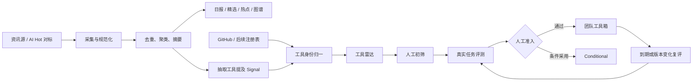
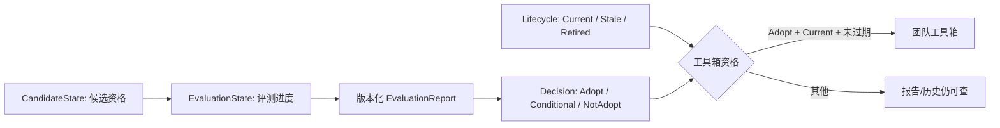
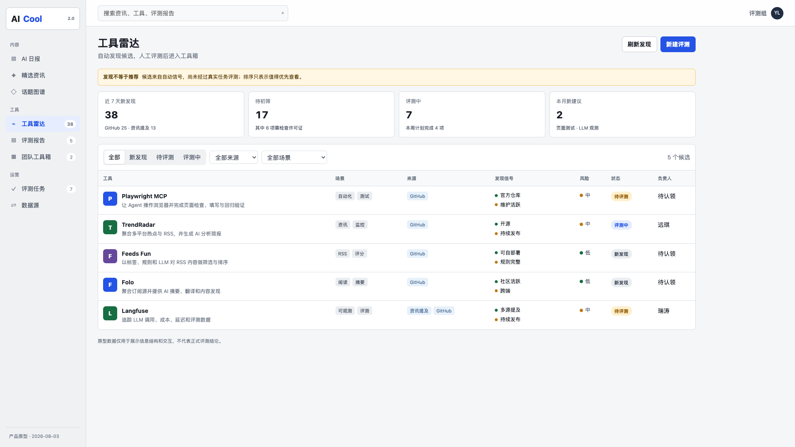
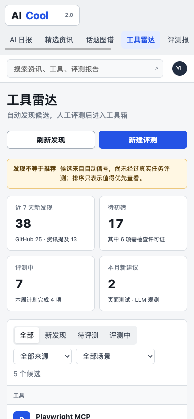
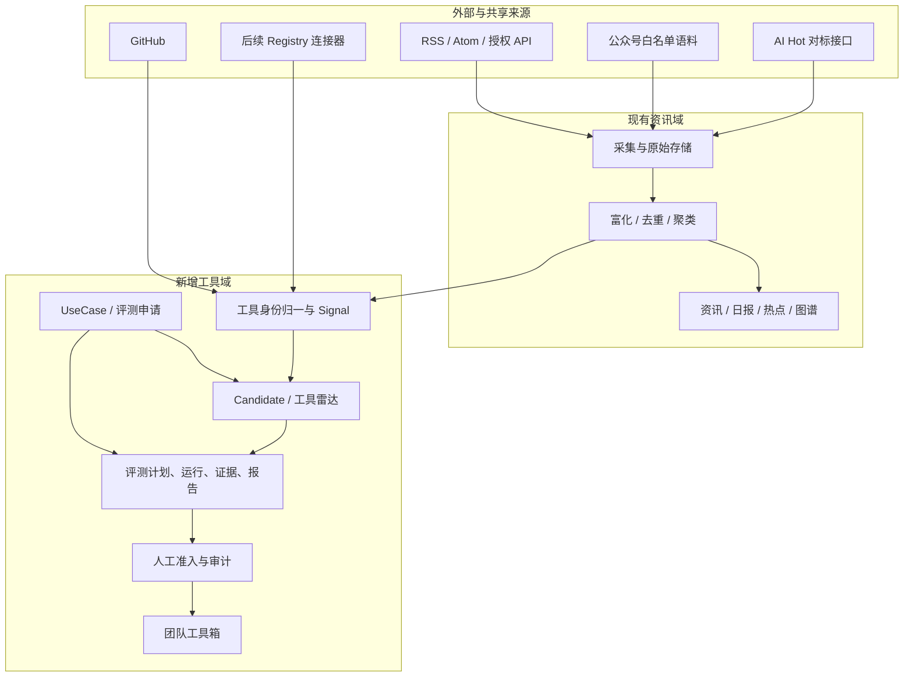

# AI Cool 2.0 产品设计方案

| 项目 | 内容 |
|---|---|
| 方案状态 | 产品设计稿，待排期评审 |
| 版本 | v1.0 |
| 日期 | 2026-08-03 |
| 需求依据 | 会议逐字稿 00:04:28–00:09:33，00:29:04–00:29:31 方向性补充 |
| MVP 服务范围 | 组内、SSO 登录的 AI 工具决策平台；扩大组织或对公网开放不在本轮 |
| 本轮重点 | 更多资讯源（首批中文）、工具发现、人工评测、团队工具箱 |
| 后续范围 | 团队 Skill、插件和能力包上传下载 |

## 0. 决策摘要

AI Cool 2.0 不应继续只做“更多资讯”，也不应变成一个按热度排列的 AI 工具黄页。MVP 明确服务组内用户，长期再验证是否扩展到更大组织。推荐定位为：

> **组内 AI 情报到工具决策平台：了解变化、发现候选、形成证据、做出判断、沉淀工具。**

本轮采用一条闭环，而不是两个孤立栏目：

```text
资讯与仓库信号 → 规范化工具 → 工具雷达 → 真实任务评测 → 人工准入 → 团队工具箱 → 到期复评/撤回
```

关键决策如下：

1. 保留现有日报、精选、全部动态和图谱，补中文来源与来源治理。
2. 新增“工具雷达”，自动找工具，但固定声明“发现不等于推荐”。
3. 新增“评测中心”，用真实任务、版本化证据和人工审批形成结论。
4. 只有通过准入的具体工具版本进入团队工具箱；热度、Star 和 LLM 分数都不能自动推荐。
5. AI Hot 可作为二级情报源和覆盖对标，不作为核心单点依赖，也不镜像第三方全文。
6. 团队自产 Skill/插件仓库放到后续阶段，上线前必须先具备 SSO/RBAC、制品扫描、签名、版本和撤回能力。
7. 在新增评测、来源配置等写操作前，先补现有认证、审计、部署可复现和健康监控基线。

本方案中的 `Adopt` 定义为：**AI Cool 评审组针对明确用户、任务、部署方式和数据边界给出的组内优先采用建议**。它不等同公司级安全认证、采购批准或法务批准；命中相应门槛时仍需走独立流程。

## 1. 逐字稿原文与目标

完整摘录和范围判断见 [`../references/ai-cool-2.0-requirements.md`](../references/ai-cool-2.0-requirements.md)。逐字稿可总结为 **3 个产品点 + 3 个高置信度执行事实**；00:29 还有 **1 条低置信度方向信号**。合计可说 7 条，但只有前 6 条用于本轮约束。

### 1.1 三个产品点

| 时间 | 原文短摘 | 需求解释 |
|---|---|---|
| 00:04:28–00:04:48 | “去接更多的数据源”；“像虎嗅啊，然后爱范啊这种……人都产品经理” | 扩充更多资讯源；点名站点是中文示例而非排他范围。“人都产品经理”结合上下文疑指“人人都是产品经理”。 |
| 00:04:48–00:05:45 | “连上 GitHub……去抓一些工具”；“只是找出来……效果不负责”；“每个月都有那个评测组”；“评测的报告也在这工具箱下面” | 自动发现候选、由现有月度评测机制挑选、沉淀报告与观点、通过后流转工具箱；具体产能和准入权未给出。 |
| 00:05:58–00:06:09 | “上传 Skill……上传我们插件”；“下载的这个能力” | 后续建设团队能力库；因当前用户少、可先在群内传递而明确延后。版本治理是本方案建议，不是原文要求。 |

### 1.2 三个高置信度执行事实

- **优先级**：第一点和第二点“立马就要启动”，能力上传下载延后。
- **分工**：远琪主做，瑞涛协助接入调研和预先定方案；具体来源共同商定。
- **现有数据链**：公众号共享语料库按白名单向 AI Cool 分发内容。基于当前架构，本方案建议继续复用，但“不重复建设”是设计决策，不是原文要求。

### 1.3 一条低置信度方向信号

00:29 没有再次点名 AI Cool，且“要住那个玩意儿，得尽快的装起来”存在明显 ASR 歧义。结合上下文，大概率是在表达“尽快提升现有基线、验证组内信息传播价值”，但不能据此直接立项评论、订阅或社区功能。

### 1.4 本轮明确排除

- 自动驾驶资讯 Agent、机器人模拟发消息、公众号二维码续期。
- PM 全流程提效评测方案。
- 下半年数据 Agent、跨平台取数和执行。
- 开放评论社区、公开投稿市场、仅凭热度的自动推荐、未知工具的自动安装或执行。

## 2. 当前现状

### 2.1 产品与系统基线

当前 AI Cool 已经具备可工作的资讯产品主链路：

```text
RSS / 公众号语料
  → 原始条目
  → LLM 标题、摘要、翻译、分类、相关度与评分
  → 资讯、精选、日报、热点聚类、术语/话题图谱
  → Go API / SSR / React 页面
```


| 能力 | 当前状态 | 2.0 缺口 |
|---|---|---|
| 资讯采集 | RSS 可配置；公众号语料可按白名单导入 | 默认仅 4 个英文 RSS；中文站点接入与来源策略未落地 |
| AI 富化 | 标题、摘要、分类、评分、翻译 | 需保留更清晰的数据血缘、机器生成标记和来源质量指标 |
| 内容消费 | 日报、精选、全部动态、图谱、详情、原文跳转 | 缺少工具实体、跨文章的工具信号与统一搜索 |
| 工具发现 | 未实现 | 缺少 GitHub、MCP、Skill 等连接器、规范化与去重 |
| 工具评测 | 未实现 | 缺少任务、证据、报告、审批、复评和撤回 |
| 工具箱 | 未实现 | 缺少准入规则、状态、版本和 Owner |
| 运营治理 | 有定时采集，审计快照中测试通过 | 无 CI；健康检查、可复现部署、认证与写接口安全仍有风险 |

### 2.2 当前核心问题

1. **覆盖不完整**：中文科技、AI 和产品资讯主要依赖公众号分流，公开中文媒体覆盖弱。
2. **对象不完整**：系统只有“文章/热点/术语”，没有稳定的“工具/版本/评测”实体。
3. **信任边界不清**：现有自动评分适合内容筛选，不适合直接表达一个工具能否被团队采用。
4. **人工作业无承载**：评测组无法在系统内挑选、分配、记录证据和发布报告。
5. **工程基线不足**：增加配置、评测、发布等写能力会放大现有认证、审计和运维风险。

因此，不建议把工具数据硬塞进现有 `items` 表。文章是一次性内容，工具有稳定身份、版本、维护状态、评测证据和撤回周期，必须建立独立领域模型。

## 3. 产品目标

### 3.1 用户与核心任务

| 用户 | 核心任务 |
|---|---|
| AI 产品经理、业务探索者 | 同时了解中外动态，按任务找到可尝试工具，减少重复搜索 |
| AI 工程师、技术负责人 | 判断仓库、框架、服务的成熟度、许可证、集成成本与安全风险 |
| 团队技术决策者 | 看见有依据的采用清单，知道何时复评、替换或撤回 |
| 内部策展/评测人员 | 用一致流程处理候选、完成真实测试并发表可追溯结论 |
| 团队能力贡献者，后续 | 上传、版本化和分发团队 Skill、插件与能力包 |

### 3.2 目标与非目标

**目标**

- 扩大中文与国际 AI 情报的有效覆盖，而不是单纯增加抓取量。
- 将文章提及、仓库趋势、注册表和发布平台统一为可解释的工具发现信号。
- 建立“发现不背书、评测有证据、推荐可撤回”的信任机制。
- 让组内成员能按实际任务找到“当前值得用的工具”，并查看适用边界和评测报告。

**非目标**

- 做全互联网通用 RSS 阅读器或海量 AI 工具导航站。
- 仅凭 GitHub Star、安装量、投票或 LLM 总分自动推荐。
- 在 MVP 中开放用户评论、社交关系、商业榜单或自动执行第三方代码。
- 把“已收录”“已评测”表达为安全认证、采购认证或绝对质量保证。

### 3.3 产品原则

1. **原始来源优先**：能使用一手来源时不依赖二次转载；每条信息可回到原文。
2. **发现与推荐分离**：候选池可以自动扩张，团队工具箱只能人工准入。
3. **结论绑定版本和场景**：不是推荐一个抽象品牌，而是在特定任务、版本和时间下给结论。
4. **证据先于分数**：分数帮助排序，不能代替测试记录、风险说明和人工判断。
5. **结论可过期、可撤回**：版本大改、风险事件或到期都会触发复评。
6. **抓取内容默认不可信**：不让外部页面内容直接触发工具安装、命令执行或权限提升。

## 4. 参考过程与结论

详细调研记录、链接、开源情况和 Ego Lite 截图见 [`../references/ai-cool-2.0-benchmark/README.md`](../references/ai-cool-2.0-benchmark/README.md)。

### 4.1 调研方式

1. 按“资讯聚合、工具发现、人工评测、团队工具箱、团队能力库”拆解问题。
2. 对每类问题同时调研专有产品与开源项目，记录“借鉴、拒绝、授权、接入”四项。
3. 用 Ego Lite 在 1920 × 960 视口访问公开页面并截图，避免只依据二手介绍。
4. 对 AI Hot 单独核对网页、Agent/API、服务条款和 GitHub 公开仓库。
5. 把参考机制映射回逐字稿需求；不复制任何产品的完整页面、内容或排序数据。

### 4.2 组合式参考

| 问题 | 参考 | 采用的机制 |
|---|---|---|
| 资讯分层与事件聚合 | AI Hot、Techmeme | 精选/全部/热点分层，一个事件挂多条来源，机器发现后保留人工修订 |
| 个人阅读 | Folo | 关注、收藏、跨媒介阅读作为后续增强，不把 AI Cool 变成全功能阅读器 |
| 热度演化 | TrendRadar | 首次/末次出现、增量、跨来源趋势与告警 |
| 工具发现 | Product Hunt、GitHub Trending、MCP Registry、skills.sh | 多渠道信号进入同一个规范工具实体；所有榜单只用于发现 |
| 工具目录 | Futurepedia | 按用户任务分类，展示定价、适用边界、替代品和限制 |
| 采用结论 | Thoughtworks Radar | 借鉴 Assess、Trial、Adopt、Caution 的状态语言；AI Cool 规定实际试用开始后才展示 Trial |
| 工具治理 | Backstage Catalog | 稳定身份、Owner、Lifecycle、Relations、错误/孤儿状态 |


### 4.3 AI Hot 是否开源、能否作为资料源

结论分两部分，调研时点为 2026-08-03：

- **公开调研未发现产品源码**：在主页、Agent 文档、`llms.txt`、OpenAPI、条款及关联 GitHub Skill 仓库的核验范围内，没有发现 AI Hot 服务端或数据管线源码；这不是对互联网所有仓库的绝对证明。[公开 Skill 仓库](https://github.com/KKKKhazix/khazix-skills/tree/main/aihot) 只包含 Agent Skill 与调用说明，MIT 许可仅覆盖该仓库文件。
- **可作为二级来源**：当前 [Agent/API 说明](https://aihot.virxact.com/agent)、[OpenAPI v1](https://aihot.virxact.com/openapi-v1.json) 和 2026-08-01 版 [服务条款](https://aihot.virxact.com/terms) 支持合理的内部只读使用，但不转授第三方文章、图片和全文版权。

推荐用途：

```text
AI Hot 条目
  → 与 AI Cool 同期内容做覆盖率对比
  → 发现漏报事件或工具提及
  → 回到原始报道/官方仓库核验
  → 由 AI Cool 自己形成聚类、摘要和候选信号
```

禁止用途：

- 不做 AI Hot 的换皮镜像，不复制第三方全文。
- 不把 AI Hot 的精选或 AI 摘要直接当成 AI Cool 的最终事实与推荐。
- 不把无 SLA、普通条目窗口有限的外部服务设为唯一关键依赖。
- 实现只使用 `/api/v1`；精选同步采用 `snapshot + changes`，遵守 ETag、缓存头、`Retry-After` 和限流。旧 `/api/public/*` 不进入新设计。

开源替代组合：RSSHub/Folo/NewsNow 负责来源适配和订阅参考，TrendRadar/Feeds Fun 负责趋势与筛选机制参考，AI Cool 继续拥有自己的富化、聚类、存储和内部展示链路。

## 5. 产品信息架构

```text
AI Cool
├── 今日
│   └── 日报、重点热点、新候选、新评测、工具箱变更
├── 资讯情报
│   ├── 精选
│   ├── 全部动态
│   ├── 热点/日报
│   └── 话题图谱
├── 工具
│   ├── 工具雷达
│   ├── 评测报告/同类对比
│   └── 团队工具箱
├── 评测运营
│   ├── 评测任务
│   └── 来源治理，可先配置化而非独立页面
├── 统一搜索
│   └── 文章、热点、术语、工具、评测报告
└── 团队能力库，后续
    └── Skill、插件、能力包、版本、下载
```

现有日报、精选、全部动态和图谱继续保留。工具雷达、评测报告与团队工具箱必须在页面名称、URL、标签和视觉上明显分开，避免用户把“系统发现”理解为“团队建议”。用户主路径为：`任务/搜索 → 候选 → 关注或申请评测 → 阅读报告/对比 → 记录试用、采用或不采用`。评测任务与来源治理只对相应角色开放。

### 5.1 两条核心流程



## 6. 功能设计

### 6.1 来源治理，必要能力、页面可选

**目标**：让“接了什么、为什么能接、最后一次成功是什么时候、能否展示全文”都可见、可管。

逐字稿要求的是“梳理并接入更多来源”，不要求一定建设一级管理页面。MVP 必须有来源注册、策略记录、健康监控和审计结果；可以先用配置、指标和运维页面完成。原型中的“数据源”页面用于展示目标能力，只有来源变更频繁、需要多人运营时才进入开发范围。

来源分四类：

| 类型 | 示例 | 用途 | 默认权利边界 |
|---|---|---|---|
| 一手官方源 | 官方博客、Release、文档 | 事实核验、版本与发布 | 优先 RSS/API，按原站条款保留必要内容 |
| 资讯媒体源 | 虎嗅、爱范儿、产品经理类站点 | 趋势、事件与工具提及 | 逐站验证；无明确授权时只保留元数据、短摘要和原文链接 |
| 共享内部语料 | 公众号白名单语料库 | 中文内容正式来源 | 沿用现有分流和授权边界，增加新鲜度/失败告警 |
| 二级策展源 | AI Hot | 覆盖对标、漏报与工具提及信号 | 公开只读接口；不复制第三方全文，不单独决定精选 |

每个 `Source` 必须记录：名称、类型、语言、Owner、获取方式、权利依据、抓取频率、展示范围、保留策略、最后成功时间、连续失败数、内容新鲜度、停用原因。

接入采用两个独立门禁，不能用技术手段代替授权：

1. **权利门禁**：先核对条款、robots、授权、展示范围和保留策略；未获得全文权限时只保留元数据、必要短摘要与原文链接。
2. **技术门禁**：在允许范围内依次优先官方 RSS/Atom、授权 API，再评估 RSSHub 或自研页面适配。RSSHub 同样可能基于页面抓取，不能绕过权利审查。
3. 对虎嗅、爱范儿、产品经理类站点逐站验证正文质量、更新频率和稳定性；首批只选 2–3 个代表源，不承诺一次性覆盖所有点名站点。
4. 用两周数据比较新增覆盖、重复率、有效文章率和维护成本，再决定扩源。

### 6.2 工具雷达

**目标**：主动发现值得评测的候选，减少人工搜索；不承担效果背书。

立即启动的只读 MVP 渠道限定为：

- GitHub Search、Topics、Release、仓库活跃信号。
- 现有资讯与公众号语料中的工具/产品/仓库提及。

第二批渠道必须先通过接入验证：

- MCP Registry 可提供标准化 MCP 元数据，但当前仍是 preview，可能出现破坏性变更或数据重置；连接器必须可重建、可降级。
- skills.sh 托管 API 需要 Vercel OIDC，CLI 的 MIT 许可不代表托管目录数据可被任意后端稳定同步；首期只做可行性与用途条款验证，不承诺生产连接器。
- Product Hunt、Hugging Face Spaces 只作为后续发现信号；接入前核对 API、归因和用途条款。

为了避免只按外部热度供给工具，MVP 同时维护轻量 `UseCase`：目标用户、任务、部署方式、数据敏感级别、成功标准、成本上限、需求强度和 Owner。用户的搜索、关注和申请评测可以汇入 `EvaluationRequest`，并关联一个 UseCase；候选相关性与最终准入结论都绑定该范围。

规范化规则：

- 以官方仓库 ID、包坐标、规范域名为主键线索，合并别名和多来源提及。
- 仓库、官网、包和 MCP/Skill 条目均指向一个 `Tool`，版本信息独立保存。
- Star、安装量、投票、媒体提及和 LLM 相关度都保存为带时间的 `Signal`，不写成工具质量事实。
- 许可证未知、仓库归档、身份冲突、异常增长、无法访问时显示显式风险。

工具雷达列表：

- 默认列：工具、解决任务、来源、发现信号、风险、阶段、Owner、更新时间。
- 筛选：阶段、场景、来源、许可证、风险、时间窗口、是否可自部署。
- 候选详情：身份、官网/仓库、用途、来源证据、维护信息、许可证、初步风险、相似工具、变更历史。
- 操作：加入评测、关注、合并重复、标记不纳入；每个动作留理由和审计记录。

候选优先级分仅用于排队：

| 维度 | 权重 |
|---|---:|
| 对已登记 UseCase 的相关性与需求强度 | 25 |
| 独立信号强度与来源多样性 | 20 |
| 维护连续性 | 15 |
| 采用趋势与增速 | 15 |
| 差异化 | 10 |
| 可访问、可测试程度 | 10 |
| 身份与元数据可信度 | 5 |

异常增长、来源单一、许可不明等额外扣 0–30 分。界面必须解释分数构成，并明确“候选优先级不等于评测结果”。

### 6.3 评测中心

**目标**：把评测组的选择、真实测试、观点与准入决策沉淀为可复用证据。

评测中心分成两个表面：阅读者看到“评测报告/同类对比”，可按 UseCase 比较结论、查看版本与申请评测；评测角色额外看到“评测任务”，用于计划、证据、评审和发布。运营后台不能替代用户侧报告入口。

不要把作业阶段、评测结论和工具生命周期塞进一个状态字段。推荐四组正交状态：

| 字段 | 状态 | 含义 |
|---|---|---|
| `CandidateState` | `Discovered → Qualified → Shortlisted`，或 `Rejected` | 是否是真实、相关、值得进入评测队列的候选 |
| `EvaluationState` | `Planned → InTest → InReview → Published`；可退回 `NeedsEvidence` | 评测工作进度；只有实际测试开始后，界面才可显示 `Trial` |
| `Decision` | `Adopt / Conditional / NotAdopt` | 针对具体 `DecisionScope` 的人工作用结论 |
| `Lifecycle` | `Current / Stale / Retired` | 该版本结论是否仍有效、是否已撤回 |



团队工具箱资格由有效的 `PromotionDecision` 派生，不直接等同任何流程状态。证据不足应进入 `NeedsEvidence`，不是 `NotAdopt`；`NotAdopt` 必须是完成评审后的明确结论。

评测流程：

1. 策展人员从雷达初筛并指定 `UseCase`、目标用户、比较对象和风险假设。
2. 评测人员锁定工具版本、执行环境、权限、测试数据与成功标准；涉及模型时记录模型和参数。
3. 在隔离环境完成真实任务，保存输入、输出、时间、成本、错误和必要截图/日志。
4. 报告区分“可验证事实”和“评测者观点”，列出适用边界、失败情况和替代品。
5. 至少两名评审人独立核对证据后决定 Adopt、Conditional、NotAdopt；高风险工具由安全/法务否决。
6. 报告发布时写入 `last_verified_at` 与 `next_review_at`，后续不可覆盖历史，只能发布新版本或撤回。

逐字稿对 AI Cool 只明确要求“实际评测、报告和个人观点”。固定环境、双人评审和证据模板是本方案推荐方法；它们与会议后半段独立 PM 提效评测的做法相似，但不作为 AI Cool 原始需求引用，需由评测组确认。

建议评测量表：

| 维度 | 权重 | 必备证据 |
|---|---:|---|
| 业务/任务适配 | 25 | 目标用户、任务价值、替代方案 |
| 真实任务效果 | 25 | 可复现测试用例、结果与失败样本 |
| 易用性与上手成本 | 15 | 安装、学习、工作流步骤 |
| 安全、隐私与许可 | 15 | 权限、数据去向、许可证、已知风险 |
| 稳定性与维护 | 10 | 错误率、版本活跃、兼容性 |
| 成本与采用成本 | 10 | 费用、性能、集成和迁移成本 |

SaaS、开源仓库、MCP/Skill 使用不同的必测清单，不能只靠同一总分横向比较。通用 1–5 分锚点为：`1=关键任务失败或风险不可接受`、`2=多数条件不满足`、`3=满足最低要求但限制明显`、`4=稳定满足目标`、`5=多次验证且显著优于基线`。`N/A` 必须说明理由并由评审人确认；安全、隐私和许可不得标记为 `N/A`。

阻断项包括：身份或许可无法确认、未经批准的数据外传、要求生产密钥或超范围权限、无法解释的远程代码执行、必测任务不可复现、存在未处置的严重安全问题。命中任一阻断项不得 Adopt。

**建议准入门槛，属于待用基线校准的产品决策，不是逐字稿原话：** 默认总分不低于 75；无阻断项；报告字段 100% 完整；两名评审均签字；证据等级达到 B（一次完整可复现实测）或 A（多次交叉验证）。总分只辅助评审，不能覆盖硬门槛或自动产生决定。

标准报告结构：结论摘要、版本与日期、目标用户、任务与环境、测试方法、结果、失败和限制、安全/许可、成本、替代品、评测者观点、准入决定、下次复评日期。

### 6.4 团队工具箱

**目标**：提供“团队在明确范围内当前可以优先采用什么”的短清单，而不是重复展示所有候选；名称避免使用“认证”或“安全验证”等容易过度背书的表述。

准入规则：

- 只展示最新 `Decision=Adopt`、`Lifecycle=Current` 且报告未过期的具体版本。
- `InTest` 保留在评测中心；`Conditional` 只在报告和同类对比中显示，不混入团队工具箱。
- 每个条目必须有 Owner、报告、版本、适用任务、限制、安全说明和下次复评时间。
- 工具箱按 UseCase 组织，不按发现来源组织；“需求分析、调研、数据、开发、测试、内容与汇报”只是首版候选分类，需根据组内需求池校准，并非取自逐字稿的硬要求。
- 重大 Release、维护停止、安全事件、许可证变化或到期会把条目标记为 `Stale` 并从默认推荐中暂时移除。
- 分享链接展示结论上下文，不提供“一键安装未知工具”。

### 6.5 统一搜索与传播

统一搜索返回文章、热点、术语、工具和评测报告，但每条结果必须显示对象类型和状态，不能混成一条热度榜。

“组内信息交流传播平台”先通过以下低成本能力验证：日报、热点分享、关注主题、评测报告分享、工具箱变更摘要。只有这些行为形成稳定使用后，再评估订阅通知、评论或社区。

### 6.6 团队能力库，后续

后续能力库承接逐字稿第三点，但可执行制品不能沿用普通资讯治理。上线门槛包括：

- SSO、RBAC、组织/团队可见范围和完整审计。
- 版本、依赖、兼容 Agent、权限声明、许可证、Owner 和弃用状态。
- 哈希与签名、恶意文件/供应链扫描、沙箱试运行、回滚与紧急撤回。
- 上传、评审、发布、下载各自权限；安装时二次确认所需能力与数据范围。

MVP 不展示空的“能力库”一级入口，避免用户误认为功能已可用。只有当组内用户和工具箱采用量达到评审约定阈值、群内分发已经形成明显检索/版本痛点时，才重启该阶段。

## 7. HTML 交互原型

原型文件：[`./prototypes/ai-cool-2.0-tools-prototype.html`](./prototypes/ai-cool-2.0-tools-prototype.html)

该文件是无外部依赖的静态 HTML，可直接在本地浏览器打开。原型重点验证工具场景，不代表最终技术实现或真实评测结论。





已实现的交互：

- 左侧/移动端横向导航切换日报、精选、图谱、工具雷达、评测报告、团队工具箱、评测任务和数据源。
- 工具雷达按阶段、MVP 来源和 UseCase 实际过滤；默认候选只来自 GitHub 与现有资讯提及，实验渠道在来源治理中单独标记。
- 点击候选打开详情抽屉，分别显示候选资格、评测进度、Decision、Lifecycle、版本和 Scope；不展示未实测的效果分。
- 候选可流转到评测任务；工具箱只展示 Adopt 示例。
- 用户侧评测报告覆盖 Adopt、Conditional、NotAdopt 和 Stale，可打开完整方法、事实、观点、失败样本与替代品；团队工具箱只派生 `Adopt + Current`。
- 申请评测表单采集 UseCase、目标用户、部署方式、数据敏感级别和成功标准；报告详情可记录 Try、Use、NotUse。
- 数据源页面区分正式内容源、候选源、覆盖对标和工具发现渠道。
- 响应式布局在移动端把宽表格限制在内部横向滚动，不让页面整体溢出。

原型未实现：真实数据、登录权限、表单提交、证据上传、报告编辑、错误重试和后端状态持久化；这些属于开发阶段。

## 8. 数据模型与系统方案

### 8.1 核心实体

| 实体 | 作用 |
|---|---|
| `Source` / `SourcePolicy` | 来源、接入方式、权利依据、频率、展示/保留边界和健康状态 |
| `SourceItem` / `ContentSnapshot` | 原始条目、规范链接、发布时间、发现时间和处理血缘 |
| `Topic` / `Cluster` / `Term` | 复用现有热点、聚类和术语能力 |
| `UseCase` / `EvaluationRequest` | 用户任务、目标人群、部署/数据边界、成功标准、需求强度与评测申请 |
| `Tool` / `ToolVersion` | 稳定工具身份及具体版本；保存官网、仓库、包坐标和关系 |
| `Signal` | 某篇内容、发布、仓库变化、安装趋势与某工具的关联 |
| `Candidate` / `ScoreSnapshot` | 候选资格状态和某一时点、某一 UseCase 下的可解释优先级分 |
| `EvaluationPlan` / `TestCase` / `TestRun` / `Evidence` | 评测方法、环境、运行结果与证据 |
| `EvaluationReport` / `Viewpoint` / `DecisionScope` | 版本化事实结论、评测者观点，以及用户/任务/部署/数据/成本适用范围 |
| `PromotionDecision` / `AuditEvent` | Adopt、Conditional、NotAdopt、撤回、复评及责任人 |
| `ToolboxEntry` | 指向已批准的工具版本、评测报告和到期时间 |
| `CapabilityPackage`，后续 | Skill/插件制品、版本、依赖、签名、哈希和权限 |

证据、评分快照和决策记录不可原地覆盖；修正通过新版本、撤回和审计事件完成。

### 8.2 架构边界



连接器负责拉取和限流，领域层负责统一实体与状态，LLM 负责抽取/归类/辅助解释，人工负责准入结论。未知仓库或页面内容不得直接进入执行环境。

## 9. 权限、治理与交互态

### 9.1 角色

| 角色 | 权限 |
|---|---|
| 阅读者 | 查看资讯、候选、公开评测和团队工具箱 |
| 策展人员 | 合并工具、初筛、标记不纳入、发起评测 |
| 评测人员 | 编辑计划、记录测试、上传证据、提交报告 |
| 评审人员 | 批准、退回、准入、撤回和设置复评时间 |
| 来源管理员 | 配置来源、策略和频率，处理失败与停用 |
| 安全/法务 | 对严重安全、隐私和许可风险拥有否决权 |

所有写操作必须接入 SSO、RBAC 和 `AuditEvent`；新增来源、报告发布、准入、撤回属于高价值审计事件。

### 9.2 必备页面状态

- **加载**：骨架与最近成功时间，不用空白页掩盖延迟。
- **空状态**：解释当前筛选无结果，提供清除筛选或发起来源检查。
- **来源失败**：展示失败类型、最后成功时间、重试状态和影响范围。
- **权限不足**：保留只读信息，隐藏或禁用写操作并说明所需角色。
- **证据不足**：不允许提交 Adopt，明确缺失的版本、测试、风险或审批。
- **过期**：工具箱卡显示过期并退出默认推荐；历史报告仍可访问。
- **冲突**：工具身份合并和并发编辑必须人工确认，不能静默覆盖。

## 10. 分阶段路线图

逐字稿要求来源扩充和工具发现/评测都“立即启动”。因此从第 1 天并行开 A/B/C0 三条工作流；最小安全门禁只阻断系统写面，不阻断只读连接器、原型和离线人工评测 pilot。

| 工作流 | 启动/周期 | 交付物 | 退出条件 |
|---|---:|---|---|
| G0a 最小写门禁 | 第 1 天，约 1 周 | SSO、RBAC、写操作审计、凭据治理、备份恢复检查 | 评测/发布/来源配置写接口均认证并可追责；未通过前保持只读 |
| A 更多资讯源 | 第 1 天，约 2 周 | 2–3 个中文试点源、AI Hot 覆盖对标、规范链接与去重 | 连续两周运行；100% 有 SourcePolicy；新鲜度、重复率、有效率形成基线 |
| B 只读工具雷达 | 第 1 天，约 3 周 | GitHub + 现有资讯提及、2 个重点 UseCase、工具归一、候选列表/详情 | 每个 UseCase 的 Top 20 由两人独立标注相关性，`Precision@20 ≥ 60%`；抽检最多 100 个规范实体，误合并率 `< 2%`；100% 候选可追溯。首周校准后冻结阈值 |
| C0 离线评测 pilot | 第 1 天至下一个月度评测周期 | 人工准备首批候选、UseCase、证据模板和报告草案，不依赖新写面 | 至少完整跑完一个现有月度评测周期，记录真实产能、角色、争议和模板缺口 |
| G0b 完整运行基线 | 与 A/B 并行，1–2 周 | CI、可复现部署、深度健康检查、来源告警 | 构建/部署身份可追溯，关键采集链失败可告警并可恢复 |
| C 评测系统与团队工具箱 | G0a、B 最小闭环和 C0 复盘后，约 3 周建设 + 1 个真实月度周期校准 | 任务、证据、报告/对比、双人评审、Adopt、复评与撤回 | 用系统完整跑完至少一个月度评测周期；报告字段完整率 100%；0 个严重风险漏放；吞吐和一致率先形成基线再定目标 |
| D 传播与扩源 | 后续 | 统一搜索、分享、变更摘要；验证后的 Registry 连接器 | 需求到决策时长下降，组内试用/采用事件稳定后再扩张 |
| E 团队能力库 | 后续 | Skill/插件上传下载、版本、签名、扫描、沙箱与回滚 | 采用量证明群内分发已成痛点，且制品安全、权限和供应链治理验收通过 |

分工沿用逐字稿：远琪主责 AI Cool 产品和交付，瑞涛负责接入调研、来源清单与方案辅助；评测组负责真实测试。建议另明确来源 Owner、评审人和安全/法务接口人，避免把全部决策集中在开发角色。

## 11. 指标与验收

### 11.1 北极星指标

**每周“由证据辅助完成的工具决策”数量**：用户查看某个工具版本的评测报告后，针对明确 UseCase 记录 `Try / Use / NotUse` 的唯一用户-UseCase-工具版本组合。收藏、关注和普通点击不计入北极星。

同时在 30 天后回访 `StillUsing / Stopped / Replaced`，避免把一次点击误算为采用价值。它比页面访问量、收录数或 Star 总数更贴近项目目的。

### 11.2 指标树

| 层级 | 指标 |
|---|---|
| 资讯质量 | 来源可用率、P95 新鲜度、解析成功率、重复率、中文出版方多样性、AI Hot 覆盖缺口 |
| 发现质量 | 人工 `Precision@K`、候选接受率、首次信号到雷达耗时、实体误合并率、异常增长命中率 |
| 评测效率 | 候选到报告时长、每评测周期完成量、证据完整率、报告退回率、评审分歧率、到期复评覆盖率 |
| 用户价值 | 重点 UseCase 工具箱覆盖率、需求到决策时长、报告到 Try/Use/NotUse 转化、30 天仍在用比例、自报节省搜索时间 |
| 信任护栏 | 过期工具箱占比、修正/撤回率、严重风险漏放数、利益冲突披露率、误导性推荐投诉 |

### 11.3 首期硬验收

- 100% 资讯和候选可追溯到来源与规范链接。
- 100% 团队工具箱条目记录工具版本、报告、Owner、评测日期、证据等级和复评日期。
- 系统不能从候选优先级分自动产生 Adopt。
- 许可证未知、身份冲突、来源失效和评测过期在默认页面可见。
- 外部内容不能直接触发未知代码安装或执行。
- 移动端页面无整体横向溢出；宽表仅在自身容器滚动。
- `EvaluationRequest`、报告查看、Try/Use/NotUse 和 30 天结果具备去重事件模型与审计字段。

来源可用率、候选有效率和评测周转时间的具体数值目标，应先跑两周基线再校准，不在缺少历史数据时制造伪精确 SLA。

## 12. 风险与应对

| 风险 | 影响 | 应对 |
|---|---|---|
| 中文站点无稳定授权接口 | 接入频繁失效或侵权 | 逐站 SourcePolicy；优先官方接口；必要时只存元数据/短摘要/原文链接 |
| AI Hot 外部依赖变化 | 覆盖缺口、接口中断 | 仅作二级信号；缓存必要元数据；保留自有一手源与降级路径 |
| LLM 摘要或实体归一错误 | 误导、错误合并工具 | 原文可见、机器标记、冲突人工处理、重要事实回源核验 |
| Star/安装量/投票被操纵 | 候选排序偏差 | 多来源去相关、异常增长检测、长尾抽样、从不自动准入 |
| 评测变成主观体验文 | 结论不可复现 | 锁定版本/环境/用例，保存证据，事实与观点分栏，双人独立评审 |
| 工具更新后报告失效 | 错误推荐 | 版本绑定、到期时间、重大 Release/风险事件触发 Stale |
| 抓取内容提示注入/供应链风险 | 凭据或执行环境受损 | 采集内容不可信；评测隔离；无生产密钥；未知代码不得自动执行 |
| 能力库过早开放 | 恶意制品、权限泄漏 | 工作流 E 延后；先完成签名、扫描、权限、沙箱、版本锁定和撤回 |
| 工程基线未补就增加写能力 | 未授权修改、难追责 | G0a 作为评测/发布写面的上线门禁 |

## 13. 下一步工作清单

继续做以下 9 项，其中第 2、4、5、6 项从第 1 天并行启动：

1. **冻结 MVP 口径**：确认“组内资讯源 + 工具雷达 + 评测报告 + Adopt 团队工具箱”，明确 Adopt 不是安全/采购认证，能力库不在本轮。
2. **建立来源注册表**：列出当前 RSS、公众号白名单、虎嗅/爱范儿/产品经理类候选和 AI Hot，对每个来源记录接入、权利、频率与 Owner。
3. **补最小写门禁**：先做认证、审计、凭据和备份恢复；CI、深度健康检查和可复现部署与两条只读工作流并行完成。
4. **跑中文源两周试点**：选 2–3 个可合法稳定接入的代表源，量化新鲜度、解析成功、重复率和新增覆盖。
5. **做工具领域最小闭环**：先接 GitHub 与现有资讯提及，围绕 2 个重点 UseCase 完成 `Tool + Signal + Candidate` 和去重；MCP Registry、skills.sh 先做接入验证。
6. **启动离线评测 pilot**：人工准备首批候选、UseCase 和证据模板，进入下一次现有月度评测周期；先验证方法和真实产能。
7. **上线雷达只读版**：候选列表、详情、来源、风险和发现优先级解释；达到 `Precision@20` 与误合并率门槛后再扩源。
8. **接评测与准入系统**：评测申请、任务、版本化证据、报告/对比、双人审批、Adopt/撤回/复评；用系统跑完一个月度周期再出阶段结论。
9. **发布团队工具箱并测传播**：只展示未过期 Adopt 条目，观察报告分享、试用与采用行为；有稳定使用后再讨论团队能力库。

## 14. 需求追踪矩阵

| 逐字稿要求 | 设计响应 | 验收证据 |
|---|---|---|
| 接更多数据源，点名中文站点 | 6.1 来源治理、工作流 A | SourcePolicy、两周运行指标、内容可追溯 |
| GitHub 或其他渠道抓工具 | 6.2 工具雷达、工作流 B | GitHub/现有语料 Signal、规范 Tool、候选列表与去重 |
| 找出来但不对效果负责 | 发现/推荐分离、候选优先级声明 | Radar 页面固定提示；不能自动 Adopt |
| 评测组从中挑选 | 6.3 评测中心 | 初筛、计划、任务、证据和审批审计 |
| 好工具流转工具箱 | 6.4 团队工具箱 | 独立 PromotionDecision 与 Adopt 入口 |
| 报告与个人观点可见 | 标准报告、事实/观点分栏 | 工具箱条目可查看版本化报告和观点 |
| 自产 Skill/插件上传下载 | 6.6 后续能力库、工作流 E | 安全与权限门禁满足后另行验收 |
| 第一、二点立即启动 | A/B/C0 并行工作流 | 第 1 天同时启动来源、只读雷达和离线评测 pilot；门禁只阻断写面 |
| 远琪主做、瑞涛辅助 | 路线图分工 | 排期和 Owner 明确 |
| 公众号语料库当前向 AI Cool 分流 | 6.1 来源策略 | 设计默认沿用白名单分流，若改造需单独决策 |
| 组内信息传播方向，低置信度 | 6.5 轻量传播验证 | 日报、分享、工具箱变更行为数据，不作为本轮硬验收 |

## 15. 默认假设与评审时需确认

在没有进一步业务数据前，本方案采用以下默认值：内部站、SSO 用户、首期不对公网开放。逐字稿已明确存在“每个月”的评测组机制，但没有给出产能、参与人数和准入权。评审时需确认四件事，但不阻塞来源试点和只读雷达：

- 评测组每月实际产能，以及谁拥有最终准入权。
- 首批中文站点的接入授权与内容保留边界。
- 何种采用量、检索或版本痛点会触发团队能力库立项。
- Adopt 之后哪些工具仍需采购、安全或法务二次流程。

只要上述口径没有发生根本变化，推荐立即并行启动来源试点、GitHub/现有语料的只读候选发现、离线评测 pilot 和最小写门禁。
