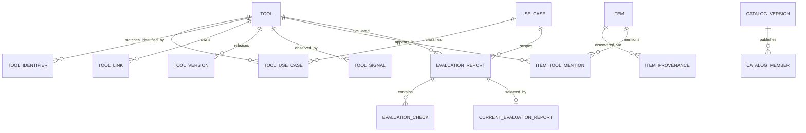
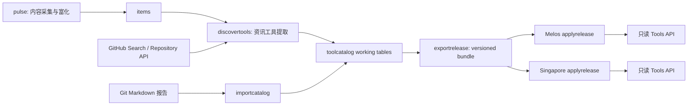
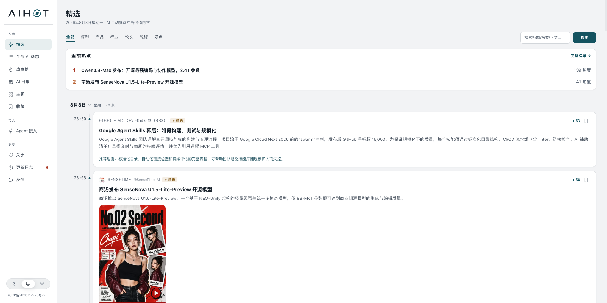
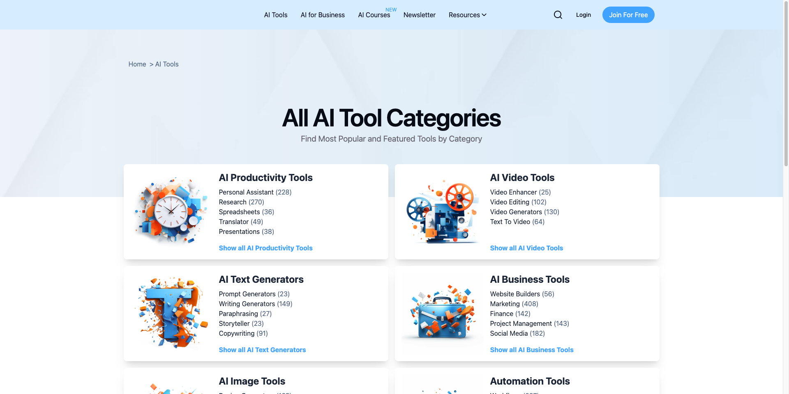
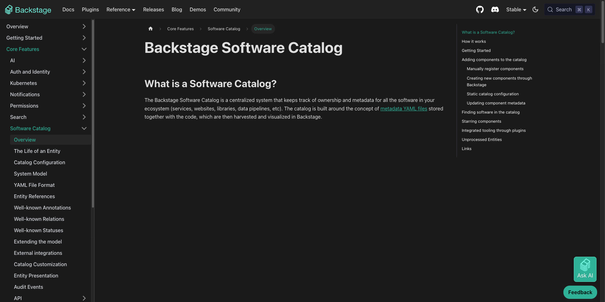
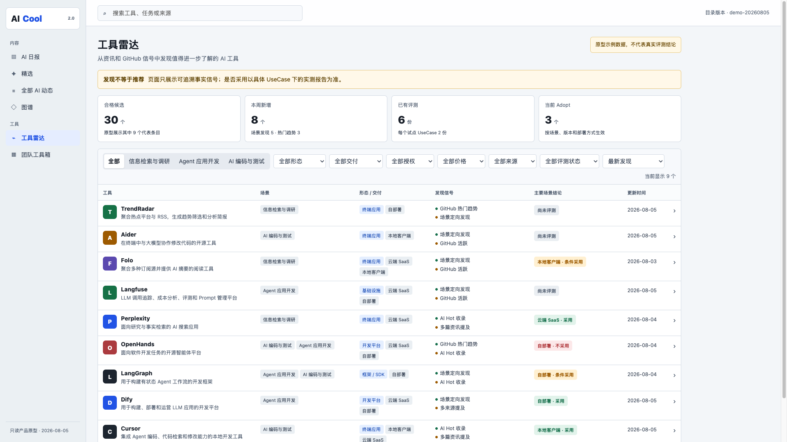
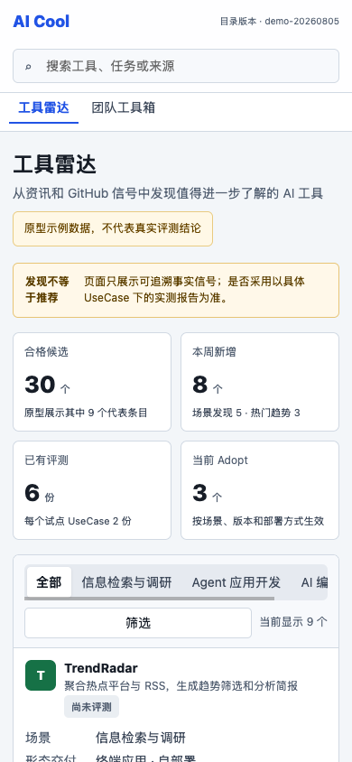

# AI Cool 2.0 产品技术方案

| 项目     | 内容                                                 |
| ------ | -------------------------------------------------- |
| 方案状态   | 可进入技术评审与排期                                         |
| 版本     | v1.0                                               |
| 日期     | 2026-08-05                                         |
| 建设方式   | 在现有 AI Cool 上增量建设，不重做资讯主链路                         |
| 新增产品面  | 工具雷达、工具详情/评测报告、团队工具箱                               |
| 首期访问方式 | 匿名只读，不新增登录、权限和写操作页面                                |
| 部署范围   | Melos 内网站点与新加坡公网站点同时发布同一构建和同一公开数据版本                |
| 交互原型   | [`./prototype/index.html`](./prototype/index.html) |

> 本目录是新的实施基线。原版方案与原型继续保留，既不覆盖，也不作为本方案的功能验收范围。

## 0. 方案摘要

AI Cool 已经具备 RSS、公众号语料、LLM 富化、日报、精选、热点与图谱。2.0 不重做这些能力，而是在同一产品中补上一条“从资讯信号到工具结论”的链路：

```text
RSS / 公众号 / AI Hot
        ↓
现有资讯采集、去重与富化
        ↓ 提取工具提及
工具原始信号 ← GitHub 场景搜索 / 热门趋势
        ↓ 身份归一、去重、质量门槛
工具雷达
        ↓ 评测组线下实测
Git 中的结构化 Markdown 报告
        ↓ 校验、审核、导入
工具详情 / 评测结论
        ↓ 最新明确结论为 Adopt
团队工具箱
```

本期采用以下边界：

1. **AI Hot 是正式资讯来源。** 条目经过自动去重和质量筛选后进入现有资讯流，不只是做覆盖率对比。
2. **产品页面只读。** 不建设在线评测任务、报告编辑、申请评测、来源管理或用户账号。
3. **发现自动化，效果评测人工完成。** 系统发现候选、整理事实信号；评测组在线下执行真实任务。
4. **报告以 Git 为内容源。** 报告采用 Markdown + YAML Front Matter，经审核后导入 PostgreSQL。
5. **发现不等于推荐。** 雷达不展示综合总分和工具排行榜；团队工具箱只展示当前明确结论为 `adopt` 的场景化条目。
6. **结论绑定范围。** 一个结论必须绑定工具、使用场景、工具版本、部署方式和评测日期。
7. **不做自动过期。** 时间推进和新版本发布只产生提示，不会自动改变结论或把工具移出工具箱；只有新的明确评测结论能够替换当前结论。
8. **两个站点功能、数据和展示一致。** 同一发布版本下使用同一前后端构建与公开数据包；工具、报告和当前 Adopt 记录的 ID 集合必须一致。

### AI Hot 作为信息源的准确含义

AI Hot 在本方案中承担“聚合采集渠道”的角色。例如一条内容可能是：

```text
采集渠道 ingest_source：AI Hot
原始发布方 publisher：OpenAI / 虎嗅 / 某个 GitHub 仓库
用户跳转链接 canonical_url：原始发布地址
聚合页链接 ingest_url：AI Hot 对应条目地址
```

AI Cool 可以展示从 AI Hot 正式接口取得且允许展示的字段，并保留 AI Hot 与原始发布方归属。所谓“不复制第三方全文”，是指不因为 AI Hot 收录了一篇媒体文章，就再从 AI Hot 或原站批量复制该文章的完整正文和全部图片。AI Hot 仍然是正式信息源，只是“采集渠道”和“最初发布者”需要分别记录。

## 1. 当前系统基线

### 1.1 可直接复用的能力

| 层次     | 当前实现                                                     | 2.0 复用方式                                                              |
| ------ | -------------------------------------------------------- | --------------------------------------------------------------------- |
| 资讯来源   | `server/internal/ingest` 已有 RSS 与公众号 Markdown 语料适配       | 保留现有适配器，新增有游标的 AI Hot 适配器                                             |
| 采集调度   | `server/internal/pulse` 每次独立处理来源，单源失败不阻断其他来源             | 扩展为可保存检查点、ETag 和错误状态的连接器运行器                                           |
| 原始数据   | `raw_items` 保存待处理内容，URL 哈希作为稳定 ID                        | 继续作为资讯暂存层，增加采集渠道和来源追溯                                                 |
| AI 富化  | `server/internal/pipeline` 生成中文标题、摘要、分类、相关度和推荐理由         | 资讯逻辑保持不变；工具提取使用独立任务，避免拖慢 `pulse`                                      |
| 资讯数据   | `items`、`item_terms`、`clusters`、`dailies` 已支撑列表、详情、图谱和日报 | 不把工具硬塞进 `items`，只增加文章与工具的关联表                                          |
| 公开读取接口 | `server/internal/publicapi` 已有 GET、游标分页、ETag 和公共 DTO     | 工具接口沿用同一处理模式和缓存策略                                                     |
| Web    | React + Vite，`App.tsx` 和 `Sidebar.tsx` 维护现有四个内容视图        | 保留原首页与内容导航，增加两个工具入口和一个工具详情路由                                          |
| 存储     | PostgreSQL + pgx，现有模块在启动期通过 `EnsureSchema` 幂等建表          | 新工具域独立建表和 Store；新增结构改为显式迁移，避免两个服务入口分别执行 DDL                           |
| 部署     | Melos 与新加坡均运行同一 Go/React 仓库，nginx 已支持 SPA fallback       | 使用同一前后端构建和公开数据包；额外校验 `buildRevision`、`dataVersion` 与 `catalogVersion` |

### 1.2 当前缺口

1. `ingest.Source.Fetch()` 一次返回完整结果，没有检查点、分页或 ETag，不能稳妥承载 AI Hot 增量接口。
2. `RawItem.Source` 同时承担“采集渠道”和“发布方”含义，无法表达“经 AI Hot 发现、由原站发布”。
3. 当前 URL 冲突时只忽略第二次写入，没有保存同一内容被多个来源发现的证据。
4. `items` 是资讯对象；它没有稳定工具身份、仓库节点 ID、交付形态、工具版本和评测结论。
5. 现有实体提取只生成词条，不能把“文章中提到的工具”归一到稳定 Tool。
6. 前端目前以 hash 切换视图，没有 `/tools/:slug` 详情路由和工具类型。
7. 两个部署环境各有本地 PostgreSQL；仅部署相同代码不能保证工具目录记录集合一致。

### 1.3 核心技术取舍

- **新增工具域，不扩充 `items` 成万能表。** 资讯与工具的生命周期、查询和证据完全不同。
- **内容采集和工具发现拆成两个深模块。** GitHub 是工具信号源，不应伪装成资讯源。
- **线上只读，线下发布。** 使用 Git 审核和导入程序代替登录、权限、在线编辑和审批流。
- **发布数据包保证双环境一致。** 采集、工具发现和报告导入先在唯一构建任务中完成，再生成版本化公开数据包，两个站点同时导入同一个版本。

## 2. 产品目标与范围

### 2.1 产品目标

- 在现有 AI 资讯消费链路中增加可追溯的工具发现能力。
- 让用户按实际任务，而不是按信息来源或热度寻找工具。
- 让工具详情同时呈现客观发现信号、实际评测证据和适用边界。
- 让团队工具箱成为短而明确的场景化采用清单。
- 用首批真实数据跑通“30 个候选、6 份报告、3 个 Adopt”的完整闭环。

### 2.2 本期不做

- 不重做 AI 日报、精选、全部动态和图谱。
- 不新增登录、账号、权限角色或用户写操作。
- 不建设独立评测中心、评测任务页、报告列表页和数据源管理页。
- 不让系统自动安装、运行或评测第三方工具。
- 不为单个媒体站点开发 HTML 爬虫。
- 不建设 Skill、插件或能力包上传下载。
- 不开放评论、投票、收藏、申请评测或社区功能。
- 不展示候选综合分、工具总分或全站排行榜。
- 不设置报告有效期、自动复评、自动下架或定时退出工具箱。

## 3. 信息架构与页面

现有内容导航保持不变，只新增工具域：

```text
AI Cool
├── 内容
│   ├── AI 日报
│   ├── 精选
│   ├── 全部 AI 动态
│   └── 图谱
└── 工具
    ├── 工具雷达        /tools
    ├── 工具详情        /tools/:slug
    └── 团队工具箱      /toolbox
```

### 3.1 工具雷达 `/tools`

只展示通过质量门槛的候选工具，固定提示“收录表示值得进一步了解，不代表实际效果或团队推荐”。

| 能力   | 设计                                       |
| ---- | ---------------------------------------- |
| 主分类  | 3 个首期 UseCase                            |
| 筛选   | 产品形态、交付方式、开源情况、价格模式、发现来源、是否已有评测          |
| 排序   | 最新发现、最近更新、来源提及最多、GitHub 活跃度、已完成评测        |
| 列表信息 | 名称、用途、场景、形态、交付方式、发现原因、GitHub/资讯事实信号、评测结论 |
| 入口   | 点击进入 `/tools/:slug`                      |

前台不显示后台优先级分，也不允许从雷达直接执行“采用”或其他写操作。

### 3.2 工具详情 `/tools/:slug`

工具详情是工具事实、发现证据和评测报告的唯一聚合页：

- 工具名称、简介、产品形态、交付方式、价格模式、许可证。
- 官方网站、官方仓库和当前可观测版本。
- 所属 UseCase 与具体任务标签。
- 首次发现、最近发现、AI Hot/资讯/GitHub 等信号时间线。
- 关联资讯和原始链接。
- 按 UseCase 展示评测报告、评测版本、部署方式、评测日期和结论。
- 如果当前观察版本晚于评测版本，只显示“评测后已有新版本”的提示，不改变结论。

### 3.3 团队工具箱 `/toolbox`

团队工具箱不是另一份候选列表，而是从最新明确结论中派生：

```text
对同一 Tool + UseCase + DeploymentMode
读取由新报告显式替换后形成的 current report
若 decision = adopt，则进入工具箱
否则不进入
```

时间不会自动修改上述结果。只有导入一份更新的明确结论，工具箱才会发生变化。

### 3.4 资讯与工具互链

- 资讯详情增加“本文提到的工具”，链接到工具详情。
- 工具详情增加“相关资讯”，链接到现有资讯详情。
- 首页不新增综合工作台；日报中的“新发现工具”属于后续轻量增强，不是首期验收项。

## 4. 分类体系与首期 UseCase

工具不使用一个混合概念的 `category` 字段，而是拆成正交属性：

| 字段                 | 取值示例                                                                 | 规则          |
| ------------------ | -------------------------------------------------------------------- | ----------- |
| `primary_use_case` | `ai-research`                                                        | 单选，用作主要展示归属 |
| `use_case_tags`    | `fact-checking`、`report-writing`                                     | 多选，描述具体任务   |
| `product_form`     | `end_user_app`、`developer_platform`、`framework_sdk`、`infrastructure` | 单选          |
| `delivery_modes`   | `cloud_saas`、`local_client`、`self_hosted`、`hybrid`                   | 多选          |
| `license_type`     | `commercial`、`open_source`、`source_available`、`unknown`              | 单选          |
| `pricing_model`    | `free`、`freemium`、`subscription`、`usage_based`、`self_hosted`         | 单选          |

首期固定 3 个 UseCase，不提供页面自定义：

| ID               | 名称              | 典型任务                    | 首期成功标准示例                   |
| ---------------- | --------------- | ----------------------- | -------------------------- |
| `ai-research`    | AI 信息检索与竞品调研    | 聚合检索、来源核验、竞品整理、研究报告     | 能回到来源；事实与生成内容可区分；结果可导出复核   |
| `agent-app-dev`  | Agent 与 AI 应用开发 | 工作流编排、RAG、模型接入、Agent 应用 | 能完成目标工作流；部署和数据边界明确；具备调试手段  |
| `ai-coding-test` | AI 编码与测试自动化     | 编码、审查、浏览器自动化、接口/UI 测试   | 能在真实代码或测试任务中复现；失败和人工接管路径明确 |

产品形态决定附加评测模板，UseCase 决定本次测试的成功标准；两者不能互相替代。

首期 `use_case_tags` 使用受控词表进一步细分，不再增加新的一级分类：

| UseCase          | 首期任务标签                                                                                           |
| ---------------- | ------------------------------------------------------------------------------------------------ |
| `ai-research`    | `source-discovery`、`cross-source-search`、`fact-checking`、`competitive-analysis`、`report-writing` |
| `agent-app-dev`  | `workflow-orchestration`、`rag`、`model-integration`、`observability-evaluation`、`deployment`       |
| `ai-coding-test` | `code-generation-edit`、`code-review`、`terminal-agent`、`browser-testing`、`api-testing`            |

导入时未知标签直接报错；增加或重命名标签必须修改版本化词表并迁移已有工具，避免同义标签逐渐失控。

## 5. 资讯来源与 AI Hot 接入

### 5.1 首期来源矩阵

| 来源          | 角色        | 接入方式                            | 进入资讯流 | 产生工具信号 |
| ----------- | --------- | ------------------------------- | -----:| ------:|
| 现有 RSS/Atom | 正式资讯来源    | 复用 `RSSSource`，配置化扩充官方源         | 是     | 是      |
| 公众号白名单语料    | 正式资讯来源    | 复用 `MPCorpusSource`             | 是     | 是      |
| AI Hot      | 正式聚合资讯来源  | 官方 `/api/v1` 接口，增量检查点与 ETag     | 是     | 是      |
| GitHub      | 工具事实和发现来源 | 官方 REST Search/Repositories API | 否     | 是      |

媒体站点只有在提供稳定官方 RSS/API 时才进入通用配置；没有标准接口的站点先不开发专用爬虫。

### 5.2 两个技术接口，而不是一个万能 Source

内容采集和工具发现具有不同语义，分别定义两个深接口。Runner 不解释连接器自己的游标，只负责租约、限流、重试、运行记录和检查点提交：

```go
type PullRequest struct {
    Checkpoint json.RawMessage
    Limit      int
}

type PullResult struct {
    NextCheckpoint json.RawMessage
    HasMore        bool
    RetryAt        *time.Time
}

type ContentConnector interface {
    Key() string
    Pull(ctx context.Context, req PullRequest, emit ContentEmit) (PullResult, error)
}

type ToolSignalProvider interface {
    Key() string
    Pull(ctx context.Context, req PullRequest, emit SignalEmit) (PullResult, error)
}
```

`ContentConnector` 的适配器为 RSS、公众号语料和 AI Hot；`ToolSignalProvider` 的适配器为资讯工具提取、GitHub 场景搜索和 GitHub 热门趋势。分页结果逐条 `emit`，避免一次把全部历史记录放进内存。

内容 Observation 至少包含：

```go
type ContentObservation struct {
    Operation     string // upsert | remove
    ExternalKey   string
    RevisionKey   string
    ChangedAt     *time.Time
    CanonicalURL  string
    IngestURL     string
    Publisher     string
    Title         *string
    Summary       *string
    PublishedAt   *time.Time
    Attribution   map[string]string
    Payload       json.RawMessage
}
```

每个来源还显式配置 `ContentPolicy`，声明可保存的字段、是否允许正文抓取、语言处理和归因要求，不再通过 `source_kind == "rss"` 隐式决定抓全文或翻译。所有 Observation 成功幂等持久化后才提交检查点；中途失败可以重放。`connector_key + external_key` 定位当前来源证据，`revision_key/payload_hash` 相同则不重复处理，变化时更新当前证据。一个连接器失败只记录自己的错误和下次重试时间，不回滚其他连接器。

### 5.3 AI Hot 同步策略

1. 首次调用 `GET /api/v1/selected/snapshot`，`limit` 取允许范围内的 1000，按 `page` 读取到 `hasMore=false`；整个快照落库完成后才保存第一页返回的变更游标。
2. 后续调用 `GET /api/v1/selected/changes?cursor=...&limit=100`，把 `upsert/remove` 都先写成 Observation；`remove` 是只有 `op/changedAt/id` 的 tombstone，不要求标题或链接。逐页投影完成且整批成功后才持久化新游标。
3. `409 snapshot_required` 表示游标不可继续，重新构建快照；不能把旧接口、其他查询或其他日期的 cursor 混用。快照使用新的 generation，全部分页成功后执行 mark-and-sweep：把该连接器旧 generation 中存在、但本轮未出现的 evidence 设为 `present=false`，失败的半个快照不能执行 sweep。
4. `ETag/If-None-Match` 命中 `304` 时只更新成功时间；`429/503` 遵守 `Retry-After`，不做无界立即重试。
5. 保存 `schemaVersion` 并做契约校验。接口字段不兼容时阻断该来源本轮提交，不让半批数据进入正式资讯流。
6. 使用 `links.original` 作为原始跳转，`links.aihot` 作为聚合证据，分别保存 `source.name` 与 `attribution.name/url`。AI Hot 当前契约没有“是否由 AI 生成”的布尔字段，不能自行推断或默认为否；只有上游未来明确提供且契约测试通过后才增加对应展示。
7. `links.original` 存在时先规范化并沿用现有 URL 稳定 ID；缺失时以 `aihot:<item.id>` 作为来源身份并跳转聚合页，后续取得原始链接再通过 provenance 合并，不凭标题自动合并。
8. 同一内容被 RSS、公众号或 AI Hot 多次发现时，只保留一个 `items` 记录，同时保存每条采集证据。`remove` 只关闭 AI Hot 当前精选证据，不删除历史资讯或其他来源证据。
9. 通过现有 AI 相关度、内容质量和重复检查后，AI Hot 条目自动进入资讯流，不要求人工逐条审核。
10. `/api/v1/items` 只用于 24 小时或 7 天短窗巡检和漏采诊断，不承担可恢复的完整同步；接口不可用时只停止 AI Hot 增量。

正式实现只使用 AI Hot 当前公开的 `/api/v1` 匿名只读契约，并以上线时的 [Agent/API 接入页](https://aihot.virxact.com/agent?tab=api)、[OpenAPI 1.1.0](https://aihot.virxact.com/openapi-v1.json)、[`llms.txt`](https://aihot.virxact.com/llms.txt) 和[服务条款](https://aihot.virxact.com/terms)进行契约测试。该服务没有公开固定吞吐配额或 SLA，因此方案不承诺依靠它实现实时、全文或全量历史检索。

### 5.4 资讯来源追溯改造

保持现有 `items.source` 为原始发布方，`items.url` 为原始链接。先增加独立的耐久 Observation 暂存层，保存所有上游修订，包括尚未通过质量门槛、没有原始链接和最终被拒绝的记录：

```sql
CREATE TABLE source_observations (
    id                 TEXT PRIMARY KEY,
    connector_key      TEXT NOT NULL,
    source_run_id      TEXT NOT NULL,
    operation          TEXT NOT NULL CHECK (operation IN ('upsert', 'remove')),
    external_id        TEXT NOT NULL,
    revision_key       TEXT NOT NULL,
    changed_at         TIMESTAMPTZ,
    canonical_url      TEXT,
    ingest_url         TEXT,
    publisher          TEXT,
    title              TEXT,
    summary            TEXT,
    published_at       TIMESTAMPTZ,
    attribution        JSONB NOT NULL DEFAULT '{}',
    payload            JSONB NOT NULL,
    payload_hash       TEXT NOT NULL,
    observed_at        TIMESTAMPTZ NOT NULL,
    projection_status  TEXT NOT NULL DEFAULT 'pending',
    projected_item_id  TEXT REFERENCES items(id) ON DELETE SET NULL,
    rejection_reason   TEXT,
    CHECK (operation = 'remove' OR title IS NOT NULL),
    UNIQUE (connector_key, external_id, revision_key)
);
```

上游有明确 revision 时直接使用；没有时，upsert 以规范化 payload 的 SHA-256、remove 以 `op + external_id + changedAt` 的 SHA-256 作为 `revision_key`。每次 `emit` 先幂等写 `source_observations`，全部 emit 成功且 `Pull` 正常返回后才推进 `source_states.checkpoint`。进程中断时上游批次会重放，但相同 revision 不会重复投影。remove 投影把对应 `item_provenance.present` 设为 false；不存在对应 evidence 时安全 no-op，tombstone 仍保留为已处理 Observation。

投影 Worker 再把 pending Observation 转成现有 `raw_items`。`raw_items` 新增 `observation_id`、`connector_key`、`external_id`、`revision_key`、`payload_hash` 和 `ingest_url`；有原始链接时继续用规范 URL 生成 ID，没有时用 `connector_key + external_id` 生成稳定 ID。写入语义从 `ON CONFLICT DO NOTHING` 改为：hash 相同 no-op；hash 变化则更新允许字段并将 `processed=false`，重新进入现有 pipeline。质量检查失败时只把 Observation 标为 `rejected` 并记录原因，不丢弃原始记录。

内容进入正式 `items` 后，再保存面向查询的多来源证据：

```sql
CREATE TABLE item_provenance (
    item_id          TEXT NOT NULL REFERENCES items(id) ON DELETE CASCADE,
    connector_key    TEXT NOT NULL,
    external_id      TEXT NOT NULL,
    ingest_url       TEXT,
    first_seen_at    TIMESTAMPTZ NOT NULL,
    last_seen_at     TIMESTAMPTZ NOT NULL,
    payload_hash     TEXT NOT NULL,
    attribution      JSONB NOT NULL DEFAULT '{}',
    present          BOOLEAN NOT NULL DEFAULT TRUE,
    PRIMARY KEY (connector_key, external_id),
    UNIQUE (item_id, connector_key, external_id)
);
```

这解决当前 `ON CONFLICT DO NOTHING` 会丢失“同一内容被其他来源再次发现”证据的问题。

连接器运行状态单独保存为 `source_states(connector_key, checkpoint, etag, last_success_at, retry_at)` 与 `source_runs(id, connector_key, started_at, finished_at, status, emitted_count, error_class)`。Observation、检查点提交和投影分别有独立状态，确保失败可恢复。日志只记录错误分类和上游请求 ID，不记录凭据或完整响应正文。

公共布局页脚固定提供可发现的 [Data source: AI HOT](https://aihot.virxact.com/) 链接；经 AI Hot 进入的资讯卡片和详情还显示可点击的“采集渠道：AI Hot”，指向该条目的 `links.aihot`，同时保留原始发布方与 `links.original`。

## 6. 工具发现、归一与质量门槛

### 6.1 独立发现任务

工具提取不加入现有 `pulse` 的资讯富化循环，而由新的 `discovertools` 命令处理，避免工具抽取失败或 GitHub 限流影响资讯更新。

```text
items 新增内容
  → ContentMentionProvider
  → LLM 提取工具名称、链接、形态、UseCase 候选
  → tool_signals

GitHub UseCase 查询
  → GitHubTargetedProvider
  → tool_signals

GitHub 新建/活跃仓库查询 + 每日快照
  → GitHubHotProvider
  → 7 日 Star/Fork/提交变化
  → tool_signals
```

每条信号都保留发现原因：

```text
content_mention
aihot_mention
github_use_case
github_hot
github_release
```

### 6.2 GitHub 双通道

**场景定向发现为主：** 根据 3 个 UseCase 的关键词、Topic 和排除词调用官方 [`GET /search/repositories`](https://docs.github.com/en/rest/search/search?apiVersion=2026-03-10#search-repositories)。每个查询固定 `is:public`、`archived:false`、场景词与最低活跃条件；把长查询拆成可追溯的小查询，保存 query ID 和查询版本。

**热门趋势发现为辅：** 使用 `created:`、`pushed:` 和最低 `stars:` 查询近期新建或活跃项目，对入池仓库保存每日快照，自行计算 `stars_delta_7d`、`forks_delta_7d`、最近提交和 Release 时间。不抓取 GitHub Trending 网页，也不把总 Star、Search 的 `score` 或 `watchers_count` 当成质量结论。

连接器固定 `Accept: application/vnd.github+json` 和 `X-GitHub-Api-Version: 2026-03-10`。单页最多 100 条、单个搜索最多可取 1000 条；遇到 `incomplete_results=true` 时标记本轮不完整，并通过拆分日期或场景查询补采。Search 和普通 REST 配额分开记录，以响应的 `x-ratelimit-*` 和 `retry-after` 为准，不把当前额度写死为系统容量承诺。热门仓库的逐 Star 历史翻页成本过高，因此趋势只对已入池候选做每日聚合快照。

GitHub Search 不提供可长期恢复的 cursor，不能把页码当成跨日检查点。这里的 `Checkpoint` 只保存 `query_set_version + last_completed_window_end`：每轮固定 `window_end`，从上次结束时间向前重叠 24 小时重扫 `created/pushed` 时间窗，在同一窗口内按页读取；结果按 Repository `node_id + signal_type + observed_on` 幂等去重。窗口出现 1000 条上限或 `incomplete_results=true` 时递归拆成更小时间窗，全部子窗口完成后才推进 `last_completed_window_end`。

热门仓库必须先映射到至少一个 UseCase 并通过质量门槛，才能出现在工具雷达。场景匹配优先于单纯热度。

### 6.3 工具身份归一

匹配优先级从强到弱：

1. 相同 GitHub Repository `node_id`。
2. 相同官方域名或规范化仓库 URL。
3. Git 中维护的明确别名映射。
4. 名称相似且链接不同的情况只生成合并建议，不自动合并。

LLM 可以辅助判断产品形态和 UseCase，但不能成为身份合并的唯一依据。无法确认身份的信号留在原始层。

### 6.4 前台质量门槛

后台保存全部 `ToolSignal`；只有同时满足以下条件的 Tool 才标记为 `qualified`：

- 有可访问的官方网站或官方仓库。
- 名称、简介和主要用途能够确认。
- 至少映射到首期 3 个 UseCase 之一。
- 属于可直接完成任务的应用、平台、框架或基础设施工具。
- 不是单独的模型、数据集、论文、课程、资讯站或团队能力包。
- 已完成确定性去重，没有未解决的强身份冲突。
- 来源、首次发现时间和最近发现时间可追溯。
- 仓库归档、许可证未知等风险已被显式标记；没有展示价值的归档仓库默认不进入前台。

质量门槛输出通过/不通过和具体原因，不输出综合数字分。

## 7. 评测报告与 Git 发布流程

### 7.1 评测职责

系统负责整理候选和客观信号，不在线运行第三方工具。评测组在独立环境中完成安装、任务执行、对比和失败记录，然后提交结构化报告。

评测由三层模板组成：

1. **通用检查表**：场景适配、实际效果、易用性、性能稳定性、集成能力、部署运维、数据安全、成本授权、维护持续性、限制与替代方案。
2. **产品形态检查表**：SaaS、开源自部署、开发平台/API、框架/SDK、基础设施分别增加必测项。
3. **UseCase 成功标准**：使用本方案第 4 节中固定场景的具体成功标准。

每个检查项使用 `conform / partial / nonconform / not_tested`，同时给出证据。系统不把分项相加成总分。

### 7.2 结论范围

一份评测结论的完整身份不是 Tool，而是：

```text
Tool + UseCase + ToolVersion + DeploymentMode + EvaluatedDate
```

其中 Tool + UseCase + DeploymentMode 是“当前结论槽位”，ToolVersion + EvaluatedDate 标明该槽位中本次报告实际测试的对象与时间。同一工具可以在不同场景或部署方式下得到不同结论。例如自部署适合内部原型，不代表其云端版本适合相同数据边界。

`decision` 只有：

```text
adopt
conditional
not_adopt
```

没有报告的工具显示“尚未评测”，不额外创建一个 Decision 值。

### 7.3 文件格式

模板与词表也进入 Git，建议目录如下：

```text
catalog/
├── schemas/evaluation-report.schema.json
├── vocabularies/tool-taxonomy.yaml
├── templates/common-v1.yaml
├── templates/product-forms/<product-form>-v1.yaml
├── templates/use-cases/<use-case>-v1.yaml
└── evaluations/<tool-slug>/<report-id>.md
```

评测报告存放在新目录 `catalog/evaluations/<tool-slug>/`。每份报告是一个 Markdown 文件，结构化字段放在 YAML Front Matter 中：

```markdown
---
report_id: dify-agent-app-dev-self-hosted-2026-08
tool_slug: dify
tool_version: 1.8.x
use_case: agent-app-dev
deployment_mode: self_hosted
evaluated_at: 2026-08-05
decision: adopt
evaluators:
  - evaluator-a
reviewed_by:
  - reviewer-b
supersedes_report_id: ""
templates:
  common: common-v1
  product_form: developer-platform-v1
  use_case: agent-app-dev-v1
checks:
  scenario_fit:
    result: conform
    evidence: "完成固定的 RAG 与工作流任务，见正文 4.1"
  task_effect:
    result: conform
    evidence: "3 组样例均达到预先定义的成功条件，见正文 4.2"
  usability:
    result: partial
    evidence: "基础配置可完成，复杂分支仍需开发者介入，见正文 4.3"
  stability_performance:
    result: conform
    evidence: "连续运行记录见正文 4.4"
  integration:
    result: conform
    evidence: "模型与知识库接入记录见正文 4.5"
  deployment_operations:
    result: partial
    evidence: "升级与回滚仍需补充脚本，见正文 4.6"
  data_security:
    result: conform
    evidence: "使用脱敏样例验证自部署数据边界，见正文 4.7"
  cost_license:
    result: conform
    evidence: "授权与成本核对见正文 4.8"
  maintenance:
    result: conform
    evidence: "版本与维护信号见正文 4.9"
  limitations_alternatives:
    result: conform
    evidence: "限制和替代方案见正文 5"
  workflow_debugging:
    result: partial
    evidence: "复杂分支调试需要查看运行日志，见正文 4.11"
  rag_workflow_success:
    result: conform
    evidence: "固定 RAG 场景通过全部成功条件，见正文 4.12"
---

## 结论摘要

## 测试任务与环境

## 测试方法和成功标准

## 分项结果与证据

## 失败、限制与不适用场景

## 替代方案

## 评测者观点
```

文件只记录本次实际评测日期，不包含自动到期或定时退出字段。

### 7.4 导入与审核

```text
评测人员完成报告
→ 指定人员提交 Git PR
→ CI 执行 importcatalog --check
→ 至少一名评测组成员审核
→ 合并
→ 目录构建任务执行 importcatalog --apply
→ 生成 release bundle
→ 两个站点 prepare 成功后同时 activate
```

`importcatalog` 必须做到：

- 验证报告 ID、工具 slug、UseCase、部署方式、日期、Decision 和模板版本；`reviewed_by` 至少包含一名已登记且未参与本次执行的评测成员。
- 验证通用、产品形态和 UseCase 的必填检查项；每项同时包含合法结果和非空证据。
- 验证 Markdown 必备章节和链接格式。
- 使用 `report_id + content_hash` 幂等导入。
- 相同 `report_id` 和 hash 重导入为 no-op；相同 ID 但 hash 不同则拒绝，修订必须使用新 ID 并显式替换旧报告。
- 在一个事务中写入报告、检查项和当前结论。
- 同一槽位已有报告时，要求 `supersedes_report_id` 精确指向当前报告；导入成功后才原子切换 current pointer。首份报告该字段为空。
- 保存 `source_file`、`source_commit`、`content_hash` 和 `imported_at`。
- Markdown 使用项目已有 goldmark 渲染，并用 bluemonday 清洗后才进入公开接口。

时间不会使报告失效。如果要改变结论，提交新的报告并通过 `supersedes_report_id` 指向被替换报告；工具箱只读取 current pointer 指向的明确结论。

### 7.5 版本变化提示

GitHub 或官方 Release 发现新版本时更新相同部署方式下 `tool_versions.is_latest` 指向的观察版本。详情页将它与报告的 `tool_version` 比较：

```text
评测版本：1.8.x，评测日期：2026-08-05
当前观察版本：1.10.0，工具在评测后已有更新
```

该提示不触发自动复评、不修改 Decision，也不影响工具箱记录。

## 8. 数据模型

### 8.1 实体关系



### 8.2 核心表

以下是逻辑结构。现有表暂时保留原来的 `EnsureSchema`，新增工具域通过 `server/migrations` 中带版本号和 checksum 的迁移创建；`cmd/migrate` 是唯一 DDL 执行入口，Web 和 Worker 启动时只检查最低 schema version。

```sql
CREATE TABLE use_cases (
    id               TEXT PRIMARY KEY,
    name             TEXT NOT NULL,
    description      TEXT NOT NULL,
    success_criteria JSONB NOT NULL,
    github_queries   JSONB NOT NULL,
    sort_order       INTEGER NOT NULL
);

CREATE TABLE tools (
    id                      TEXT PRIMARY KEY,
    slug                    TEXT NOT NULL UNIQUE,
    name                    TEXT NOT NULL,
    summary                 TEXT NOT NULL,
    product_form            TEXT NOT NULL,
    delivery_modes          TEXT[] NOT NULL,
    license_type            TEXT NOT NULL,
    pricing_model           TEXT NOT NULL,
    official_url            TEXT,
    repo_url                TEXT,
    qualification_status    TEXT NOT NULL,
    qualification_reason    TEXT NOT NULL,
    first_discovered_at     TIMESTAMPTZ NOT NULL,
    last_discovered_at      TIMESTAMPTZ NOT NULL,
    updated_at              TIMESTAMPTZ NOT NULL
);

CREATE TABLE tool_identifiers (
    identifier_type TEXT NOT NULL,
    identifier_value TEXT NOT NULL,
    tool_id         TEXT NOT NULL REFERENCES tools(id) ON DELETE CASCADE,
    verified_by     TEXT NOT NULL,
    verified_at     TIMESTAMPTZ NOT NULL,
    PRIMARY KEY (identifier_type, identifier_value)
);

CREATE TABLE tool_versions (
    id              TEXT PRIMARY KEY,
    tool_id         TEXT NOT NULL REFERENCES tools(id) ON DELETE CASCADE,
    deployment_mode TEXT NOT NULL,
    version         TEXT NOT NULL,
    source_kind     TEXT NOT NULL,
    source_url      TEXT,
    released_at     TIMESTAMPTZ,
    observed_at     TIMESTAMPTZ NOT NULL,
    is_latest       BOOLEAN NOT NULL DEFAULT FALSE,
    UNIQUE (tool_id, deployment_mode, version),
    UNIQUE (id, tool_id, deployment_mode)
);

CREATE UNIQUE INDEX tool_versions_one_latest_idx
    ON tool_versions (tool_id, deployment_mode) WHERE is_latest;

CREATE TABLE tool_use_cases (
    tool_id      TEXT NOT NULL REFERENCES tools(id) ON DELETE CASCADE,
    use_case_id  TEXT NOT NULL REFERENCES use_cases(id),
    is_primary   BOOLEAN NOT NULL DEFAULT FALSE,
    task_tags    TEXT[] NOT NULL DEFAULT '{}',
    PRIMARY KEY (tool_id, use_case_id)
);

CREATE UNIQUE INDEX tool_use_cases_one_primary_idx
    ON tool_use_cases (tool_id) WHERE is_primary;

CREATE TABLE tool_links (
    tool_id       TEXT NOT NULL REFERENCES tools(id) ON DELETE CASCADE,
    kind          TEXT NOT NULL,
    canonical_url TEXT NOT NULL,
    PRIMARY KEY (tool_id, kind, canonical_url)
);

CREATE TABLE tool_signals (
    id             TEXT PRIMARY KEY,
    tool_id        TEXT REFERENCES tools(id),
    signal_type    TEXT NOT NULL,
    provider       TEXT NOT NULL,
    external_id    TEXT NOT NULL,
    source_url     TEXT NOT NULL,
    observed_at    TIMESTAMPTZ NOT NULL,
    facts          JSONB NOT NULL,
    UNIQUE (provider, external_id, signal_type)
);

CREATE TABLE github_repo_snapshots (
    github_node_id TEXT NOT NULL,
    captured_on    DATE NOT NULL,
    stars          INTEGER NOT NULL,
    forks          INTEGER NOT NULL,
    open_issues    INTEGER NOT NULL,
    pushed_at      TIMESTAMPTZ,
    release_tag    TEXT,
    PRIMARY KEY (github_node_id, captured_on)
);

CREATE TABLE item_tool_mentions (
    item_id          TEXT NOT NULL REFERENCES items(id) ON DELETE CASCADE,
    tool_id          TEXT NOT NULL REFERENCES tools(id) ON DELETE CASCADE,
    mention_evidence TEXT NOT NULL,
    extracted_at     TIMESTAMPTZ NOT NULL,
    PRIMARY KEY (item_id, tool_id)
);

CREATE TABLE evaluation_reports (
    id                    TEXT PRIMARY KEY,
    tool_id               TEXT NOT NULL REFERENCES tools(id),
    use_case_id           TEXT NOT NULL REFERENCES use_cases(id),
    tool_version_id       TEXT NOT NULL,
    deployment_mode       TEXT NOT NULL,
    evaluated_at          DATE NOT NULL,
    decision              TEXT NOT NULL,
    evaluators            TEXT[] NOT NULL,
    reviewed_by           TEXT[] NOT NULL,
    supersedes_report_id  TEXT REFERENCES evaluation_reports(id),
    report_markdown       TEXT NOT NULL,
    report_html           TEXT NOT NULL,
    source_file           TEXT NOT NULL,
    source_commit         TEXT NOT NULL,
    content_hash          TEXT NOT NULL,
    imported_at           TIMESTAMPTZ NOT NULL,
    UNIQUE (id, tool_id, use_case_id, deployment_mode),
    FOREIGN KEY (tool_version_id, tool_id, deployment_mode)
        REFERENCES tool_versions (id, tool_id, deployment_mode)
);

CREATE TABLE evaluation_checks (
    report_id       TEXT NOT NULL REFERENCES evaluation_reports(id) ON DELETE CASCADE,
    dimension_key   TEXT NOT NULL,
    result          TEXT NOT NULL,
    evidence        TEXT NOT NULL,
    PRIMARY KEY (report_id, dimension_key)
);

CREATE TABLE current_evaluation_reports (
    tool_id          TEXT NOT NULL REFERENCES tools(id),
    use_case_id      TEXT NOT NULL REFERENCES use_cases(id),
    deployment_mode  TEXT NOT NULL,
    report_id        TEXT NOT NULL UNIQUE,
    updated_at       TIMESTAMPTZ NOT NULL,
    PRIMARY KEY (tool_id, use_case_id, deployment_mode),
    FOREIGN KEY (report_id, tool_id, use_case_id, deployment_mode)
        REFERENCES evaluation_reports (id, tool_id, use_case_id, deployment_mode)
);

CREATE TABLE catalog_versions (
    id            TEXT PRIMARY KEY,
    content_hash  TEXT NOT NULL UNIQUE,
    source_commit TEXT NOT NULL,
    generated_at  TIMESTAMPTZ NOT NULL
);

CREATE TABLE catalog_members (
    catalog_version_id TEXT NOT NULL REFERENCES catalog_versions(id) ON DELETE CASCADE,
    member_type        TEXT NOT NULL,
    member_id          TEXT NOT NULL,
    content_hash       TEXT NOT NULL,
    PRIMARY KEY (catalog_version_id, member_type, member_id)
);
```

所有状态字段在 Go 中使用显式常量并在 SQL 中加 `CHECK`，不让任意字符串进入数据库。

### 8.3 当前结论与工具箱视图

```sql
CREATE VIEW current_tool_decisions AS
SELECT r.*
FROM current_evaluation_reports c
JOIN evaluation_reports r ON r.id = c.report_id;

CREATE VIEW toolbox_entries AS
SELECT * FROM current_tool_decisions
WHERE decision = 'adopt';
```

current pointer 只在通过校验的新报告显式替换当前报告时更新；视图不引用当前时间，因此报告不会因为日期推进而自动消失。

导入器将 Front Matter 中的 `tool_version` 解析为相同 `tool_id + deployment_mode + version` 的 `tool_versions.id`，不存在时先以报告为证据创建版本记录，再写报告。切换 current pointer 时对槽位执行 `SELECT ... FOR UPDATE`，并以 `supersedes_report_id` 作为 expected value 做 CAS；预期旧值不匹配则整笔事务失败，防止两个并发导入互相覆盖。

## 9. 后端模块设计

### 9.1 模块与文件责任

| 模块      | 建议路径                                                                | 责任                                             |
| ------- | ------------------------------------------------------------------- | ---------------------------------------------- |
| 来源运行器   | `server/internal/source`                                            | 检查点、运行记录、租约、重试、来源追溯和 ContentPolicy             |
| 内容连接器   | `server/internal/connectors/{rss,mpcorpus,aihot}`                   | 把上游协议转换为 Content Observation，不访问工具域            |
| 工具目录    | `server/internal/toolcatalog`                                       | Tool、UseCase、Signal、Report 的领域类型、Store、查询和质量门槛 |
| 工具发现    | `server/internal/tooldiscovery`、`server/internal/connectors/github` | 资讯提取、GitHub 双通道、快照增量和身份解析                      |
| 报告导入    | `server/internal/evaluationimport`                                  | Front Matter/Markdown 解析、三层模板校验和事务导入           |
| 公共读取    | `server/internal/publicapi`                                         | 工具列表、详情和工具箱 DTO/handler                        |
| HTTP 装配 | `server/internal/httpapp`                                           | 维护唯一公共路由清单，分别适配 Nuwa 和标准 `net/http`，避免入口漂移     |
| 数据迁移    | `server/migrations`、`server/cmd/migrate`                            | 迁移顺序、checksum、advisory lock 与最低版本检查            |
| 目录构建命令  | `server/cmd/discovertools`                                          | 运行资讯提取和 GitHub 发现                              |
| 报告导入命令  | `server/cmd/importcatalog`                                          | 校验并导入 Git 报告                                   |
| 数据发布命令  | `server/cmd/exportrelease`、`server/cmd/applyrelease`                | 生成、校验和导入双环境公开数据包                               |

`toolcatalog.Store` 是工具域的唯一数据库接口；页面 handler、发现任务和报告导入都不直接拼写工具域 SQL。身份解析器只返回确定匹配、创建新工具或冲突三种结果，把合并复杂度封装在模块内部。

### 9.2 任务边界



资讯更新失败不应阻断已有工具读取；GitHub 限流不应阻断 AI Hot/RSS；报告文件错误不应发布半个数据版本。三条链路通过 Store 和发布数据包连接，而不是互相嵌套调用。

现有 `server/cmd/webserver/main.go` 与 Nuwa HTTP 入口必须改为调用同一 `httpapp.RegisterPublicRoutes`，并用契约测试比较两套 Adapter 的方法、路径和响应。`deploy/build-linux.sh`、`server/build.sh` 及两个环境的安装脚本必须统一产出并复制 `migrate`、`discovertools`、`importcatalog`、`exportrelease`、`applyrelease`；Release manifest 对每个二进制和 Web assets 记录 SHA-256，避免出现“定时任务已配置、安装包却没有命令”的漂移。

## 10. 公开读取接口

本期只增加 GET，不增加 POST、PUT、PATCH 或 DELETE。

| 方法与路径                          | 用途                    | 关键参数                                                                                                     |
| ------------------------------ | --------------------- | -------------------------------------------------------------------------------------------------------- |
| `GET /api/public/use-cases`    | 返回固定 3 个 UseCase 和筛选项 | 无                                                                                                        |
| `GET /api/public/tools`        | 工具雷达列表                | `use_case`、`product_form`、`delivery`、`license`、`pricing`、`source`、`evaluated`、`sort`、`q`、`take`、`cursor` |
| `GET /api/public/tools/{slug}` | 工具详情、信号、关联资讯和报告       | `slug`                                                                                                   |
| `GET /api/public/toolbox`      | 当前 Adopt 条目           | `use_case`、`product_form`、`delivery`                                                                     |

列表接口只查询 `qualification_status='qualified'`。工具详情允许访问 qualified 工具，不暴露未解析的原始候选和 LLM 中间输出。

现有资讯列表/详情 DTO 增加公开来源投影，不暴露 Observation payload：

```json
{
  "publisher": "OpenAI",
  "originalUrl": "https://example.com/original",
  "provenance": [
    {
      "connectorKey": "aihot",
      "displayName": "AI Hot",
      "ingestUrl": "https://aihot.virxact.com/items/example",
      "attribution": {
        "name": "AI HOT",
        "url": "https://aihot.virxact.com/"
      },
      "present": true
    }
  ]
}
```

`provenance` 来自 `item_provenance` 的白名单字段并按 connector 稳定排序。Web 公共布局用 `attribution.url` 渲染产品级 `Data source: AI HOT`，资讯卡片/详情用 `ingestUrl` 渲染该条目的“采集渠道：AI Hot”，同时把 `originalUrl` 留给原始发布方跳转。

示例工具列表项：

```json
{
  "slug": "dify",
  "name": "Dify",
  "summary": "用于构建和运营 LLM 应用的开发平台",
  "primaryUseCase": "agent-app-dev",
  "useCaseTags": ["workflow", "rag"],
  "productForm": "developer_platform",
  "deliveryModes": ["cloud_saas", "self_hosted"],
  "licenseType": "open_source",
  "discoveryReasons": ["content_mention", "github_use_case"],
  "firstDiscoveredAt": "2026-08-01T08:00:00Z",
  "lastDiscoveredAt": "2026-08-05T08:00:00Z",
  "github": {
    "stars": 100000,
    "starsDelta7d": 1200,
    "pushedAt": "2026-08-04T12:00:00Z"
  },
  "currentDecisions": [
    {
      "reportId": "dify-agent-app-dev-self-hosted-2026-08",
      "useCase": "agent-app-dev",
      "toolVersion": "1.8.x",
      "deploymentMode": "self_hosted",
      "value": "adopt",
      "evaluatedAt": "2026-08-05"
    }
  ]
}
```

数字仅代表接口格式，不是本方案预置的真实数据。

`currentDecisions` 始终是数组，避免把不同 UseCase 或部署方式的结论压成一个工具级状态。传入 `use_case` 时服务端只返回该场景相关结论；未传时列表页按主要 UseCase 展示摘要，详情页展示全部作用域。

接口沿用当前做法：游标分页、稳定排序、公共缓存头、弱 ETag、输入白名单和统一错误 JSON。`/api/public/version` 增加：

```json
{
  "buildRevision": "<git-sha>",
  "dataVersion": "sha256:<public-data-hash>",
  "catalogVersion": "sha256:<catalog-subset-hash>"
}
```

用于验证两个站点是否运行同一代码和同一公开数据。

## 11. 前端改造

### 11.1 路由

当前 hash 导航升级为明确路径，并对旧 hash 做一次兼容跳转：

```text
/                    AI 日报
/selected            精选
/all                 全部 AI 动态
/graph               图谱
/tools               工具雷达
/tools/:slug         工具详情
/toolbox             团队工具箱
```

现有 nginx 已使用 `try_files ... /index.html`，支持 SPA 深层路径。`/items/:id` 仍由 Go 提供资讯 SSR 详情，不与 `/tools/:slug` 冲突。

### 11.2 建议文件

```text
web/src/api/tools.ts
web/src/components/ToolRadar.tsx
web/src/components/ToolFilters.tsx
web/src/components/ToolDetail.tsx
web/src/components/EvaluationReport.tsx
web/src/components/Toolbox.tsx
web/src/router.ts
```

`App.tsx` 只负责选择页面和公共壳层；每个工具页面自行管理其读取状态。`Sidebar.tsx` 增加“工具”分组和两个入口。

### 11.3 页面状态

- **加载**：稳定高度的骨架，不让筛选条跳动。
- **空结果**：说明当前筛选无候选，并提供清除筛选。
- **接口失败**：显示重试，不回退到原型数据。
- **工具不存在**：明确 404，并返回工具雷达。
- **尚未评测**：只显示事实信号和“尚未评测”，不生成占位结论。
- **版本更新**：显示新版本提示，不改变 Adopt。
- **移动端**：筛选变为两行紧凑控件；列表转换为纵向条目，不让页面整体横向溢出。

## 12. 调度与运行

| 任务          | 建议频率                     | 输入                   | 输出/失败策略                                     |
| ----------- | ------------------------:| -------------------- | ------------------------------------------- |
| `pulse`     | 保持当前 30 分钟               | RSS、公众号、AI Hot       | 单源失败隔离；检查点只在成功后推进                           |
| 内容工具提取      | 每小时                      | 新增 `items`           | 幂等写 `item_tool_mentions` 和 `tool_signals`   |
| GitHub 场景发现 | 每日                       | 3 个 UseCase 查询       | 保存查询版本和已完成时间窗；重叠重扫，不持久化页码 cursor            |
| GitHub 热门快照 | 每日                       | 热门候选仓库               | 保存每日快照，7 日后产生趋势信号                           |
| 报告校验        | 每个 PR                    | Git Markdown         | 任一必填字段/章节不合法则阻断合并                           |
| 公开数据导出      | 每轮 `pulse` 收敛后；其他任务完成后即时 | 最新内容、已审核报告、工具目录      | 允许单源失败；公开投影 hash 未变化则跳过，变化后生成独立 data bundle |
| 双环境数据发布     | 每个 data bundle           | 同一不可变数据包             | 两端先 prepare 和校验，均成功后按共同 `activateAt` 切换     |
| 应用发布        | 代码合并并通过 CI 后             | Go 二进制、Web assets、迁移 | 与数据发布解耦；同一应用 artifact 同时部署两站                |

所有网络凭据只通过运行环境注入，不进入仓库、数据包、文档或日志。GitHub API 达到限流时记录 `reset_at` 并等待下一窗口，不使用无界重试。

## 13. 双环境一致发布

“同一代码”不足以保证“同一数据”。采集、富化、工具发现和报告导入只在唯一的数据构建任务中运行；两个在线站点不各自生成一套结果，而是同时读取同一份版本化公开投影。应用 artifact 与 data bundle 分开版本化，日常资讯更新不要求重新构建二进制：

```text
ai-cool-release-<dataVersion>.tar.zst
├── schemaVersion
├── buildRevision
├── dataVersion = sha256(all public projection)
├── catalogVersion = sha256(tool catalog subset)
├── generatedAt
├── minReaderSchemaVersion
├── maxReaderSchemaVersion
├── content/
│   ├── items + public item provenance + item terms + clusters
│   └── dailies
└── catalog/
    ├── useCases + qualified tools + public signals
    ├── reports
    └── currentDecisions
```

原始上游 payload、未通过质量门槛的候选、运行日志和凭据不进入公开数据包。它们留在构建库中；两个站点得到相同的可见内容、筛选结果和详情数据。

发布规则：

1. 每轮 `pulse` 完成后检查公开投影 hash；单源失败不阻断其他来源已成功变更的发布。有变化就生成 data bundle。GitHub 发现、报告合并或目录变更也立即触发一次，因此正常情况下资讯最迟随下一轮 30 分钟发布，不依赖人工操作。
2. 应用发布独立生成同一份 Go/Web artifact；manifest 记录 `buildRevision`。不兼容迁移采用 expand/contract：先发布可同时读取旧、新 schema 的应用，再发布新数据，最后才清理旧结构。
3. Melos 与新加坡先执行 `applyrelease --prepare`，在 staging schema 校验 reader schema 范围、行数、外键、对象哈希和 `30/6/3`，并向发布控制器回传 prepare ACK。
4. 只有两个 ACK 都成功，发布控制器才更新唯一的签名 `release-pointer`。Pointer 同时保存 `active` 与 `pending`：`active` 是当前三项版本，`pending` 才包含目标 `buildRevision/dataVersion/catalogVersion` 和至少 2 分钟后的共同 `activateAt`。`activateAt` 不写入预先生成的不可变 bundle。
5. `activateAt` 之前，公共读请求只与 `active` 比较，两个站点继续正常提供旧版本；到达该时间后，期望版本才切为 `pending`。两端切换本地应用/数据指针并回传 activation ACK；不匹配的一端返回维护态 `503`，不能继续提供旧版本。
6. 两个 activation ACK 都成功后，控制器把 `pending` 提升为新的 `active` 并清空 pending。任一端在 2 分钟确认窗口内未 ACK，控制器清空 pending、恢复旧 active；已切换端自动回滚，失败端在恢复一致前继续 `503`。这里明确选择一致性优先，短时不可用优于展示不同功能或数据。
7. 两站恢复服务后，`/api/public/version` 必须返回相同 `buildRevision`、`dataVersion` 和 `catalogVersion`；发布验证再比较公开 Item ID、Daily ID、Tool ID、Report ID 和当前 Adopt ID 集合。
8. 回滚只激活上一份已准备的数据版本和应用 artifact，不通过手工 SQL 修改其中一个环境。

域名、网络、运行凭据和进程管理方式可以不同；功能开关、产品路由、接口字段、筛选行为、页面文案和公开数据不能不同。发布期间允许某一站短暂返回维护态，但不允许两个可用站点返回不同版本。

## 14. 分阶段实施

| 阶段              | 建议周期  | 主要交付                                              | 完成标准                                            |
| --------------- | -----:| ------------------------------------------------- | ----------------------------------------------- |
| A. 工程基座与 AI Hot | 1 周   | 显式迁移、公共路由装配、Connector 检查点、来源追溯、AI Hot 适配器         | 两个 HTTP 入口路由一致；至少一条真实 AI Hot 内容经正式链路进入资讯流，重跑无重复 |
| B. 工具目录与发现      | 1.5 周 | Tool 域表、资讯提取、GitHub 双通道、身份归一和质量门槛                 | 3 个 UseCase 均产生合格真实候选；冲突不会自动误合并                 |
| C. 只读产品页面       | 1 周   | Tools API、工具雷达、详情、资讯互链                            | 桌面/移动端完成筛选、排序、详情和错误状态                           |
| D. 评测报告与工具箱     | 1 周   | Markdown 模板、校验导入、当前结论视图、工具箱                       | 6 份真实报告成功导入，非 Adopt 不进入工具箱                      |
| E. 双环境发布与首批数据   | 1 周   | release bundle、两端 prepare/activate、版本校验、30/6/3 数据 | 两站 build/data/catalog 版本与全部公开对象 ID 集合完全一致       |

评测组从阶段 B 起并行准备报告，不等待所有页面完成后才开始测试。建议总周期约 5–6 周，实际排期以评测组完成 6 份真实报告的速度为准。

## 15. 首期验收

### 15.1 产品验收

- 保留现有 AI 日报、精选、全部动态和图谱。
- 只新增 `/tools`、`/tools/:slug`、`/toolbox` 三类工具页面。
- 工具雷达只展示 qualified 候选，并按 3 个固定 UseCase 浏览。
- 前台没有综合总分、工具总榜或写操作。
- 工具详情能区分发现事实、评测事实、评测者观点和 Decision。
- 团队工具箱只展示每个 Tool + UseCase + DeploymentMode 下最新明确结论为 `adopt` 的条目。
- 推进系统时间不会让 Adopt 自动消失；只有导入新结论会改变当前工具箱。

### 15.2 数据验收

- 至少 30 个唯一真实工具通过质量门槛，不用重复 slug 或原型数据计数。
- 至少 6 份唯一真实报告，每个 UseCase 至少 2 份。
- 至少 3 个唯一 Adopt 工具，每个 UseCase 至少 1 个。
- 每个候选可追溯至少一个发现信号。
- 每份报告包含工具版本、UseCase、部署方式、评测日期、方法、事实结果、限制和明确结论。
- 至少一条真实 AI Hot 数据可在资讯流中查询并返回来源与外链。
- 公共布局可发现 `Data source: AI HOT` 链接；经 AI Hot 采集的资讯同时显示聚合渠道和原始发布方。

### 15.3 技术验收

- Melos 与新加坡返回相同 `buildRevision`、`dataVersion`、`catalogVersion`。
- 两站公开 Item ID、Daily ID、Tool ID、Report ID、当前 Adopt ID 集合完全一致；`30/6/3` 在两站分别成立，不能跨环境相加。
- 任一站本地版本与共享 release pointer 不一致时返回维护态，不得继续提供不同版本数据。
- 连接器单独失败不会中断其他来源；检查点不会越过未持久化批次。
- AI Hot、GitHub 限流和无变化响应均有确定处理路径。
- 工具和报告 GET 接口支持稳定分页、缓存和输入校验。
- 导入同一报告或同一 bundle 两次不会产生重复记录。
- 无效报告不会产生半成品 Decision。
- Markdown 输出经过 HTML 清洗。
- 桌面端和 390px 移动端无页面整体横向溢出。

## 16. 风险与应对

| 风险                    | 应对                                                    |
| --------------------- | ----------------------------------------------------- |
| AI Hot 接口或使用规则变化      | 契约测试、检查点可重建、单源降级；上线前重新核对官方文档                          |
| AI Hot 与原始发布方混淆       | 在 `item_provenance` 中分离 `connector_key`、发布方、原始链接和聚合链接 |
| GitHub Search 结果和限流波动 | 固定查询、保存检查点/限流窗口、每日快照，不抓 Trending 网页                   |
| LLM 抽取错误或错误合并         | 确定性身份优先；LLM 只建议；冲突保留原始信号                              |
| 热度被误解为推荐              | 前台只展示事实信号，不展示综合分，Adopt 只能来自报告                         |
| 报告模板逐渐失控              | 三层模板校验、已知枚举、PR Reviewer 和事务导入                         |
| 新版本与旧结论不一致            | 显示版本变化提示，但不自动修改结论                                     |
| 两个环境出现目录漂移            | 单一不可变 bundle、哈希版本、集合比对和整包回滚                           |
| 新功能拖慢现有资讯             | 工具发现独立命令和表；GitHub/LLM 失败不进入 `pulse` 主事务               |

## 17. 参考过程与取舍

### 17.1 参考方法

本方案没有直接复制某一个站点，而是把问题拆成“资讯接入、候选发现、工具目录、评测结论、内部采用”五部分分别核验：

1. 先用 Ego Lite 以 1920 x 960 视口直接访问产品公开页面，记录信息层级、筛选方式和状态表达；本目录保存 2026-08-03 的调研截图，避免仅凭二手介绍判断。
2. API 与运行限制只采用官方 OpenAPI、官方开发文档和服务条款；对会变化的接口在 2026-08-05 重新核验。
3. 开源项目同时检查许可证和仓库边界，只借鉴机制；GPL/AGPL 项目不直接并入现有服务端。
4. 每个参考项都记录“采用什么、明确不采用什么”，再映射到 AI Cool 已有 Go/React/PostgreSQL 架构。
5. 截图仅作为研究证据，不作为产品素材；第三方列表、评分、文章和图片不进入 AI Cool 的预置数据。

### 17.2 产品对标

| 参考                                                                                 | 借鉴                       | 明确不照搬                            |
| ---------------------------------------------------------------------------------- | ------------------------ | -------------------------------- |
| [AI Hot](https://aihot.virxact.com/)                                               | 精选快照/变更、聚合来源归因、原始链接与热点事实 | 不复制它的排序分，不把外部摘要当评测，不依赖其提供全文或永久历史 |
| [Product Hunt](https://www.producthunt.com/)                                       | 新产品发现信息密度、时间信号、产品入口      | 不做社区投票、评论、榜单，也不以票数形成 Adopt       |
| [Futurepedia](https://www.futurepedia.io/ai-tools)                                 | 按任务组织工具、多维筛选和简洁详情字段      | 不复制其分类、目录记录、推广位或评分               |
| [Thoughtworks Technology Radar](https://www.thoughtworks.com/radar)                | “发现”和“采用结论”分离，结论带上下文     | 不使用雷达环形图，不做全局排名，也不让日期自动改变结论      |
| [Backstage Software Catalog](https://backstage.io/docs/features/software-catalog/) | 稳定实体身份、关系和来源可追溯          | 不引入其完整开发者门户、Owner、账号和写工作流        |










### 17.3 开源参考与替代组合

截至 2026-08-05，在 AI Hot 主页、API 文档、`llms.txt`、服务条款和可见关联仓库的核验范围内，没有发现其服务端、排序或数据管线源码。公开的 Agent/Skill 调用文件不能等同于 AI Hot 产品开源，因此技术上按外部服务接入，而不是 fork 或自建镜像。

AI Hot 没有一个可直接一比一替换的开源项目；可用以下组合降低单点依赖：

| 项目                                                  | 可参考能力                    | 许可证与边界                         |
| --------------------------------------------------- | ------------------------ | ------------------------------ |
| [TrendRadar](https://github.com/SANSAN0/TrendRadar) | 跨来源热度演化、首次/末次出现、增量       | GPL-3.0，只参考机制，不并入闭源服务端         |
| [RSSHub](https://github.com/DIYgod/RSSHub)          | Route/Adapter、来源健康和标准化输出 | AGPL-3.0；可抓取不代表拥有上游内容授权        |
| [NewsNow](https://github.com/ourongxing/newsnow)    | 多平台实时聚合和轻量来源适配           | MIT；仍需逐站核验上游接口和用途条款            |
| [Folo](https://github.com/RSSNext/Folo)             | 关注、跨媒介阅读和订阅管理            | 主体 AGPL-3.0；本期不建设个人阅读器         |
| [Feeds Fun](https://github.com/Tiendil/feeds.fun)   | 规则、标签和 LLM 组合筛选          | BSD-3-Clause；机器筛选只产生候选，不替代人工评测 |

因此，AI Cool 的替代策略不是换成另一个聚合站，而是保留 RSS/公众号一手来源，用通用 Connector 扩源，以 GitHub 和资讯提及发现工具，并由自身完成去重、质量门槛、评测和发布。AI Hot 接口中断时，产品继续使用上一版公开数据与其他来源，恢复后从检查点补采。

## 18. 原型说明

本目录的 [`prototype/index.html`](./prototype/index.html) 是无外部依赖的静态交互原型，用于验证：

- 现有资讯导航与新工具入口是否协调。
- 3 个 UseCase 的浏览和多维筛选是否清晰。
- 未评测、Adopt、Conditional、NotAdopt 能否在不使用综合分的情况下表达。
- 工具详情能否同时承载来源信号、版本提示和三层评测报告。
- 同一工具的 current reports 能否按 UseCase 与部署方式分别呈现，而不形成工具级总判定。
- 工具箱是否清楚表达具体场景、版本和部署方式。
- 相关资讯能否进入现有资讯详情并继续打开原始链接。
- 加载、失败重试、空结果和 404 是否有完整状态；可用 `?state=loading#tools` 与 `?state=error#tools` 查看前两种演示状态。
- 只读产品在桌面端和移动端是否完整可用。

原型数据仅用于说明信息结构，不计入“30/6/3”验收数据，也不代表真实评测结论。

桌面端验证截图：



390 x 844 移动端验证截图：


