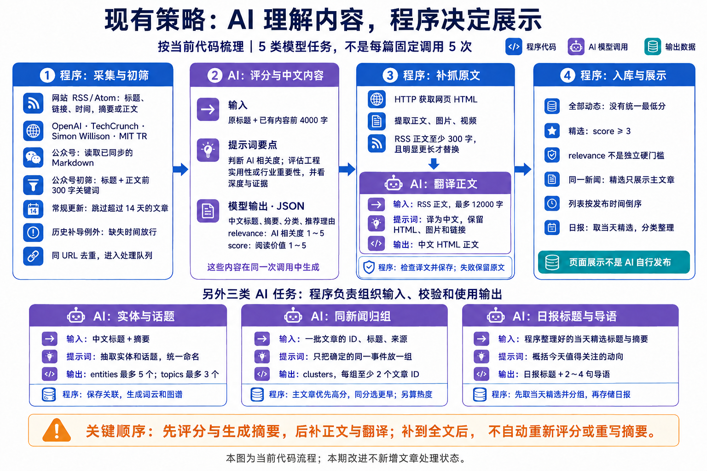
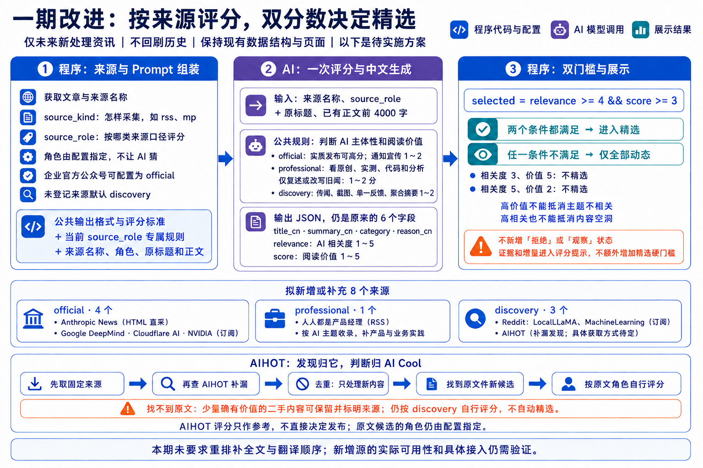

# AI Cool 信息源扩展 PRD

| 项目 | 内容 |
|---|---|
| 文档状态 | 开发用 PRD，待需求确认 |
| 版本 | v1.0 |
| 日期 | 2026-09-14 |
| 需求来源 | Cooper 文档《AI Cool 升级方案》第 4 部分 |
| Cooper 资源 | `2209600482571`，`appId=2`，读取时间 2026-09-14 |
| 实现基线 | 当前 `ai-cool` 仓库 `main@bdf5b823abecd614cea5746c5d44c5920be165e8` |
| 本期口径 | 只覆盖第 4 部分“信息源扩展方案”；第 5、6 部分工具发现与工具管理不纳入本文档 |

## 0. 开发结论

本期目标是在不重做 AI Cool 资讯主链路的前提下，提高资讯覆盖和精选准确度。

```text
来源配置
  -> RSS / Atom / HTML / 公众号语料 / AIHOT 补漏
  -> raw_items 入队并保留 source_kind + source_role
  -> LLM 富化时读取来源名称和来源角色
  -> 仍输出 title_cn / summary_cn / category / relevance / score / reason_cn
  -> 程序按 relevance >= 4 && score >= 3 设置 selected
  -> 继续进入全部动态 / 精选 / 日报 / 热点 / 图谱
```

本期明确采用以下产品口径：

- 保留现有资讯页面、数据展示和后续链路，不新增文章状态。
- 保留现有六项 LLM 输出，不新增评分维度。
- 新增来源角色 `official`、`professional`、`discovery`，由程序配置传入，不让模型猜。
- 精选门槛从 `score >= 3` 调整为 `relevance >= 4 && score >= 3`。
- 仅对启用后新处理的资讯生效，不回刷历史文章。
- AIHOT 只作为补漏发现源，不继承 AIHOT 分数、精选结论或正文授权。
- 单个来源失败只记录错误，不阻断其他来源、文章富化、日报、热点、图谱或工具发现任务。

## 1. 当前代码库事实

### 1.1 后端事实

| 维度 | 当前实现 | 对本期设计的影响 |
|---|---|---|
| 采集入口 | `server/cmd/pulse/main.go` 读取 `-sources`，调用 `pulse.LoadSources` 和 `pulse.Run` | 本期继续挂在 `pulse`，不新增主调度命令 |
| 来源配置 | `server/internal/pulse/sources.go` 的 `SourceConfig` 只有 `name`、`url` | 需要扩展配置字段以表达 adapter、source_role、enabled、limit 等 |
| RSS/Atom | `server/internal/ingest/rss.go` 使用 `gofeed` 解析，当前统一写 `source_kind=rss` | 新 RSS/Atom 来源可复用；Anthropic 需要 HTML 直采适配器 |
| 公众号语料 | `server/internal/ingest/mpsource.go` 从 `AIHOT_MP_CORPUS_DIR` 读取本地 Markdown，并先做关键词粗筛 | 本期继续使用本地语料，不新增微信公众号直连 |
| 原始入队 | `raw_items` 以 URL hash 作为主键，字段含 source、source_kind、url、title、raw_content、media | 若富化时要知道来源角色，需要在 raw 阶段保留 `source_role` 或等价可恢复映射 |
| 富化提示词 | `server/internal/pipeline/enrichment.go` 的 `buildPrompt` 只放标题和正文 | 需要加入来源名称、source_role 和角色专属阅读价值规则 |
| 富化输出 | `Enrichment` 已有 `relevance`、`score`，均会 clamp 到 1-5 | 可直接承接新门槛，不需要新模型字段 |
| 精选判断 | `server/internal/pipeline/processor.go` 当前 `selected := score >= 3` | 需要改为 `relevance >= 4 && score >= 3` 并补边界测试 |
| 正文补抓 | `Processor.WithPageResolver` 在评分后尽力补抓正文和媒体，RSS 英文源可翻译 | 本期不重做补抓；补抓后不追加自动重评 |
| 下游链路 | items、daily、cluster、terms 继续读取 `items.selected`、category、score 等 | 改门槛后自然影响新入库精选候选，不改日报/热点规则 |
| 公共接口 | `/api/public/items` 支持 `mode`、`category`、`source_kind`、`q`、`take`、`cursor` | 响应字段保持不变；`source_kind` 过滤需扩展新枚举 |
| 部署 | `deploy/aihot-cron.sh` 每 30 分钟跑 `pulse`，并注入 DB、LLM、公众号语料目录 | 新来源配置通过文件或 env 注入，不把密钥和大段配置写死在代码里 |

### 1.2 前端事实

| 维度 | 当前实现 | 对本期设计的影响 |
|---|---|---|
| 技术栈 | React + Vite + TypeScript，自研 CSS | 不引入新 UI 框架 |
| 路由 | `web/src/App.tsx` 通过 hash 切换精选、全部、日报、图谱等视图 | 不新增页面路由 |
| 列表组件 | `web/src/components/Feed.tsx` 展示筛选、搜索、时间线和卡片 | 扩展来源筛选即可 |
| API 封装 | `web/src/api/items.ts` 调用 `/api/public/items` | 更新 sourceKind 类型和筛选参数 |
| 卡片字段 | `ItemCard` 展示标题、来源、分类、精选标记、score、摘要 | 不新增卡片必填字段；AIHOT 二手内容通过 `source` 名称表达 |

### 1.3 已验证外部入口

以下是 2026-09-14 在当前机器上的连通性检查，只能证明当前环境可访问，部署机 Melos 仍需上线前复核。

| 来源 | 入口 | 当前检查 | 处理口径 |
|---|---|---|---|
| Anthropic News | `https://www.anthropic.com/news` | HTTP 200，HTML 页面 | 新增 HTML 直采适配器 |
| Google DeepMind | `https://deepmind.google/blog/rss.xml` | HTTP 200，RSS | 复用 RSSSource |
| Cloudflare AI | `https://blog.cloudflare.com/tag/ai/rss/` | HTTP 200，RSS | 复用 RSSSource |
| NVIDIA Generative AI | `https://developer.nvidia.com/blog/category/generative-ai/feed/` | HTTP 200，RSS | 复用 RSSSource |
| 人人都是产品经理 | `https://www.woshipm.com/feed` | HTTP 200，RSS | 复用 RSSSource |
| Reddit LocalLLaMA | `https://www.reddit.com/r/LocalLLaMA/new/.rss` | HTTP 200，Atom/RSS | 复用 RSSSource，设置 User-Agent |
| Reddit MachineLearning | `https://www.reddit.com/r/MachineLearning/new/.rss` | 当前返回 429 | 接入时必须按 `Retry-After` 退避；部署机若仍 429，则默认禁用并记录原因 |
| AIHOT | `https://aihot.virxact.com/` | HTTP 200 | 使用当前公开文档指向的 `https://aihot.news/api/v1/*` |

AIHOT 当前公开说明和 OpenAPI 校验结果：`https://aihot.news/openapi-v1.json` 的 `info.version` 为 `1.3.0`，可用接口包括 `/api/v1/items`、`/api/v1/selected/snapshot`、`/api/v1/selected/changes`、`/api/v1/hot-topics`、`/api/v1/stories/{publicId}`、`/api/v1/dailies/*`。本期只使用资讯补漏所需的只读 items 或 selected 接口，不抓网页正文。

## 2. 需求原文整理

### 2.1 第 4 部分目标

第 4 部分要把“扩大信息覆盖”和“提高精选准确度”一起处理：

- 保留现有来源。
- 补充八个资讯来源。
- 把来源名称和来源角色交给 AI。
- 使用公共评分标准加来源专属提示词。
- 程序同时检查 AI 相关度和阅读价值后决定是否精选。

### 2.2 改动边界

- 仅对规则启用后新处理的资讯生效，不回刷历史。
- 保持现有资讯页面形态和模型六项输出。
- 不增加“观察中”“待核验”“不收录”等文章状态。
- 不建设新的拒收池或固定拒绝原因码。
- 不重做正文补抓、全文翻译、术语提取、事件聚类、日报和图谱。
- 不改变现有事件主文章选择规则。
- 第 4 部分只约束资讯模块；工具模块状态、表结构和测评流程属于第 5、6 部分。

### 2.3 流程图快照





## 3. 目标与非目标

### 3.1 目标

- 接入或配置八个新增来源，让 AI Cool 覆盖更多模型发布、AI 产品、工程实践、产品案例、开源模型和社区线索。
- 为每个来源明确 `source_kind` 和 `source_role`，避免采集方式和评分口径混在一起。
- 让 LLM 富化时知道来源名称和来源角色，但仍返回现有六项结构化结果。
- 用 `relevance >= 4 && score >= 3` 作为程序精选门槛，减少“文章有价值但 AI 不是主体”的误精选。
- 将 AIHOT 作为补漏来源，只取它允许公开使用的摘要级字段和原文链接。
- 保持现有列表、日报、热点、图谱的稳定性。

### 3.2 非目标

- 不做历史文章回刷或批量重评。
- 不新增文章处理状态、拒收池、拒收原因码。
- 不新增文章总分、来源质量分或更多评分维度。
- 不让官方来源自动加分。
- 不让 AIHOT 分数、精选结果直接进入 AI Cool 结论。
- 不抓取 AIHOT 站内网页正文，不猜测单篇详情 API。
- 不新增资讯管理后台。
- 不扩展第 5、6 部分的工具发现、测评和工具箱能力。
- 不做跨 URL 全量语义去重；本期只做 URL 级和 AIHOT 原文链接级最小去重。

## 4. 来源配置方案

### 4.1 来源角色

`source_kind` 回答“怎样采集”，`source_role` 回答“按什么来源口径评分”。两者不能互相替代。

| 字段 | 枚举 | 用途 |
|---|---|---|
| `source_kind` | `rss`、`html`、`mp`、`aihot` | 采集方式、翻译判断、前端来源筛选 |
| `source_role` | `official`、`professional`、`discovery` | 富化提示词中的阅读价值判断口径 |

角色规则：

- `official`：官方博客、官网新闻、明确登记的企业官方公众号。官方身份不自动加分；活动、招聘、预告、空洞宣传仍应低分。
- `professional`：科技媒体、专家博客、普通公众号。重点看原创采访、实测、代码、数据、工程经验和独特分析。
- `discovery`：社区、社交平台、聚合入口。匿名传闻、截图、单一用户反馈和聚合摘要要压低；找到原文后改按原文来源角色处理。

未登记的新来源默认 `source_role=discovery`。公众号默认 `professional`，只有命中显式官方公众号名单时才是 `official`。

### 4.2 默认来源清单

| 来源 | adapter | source_kind | source_role | 默认启用 |
|---|---|---|---|---|
| OpenAI Blog | `rss` | `rss` | `official` | 是 |
| TechCrunch AI | `rss` | `rss` | `professional` | 是 |
| Simon Willison | `rss` | `rss` | `professional` | 是 |
| MIT Technology Review AI | `rss` | `rss` | `professional` | 是 |
| 已有公众号语料 | `mp_corpus` | `mp` | `professional`，可按账号覆盖为 `official` | 配置 `AIHOT_MP_CORPUS_DIR` 时启用 |
| Anthropic News | `anthropic_news_html` | `html` | `official` | 是，部署机验证通过后启用 |
| Google DeepMind | `rss` | `rss` | `official` | 是 |
| Cloudflare AI | `rss` | `rss` | `official` | 是 |
| NVIDIA Generative AI | `rss` | `rss` | `official` | 是 |
| 人人都是产品经理 | `rss` | `rss` | `professional` | 是 |
| Reddit LocalLLaMA | `rss` | `rss` | `discovery` | 是，部署机验证通过后启用 |
| Reddit MachineLearning | `rss` | `rss` | `discovery` | 否，部署机验证通过后启用 |
| AIHOT | `aihot_v1_items` | `aihot` | `discovery` | 是，按 API v1 和频率限制启用 |

虎嗅、爱范儿不列入本次确定来源。

### 4.3 配置文件格式

继续支持 `pulse -sources /path/sources.json`，但配置结构从 `name + url` 扩展为兼容旧字段的新结构：

```json
[
  {
    "name": "Google DeepMind",
    "url": "https://deepmind.google/blog/rss.xml",
    "adapter": "rss",
    "source_kind": "rss",
    "source_role": "official",
    "enabled": true,
    "max_items_per_run": 50,
    "rate_limit": "10/m"
  },
  {
    "name": "Anthropic News",
    "url": "https://www.anthropic.com/news",
    "adapter": "anthropic_news_html",
    "source_kind": "html",
    "source_role": "official",
    "enabled": true,
    "max_items_per_run": 30
  },
  {
    "name": "AIHOT",
    "url": "https://aihot.news/api/v1/items",
    "adapter": "aihot_v1_items",
    "source_kind": "aihot",
    "source_role": "discovery",
    "enabled": true,
    "window": "7d",
    "max_items_per_run": 50,
    "max_secondary_per_run": 10
  }
]
```

兼容规则：

- 老配置只有 `name`、`url` 时，默认 `adapter=rss`、`source_kind=rss`、`source_role=discovery`、`enabled=true`。
- 内置默认来源必须显式带角色，不走 `discovery` 默认值。
- 配置项 `enabled=false` 时跳过该来源，不报错。
- `max_items_per_run` 控制单来源入队上限，避免高流量来源吞掉 LLM 调用额度。
- `rate_limit` 控制单来源抓取前的最小等待时间，支持 `250ms`、`2s` 等 duration，或 `10/m`、`1/5s` 等 `count/window` 格式。
- Reddit 和 AIHOT 遇到 429/503 时按响应头或默认退避，不做无界重试。

## 5. 后端方案

### 5.1 领域结构

本期仍沿用资讯主链路，不新增独立服务。

```text
server/internal/pulse
  sources.go          // 加载扩展来源配置，实例化 adapter

server/internal/ingest
  rawitem.go          // RawItem 增加 SourceRole
  schema.sql          // raw_items 增加 source_role
  rss.go              // RSS/Atom adapter 透传 SourceRole
  html_anthropic.go   // Anthropic News HTML 列表 adapter
  aihot.go            // AIHOT API v1 只读补漏 adapter
  mpsource.go         // 公众号语料 source_role 默认 professional，可按账号覆盖

server/internal/pipeline
  enrichment.go       // Prompt 增加 source_name + source_role + 角色规则
  processor.go        // selected 双门槛

server/internal/publicapi
  params.go           // source_kind 过滤枚举扩展
```

### 5.2 RawItem 与 raw_items

新增最小字段：

```go
type RawItem struct {
    ID          string
    Source      string
    SourceKind  string
    SourceRole  string
    URL         string
    Title       string
    PublishedAt *time.Time
    RawContent  *string
    ImageURL    *string
    VideoURL    *string
}
```

`raw_items` 增加：

```sql
ALTER TABLE raw_items ADD COLUMN IF NOT EXISTS source_role TEXT NOT NULL DEFAULT 'discovery';
```

约束：

- `source_role` 只在 raw 阶段和富化阶段使用，不进入 `items` 公共 DTO。
- 插入冲突仍 `DO NOTHING`，避免历史 raw 被重复来源覆盖。
- 如果 AIHOT 条目有 `links.original`，使用 normalized original URL 生成 `RawID`；规范化会处理大小写、默认端口、fragment、常见追踪参数、query 顺序和路径中的 `.`/`..`。
- 如果 AIHOT 条目没有原文链接但允许作为少量二手线索保留，使用 `aihot:<id>` 生成稳定 ID，`Source` 写为 `AIHOT · 二手线索`。

### 5.3 来源适配器

#### RSS / Atom

复用 `gofeed`。新增 Source 配置对象后，`RSSSource` 不再只保存 `name`、`feedURL`，还要保存 `source_role` 和每轮上限。

验收：

- 能解析 Google DeepMind、Cloudflare、NVIDIA、人人都是产品经理、Reddit LocalLLaMA。
- 保持条目无 link 时跳过。
- 图片和视频提取沿用现有逻辑。
- 发布超过 `maxItemAge=14d` 的条目仍在 Runner 层跳过。

#### Anthropic HTML

新增 `anthropic_news_html` adapter，仅负责从 `https://www.anthropic.com/news` 抽取新闻列表中的文章链接、标题和可用日期。

边界：

- 不抓取全站。
- 不从页面生成虚构正文。
- 详情正文仍交给现有 PageResolver 尽力补抓。
- HTML 结构变化导致抽取失败时，本来源报错，其他来源继续。

#### 公众号语料

继续从 `AIHOT_MP_CORPUS_DIR` 读取本地 Markdown，不新增微信接口。

新增官方账号覆盖：

- 默认 role：`professional`。
- 可选 env：`AIHOT_MP_OFFICIAL_ACCOUNTS`，逗号分隔公众号名称。
- 当 frontmatter 的 `mp_name` 命中该列表时，role 写为 `official`。

#### AIHOT API v1

默认使用：

```text
GET https://aihot.news/api/v1/items?mode=all&window=7d&by=published&limit=50
```

处理规则：

- `links.original` 存在时，优先把原文 URL 作为 AI Cool 候选 URL。
- `links.original` 缺失时，只在本轮二手线索上限内保留，URL 使用 `links.aihot`。
- `title`、`originalTitle`、`summary` 只作为候选标题和 raw_content，不作为 AI Cool 结论。
- `score`、`selected`、`reason` 不进入 AI Cool 的 `score`、`selected`、`reason_cn`。
- `source.name` 用作可见来源参考；AI Cool 的 `Source` 对于原文候选优先用原文来源名，对于二手候选用 `AIHOT · 二手线索`。
- 按 AIHOT 的 Cache-Control、ETag、429/503 和 `Retry-After` 处理轮询，不高频请求。
- 不调用不存在的 `/api/v1/items/{id}`，不抓网页绕过正文授权。

### 5.4 LLM 富化提示词

公共系统提示词拆成三段：

```text
公共输出格式、分类要求和 relevance / score 评分标准
+ 当前 source_role 对应的阅读价值规则
+ 当前文章的来源名称、来源角色、原标题、可用正文
```

用户输入增加：

```text
来源名称：OpenAI Blog
来源角色：official
原始标题：...

正文：
...
```

评分标准：

| 分数 | relevance：AI 是否为主体 | score：文章是否值得阅读 |
|---|---|---|
| 5 | AI 是绝对主体 | 重大突破、重要行业变化或范式级实践，且证据完整 |
| 4 | 明确讨论 AI，主要结论离不开 AI | 高价值发布、研究、实测或工程实践 |
| 3 | AI 是部分话题或应用背景 | 有新信息和阅读价值，但影响或深度一般 |
| 2 | AI 仅被顺带提及 | 增量很小、重复转述、偏宣传或内容较浅 |
| 1 | 主体是其他内容，与 AI 关系弱 | 活动、招聘、预告、标题党、传闻或无实质内容 |

角色专属规则只影响 `score` 判断，不改变输出字段：

- `official`：实质能力变化、技术文档、数据或重要政策可高分；活动、招聘、预告和空洞宣传低分。
- `professional`：原创采访、实测、代码、数据、工程经验和独特分析高分；搬运公告和旧闻改写低分。
- `discovery`：社区线索需看是否有可验证增量；单一反馈、聚合摘要和传闻低分。找到原文后按原文角色处理。

### 5.5 精选门槛

`toItem` 改为：

```go
selected := e.Relevance >= 4 && e.Score >= 3
```

`ai_selected` 建议同步为同一门槛，避免内部字段继续表达旧的 `score >= 4` 口径。若后续仍要保留“强推荐”分析字段，应单独命名，不复用 `ai_selected`。

边界用例：

| relevance | score | selected |
|---:|---:|---|
| 4 | 3 | true |
| 5 | 5 | true |
| 3 | 5 | false |
| 5 | 2 | false |
| 1 | 5 | false |
| 4 | 1 | false |

## 6. 前端展示方案

### 6.1 页面结构

不新增页面，继续使用现有：

```text
#selected  精选
#all       全部 AI 动态
#daily     AI 日报
#graph     图谱
```

### 6.2 列表和卡片

`ItemCard` 响应字段不变：

- 标题、原始标题、来源、发布时间、分类、score、精选标记、摘要、图片、视频。
- 不展示 `source_role`，避免读者把来源角色误解为质量背书。
- AIHOT 找不到原文的少量二手内容，通过来源名展示为 `AIHOT · 二手线索`。

### 6.3 来源筛选

当前筛选是“全部来源 / 公众号 / 英文源”。本期建议改为：

| 筛选项 | 请求参数 | 含义 |
|---|---|---|
| 全部来源 | 无 | 所有可展示资讯 |
| RSS/Atom | `source_kind=rss` | 订阅源 |
| 网页直采 | `source_kind=html` | Anthropic News 等 HTML 来源 |
| 公众号 | `source_kind=mp` | 本地公众号语料 |
| AIHOT 补漏 | `source_kind=aihot` | AIHOT API v1 补充线索 |

移动端仍保持横向 chip 自动换行，不引入复杂侧栏筛选。

### 6.4 空态与错误态

- 某个来源失败不会让页面报错，只影响本轮新增内容。
- `/api/public/items` 失败时沿用现有“加载失败，请稍后重试”。
- 筛选后无结果时沿用“暂无资讯”。
- AIHOT 二手内容不增加单独警告卡片；在来源名上保持可见即可。

## 7. 接口方案

### 7.1 公共读取接口

继续使用：

```text
GET /api/public/items
```

响应 JSON 不新增必填字段，保持前端和下游兼容。

查询参数变更：

| 参数 | 当前 | 本期 |
|---|---|---|
| `mode` | `selected`、`all` | 不变 |
| `category` | 现有五类 | 不变 |
| `source_kind` | `mp`、`rss` | 扩展为 `mp`、`rss`、`html`、`aihot` |
| `q` | 标题/摘要/正文搜索 | 不变 |
| `take` | 1-100 | 不变 |
| `cursor` | keyset cursor | 不变 |

### 7.2 内部采集接口

`ingest.Source` 接口不需要改变：

```go
type Source interface {
    Name() string
    Fetch(ctx context.Context) ([]RawItem, error)
}
```

每个 Source 返回的 `RawItem` 必须填：

- `Source`
- `SourceKind`
- `SourceRole`
- `URL`
- `Title`

`PublishedAt`、`RawContent`、`ImageURL`、`VideoURL` 仍按可用性填写。

### 7.3 配置加载接口

`pulse.LoadSources(path string)` 行为：

- `path=""`：加载内置默认来源。
- `path!= ""`：读取扩展 JSON 配置。
- 配置格式错误、未知 adapter、未知 role、未知 kind：返回错误并让 `pulse` 失败。
- 单个已知来源抓取失败：进入 `Result.Errors`，不让 `pulse` 整体失败。

### 7.4 AIHOT 请求契约

建议实现 `AIHOTClient`，便于测试：

```go
type AIHOTClient interface {
    ListItems(ctx context.Context, q AIHOTQuery) (AIHOTPage, error)
}
```

最小字段映射：

| AIHOT 字段 | AI Cool 使用 |
|---|---|
| `id` | 无原文链接时生成 `aihot:<id>` |
| `title` / `originalTitle` | RawItem.Title |
| `summary` | RawItem.RawContent |
| `source.name` | RawItem.Source 的参考来源 |
| `links.original` | 优先作为 RawItem.URL |
| `links.aihot` | 二手线索 fallback URL |
| `publishedAt` | RawItem.PublishedAt |
| `score`、`selected`、`reason` | 不使用 |

## 8. 数据与迁移

### 8.1 raw_items

新增：

```sql
ALTER TABLE raw_items ADD COLUMN IF NOT EXISTS source_role TEXT NOT NULL DEFAULT 'discovery';
ALTER TABLE raw_items ADD CONSTRAINT raw_items_source_role_check
    CHECK (source_role IN ('official','professional','discovery'));
```

若 PostgreSQL 中约束已存在，迁移需幂等处理，避免重复创建约束失败。

### 8.2 items

不新增字段。

改动：

- 新入库 `selected` 改由双门槛决定。
- `ai_relevance` 继续保存模型返回的相关度。
- `score` 继续保存模型返回的阅读价值。
- `source_kind` 允许 `rss`、`html`、`mp`、`aihot`。

### 8.3 历史数据

- 不回刷 `items`。
- 不修改历史 `selected`。
- 历史 `raw_items` 的 `source_role` 默认值为 `discovery`，但这些记录通常已 processed，不参与重评。

## 9. 封闭链路 Case

| Case ID | 名称 | 起点 | 终点 |
|---|---|---|---|
| C01 | 加载内置默认来源 | `pulse.LoadSources("")` | 返回现有来源 + 新增默认来源，角色明确 |
| C02 | 加载旧格式 JSON | `sources.json` 只有 name/url | 成功兼容，默认 `rss + discovery` |
| C03 | 加载新格式 JSON | `sources.json` 带 adapter/kind/role | 成功创建对应 Source |
| C04 | 拒绝非法配置 | 未知 adapter 或 role | `pulse` 启动失败并输出明确错误 |
| C05 | RSS/Atom 新来源入队 | DeepMind 等 feed | RawItem 带 `source_kind=rss` 和配置角色 |
| C06 | Anthropic HTML 入队 | Anthropic News 页面 | 抽取新闻条目并写 `source_kind=html` |
| C07 | 公众号官方账号覆盖 | MP frontmatter 命中官方名单 | RawItem `source_role=official` |
| C08 | 公众号普通账号 | MP frontmatter 未命中官方名单 | RawItem `source_role=professional` |
| C09 | AIHOT 原文候选 | AIHOT item 有 `links.original` | 用原文 URL 入队，不继承 AIHOT 分数 |
| C10 | AIHOT 二手候选 | AIHOT item 无 `links.original` | 在上限内以 `AIHOT · 二手线索` 入队 |
| C11 | AIHOT 重复跳过 | AIHOT 原文 URL 已存在 | `InsertRaw` 冲突跳过，不新增 |
| C12 | 来源失败隔离 | Reddit 返回 429 或单源网络失败 | 记录 SourceErrors，其他来源继续 |
| C13 | Prompt 带来源角色 | 富化任一 RawItem | LLM 输入含来源名称和角色规则 |
| C14 | 精选双门槛通过 | relevance=4, score=3 | `selected=true` |
| C15 | 相关度不足不精选 | relevance=3, score=5 | `selected=false` |
| C16 | 阅读价值不足不精选 | relevance=5, score=2 | `selected=false` |
| C17 | 历史不回刷 | 部署新版本 | 历史 items 不批量更新 |
| C18 | 前端来源筛选 | 点击 AIHOT 补漏 chip | 请求 `source_kind=aihot`，列表正常 |
| C19 | 公共 API 兼容 | GET `/api/public/items` 不带新参数 | 响应字段与当前一致 |
| C20 | 下游链路兼容 | 新 selected 文章入库后跑 gendaily/hotpass | 日报、热点、图谱不因新字段失败 |

### 9.1 主闭环验收

```text
配置新增来源
  -> pulse 拉取至少 1 条新来源文章
  -> raw_items 记录 source_kind/source_role
  -> ProcessBatch 调 LLM 时提示词带来源角色
  -> relevance=4 且 score=3 的条目进入精选
  -> relevance=3 且 score=5 的条目只在全部动态
  -> 前端精选页、全部页和来源筛选均可正常浏览
```

## 10. 测试计划

### 10.1 Go 单元测试

| 包 | 测试重点 |
|---|---|
| `server/internal/pulse` | 默认来源、新旧 JSON 配置、非法 adapter/role、enabled=false |
| `server/internal/ingest` | RSS source role 透传、Anthropic HTML 抽取、AIHOT 字段映射、MP 官方账号覆盖 |
| `server/internal/pipeline` | Prompt 包含 source name/role、三类 role 规则、双门槛 selected |
| `server/internal/publicapi` | `source_kind=html/aihot` 合法，未知值 400 |

### 10.2 数据库测试

有 `AIHOT_TEST_DATABASE_URL` 时运行：

```bash
cd server
GOTOOLCHAIN=go1.25.5 GOSUMDB=sum.golang.org AIHOT_TEST_DATABASE_URL=... go test ./internal/ingest ./internal/items ./internal/pipeline ./internal/publicapi -v
```

无测试库时，DB 测试按现有习惯 skip，但纯单测仍必须通过。

### 10.3 前端测试

```bash
cd web
npm run lint
npm test -- --run
```

覆盖：

- 来源筛选 chip 渲染。
- 点击 `AIHOT 补漏` 后请求 `source_kind=aihot`。
- 点击 `网页直采` 后请求 `source_kind=html`。
- 搜索、分类和来源筛选组合后能重置分页。
- 移动端 chip 换行不遮挡搜索框。

### 10.4 接入 smoke

部署前从 Melos 执行：

```bash
curl -L -A 'aihot-source-check/0.1' -I https://deepmind.google/blog/rss.xml
curl -L -A 'aihot-source-check/0.1' -I https://www.anthropic.com/news
curl -L -A 'aihot-source-check/0.1' -I https://aihot.news/api/v1/items
```

验收时至少跑一次：

```bash
cd server
AIHOT_DATABASE_URL=... AIHOT_LLM_API_KEY=... go run ./cmd/pulse -sources /root/aihot/etc/sources.json
```

检查：

- summary 中 `srcerrs` 不阻断本轮处理。
- 新来源有 raw 入库。
- 新处理 items 的 `selected` 符合双门槛。
- 前端 `/api/public/items?source_kind=aihot&mode=all` 返回 200。

## 11. 发布与回滚

### 11.1 发布步骤

1. 合入代码后构建后端和前端。
2. 在 Melos 放置 `/root/aihot/etc/sources.json`，包含本期默认来源和部署机验证后启用的来源。
3. 保持 `aihot-cron.sh pulse` 调度不变。
4. 首次运行观察 `pulse` 日志，记录各来源 fetched/inserted/skipped/srcerrs。
5. 前端验证精选、全部、来源筛选、日报、热点和图谱。

### 11.2 回滚方式

- 若新来源导致抓取失败多但主链路正常：在 `sources.json` 中把问题来源 `enabled=false`。
- 若新精选门槛不符合预期：回滚代码到旧版本；不批量修改已入库历史。
- 若 AIHOT 接入触发限流或授权争议：禁用 AIHOT 配置，保留其他固定来源。
- 若新 schema 有问题：`source_role` 是 raw 阶段字段，可先停止 pulse，修复迁移后恢复；不影响已存在 items 展示。

## 12. 待确认但不阻塞 PRD 的实现边界

这些点不应在开发时被默认为更大范围：

- AIHOT 使用 `items mode=all window=7d` 作为默认补漏入口；如果团队希望只跟踪 AIHOT 精选变化，可以改为 `selected/snapshot + selected/changes`，但这会降低“全部动态补漏”覆盖。
- AIHOT 无原文链接时，本 PRD 约定每轮最多保留 10 条二手线索；这个数字可通过配置调整。
- 跨 URL 重复识别只做规范化 URL 和 AIHOT 原文链接级去重；不做语义去重。
- 二手来源标注先通过 `Source="AIHOT · 二手线索"` 完成；如果后续需要更强提示，再新增公开字段或卡片样式。

## 13. 相关文档

- Cooper 文档：`https://cooper.didichuxing.com/didocs/2209600482571`
- 当前工具发现 PRD：`docs/design/ai-cool-tool-discovery-prd.md`
- 项目产品概览：`docs/overview/product.md`
- 系统架构：`docs/overview/architecture.md`
- 技术栈：`docs/overview/technical-stack.md`
- OpenAPI 参考：`docs/references/openapi.yaml`
