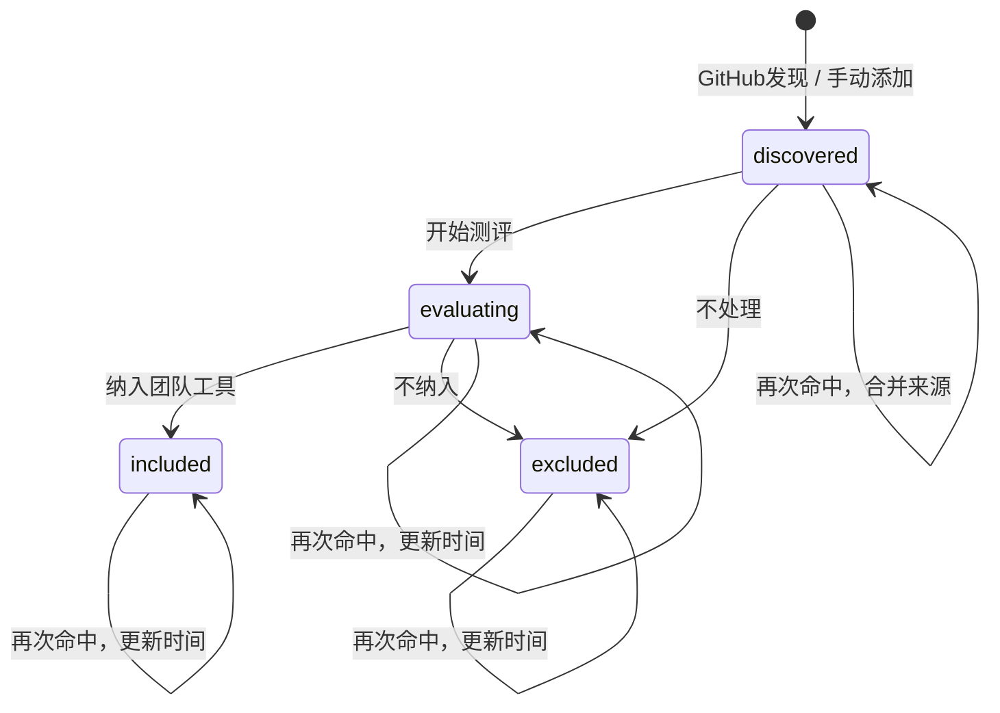

# AI Cool 工具发现与沉淀 PRD

| 项目 | 内容 |
|---|---|
| 文档状态 | 开发用 PRD，已按当前代码库对齐 |
| 版本 | v2.0 |
| 日期 | 2026-09-07 |
| 需求来源 | Cooper 文档《AI Cool 升级方案》第 5 部分 |
| 实现基线 | 当前 `ai-cool` 仓库 |
| 本期口径 | 以 Cooper 第 5 部分为准，覆盖旧方案中“首期只读、Git 报告导入”的口径 |

## 0. 开发结论

本期新增“工具发现与沉淀”模块，目标是跑通一个封闭链路：

```text
发现配置
  -> 手动执行或每周自动执行
  -> GitHub 官方 API 拉取仓库
  -> 按 GitHub node_id 去重并合并来源
  -> 工具百宝箱列表
  -> 开始测评，记录测评人和 Cooper 测评链接
  -> 完成测评：纳入团队工具 / 不纳入
  -> 团队工具列表只展示 included 工具
  -> 后续再次命中只更新时间和来源，不重复创建
```

本期明确采用以下产品口径：

- 发现配置页面首期上线，支持新增、编辑、启停和手动执行。
- 操作人、测评人先由用户手填，不接 SSO/RBAC。
- Cooper 测评文档由用户自己创建，AI Cool 只保存链接，不自动创建 Cooper 文档。
- AI Cool 不建设站内测评编辑器，不读取或校验 Cooper 文档正文。
- 原 GitHub Trending 自动发现方式删除，不解析 Trending 页面。

## 1. 当前代码库事实

### 1.1 后端事实

| 维度 | 当前实现 | 对本期设计的影响 |
|---|---|---|
| 语言与服务 | Go 1.25，`net/http` 公共入口和 Nuwa 入口并存 | 新接口优先放在 `server/internal/publicapi` 风格下，两个入口都要注册 |
| 数据库 | PostgreSQL + `pgxpool` | 工具模块新增独立 schema 和 Store |
| 资讯采集 | `server/internal/ingest` 的 `Source.Fetch(ctx) []RawItem` | 工具发现不复用 `RawItem`，因为工具需要状态和来源合并 |
| 资讯入库 | `raw_items -> pipeline -> items` | 工具是独立领域，不扩展 `items` 成万能表 |
| schema 方式 | 各模块内嵌 `schema.sql`，`EnsureSchema` 幂等建表 | 工具模块沿用现有 `schema.sql + EnsureSchema` 模式 |
| 列表接口 | `/api/public/items` 使用 GET、query、keyset cursor、ETag | 工具读接口沿用同样分页和缓存风格 |
| 写接口现状 | 只有 `/items/{id}/retranslate`，返回 `{"ok":true/false}`，带限流 | 工具写接口需要明确权限风险和操作人手填 |
| 定时任务 | `pulse/gendaily/hotpass`，由 `deploy/aihot-cron.sh` 调用 | 需要新增 `discovertools` 命令并接入打包和 cron |

相关代码位置：

- 后端公共入口：`server/cmd/webserver/main.go`
- Nuwa HTTP 入口：`server/common/server/httpserv/httpserv.go`
- 资讯采集：`server/internal/ingest`
- 资讯数据：`server/internal/items`
- 公共 API：`server/internal/publicapi`
- 定时任务入口：`server/cmd/pulse`、`server/cmd/gendaily`、`server/cmd/hotpass`
- 部署脚本：`deploy/build-linux.sh`、`deploy/install-melos.sh`、`deploy/aihot-cron.sh`

### 1.2 前端事实

| 维度 | 当前实现 | 对本期设计的影响 |
|---|---|---|
| 技术栈 | React 19 + Vite + TypeScript | 新页面继续用当前栈 |
| 组件风格 | 自研 CSS 和轻量组件，无 Ant Design | 不引入新 UI 组件库 |
| 路由 | `App.tsx` 根据 hash 切换视图 | 首期继续用 hash 视图，避免引入 router |
| 导航 | `Sidebar.tsx` 管理视图枚举和导航按钮 | 新增“工具”分组和 4 个工具入口 |
| API 封装 | `web/src/api/*.ts` 每类接口单独封装 | 新增 `web/src/api/tools.ts` |
| 测试 | Vitest + Testing Library，使用 `fireEvent` | 工具页面测试沿用现有测试方式 |

相关代码位置：

- 应用壳层：`web/src/App.tsx`
- 侧栏：`web/src/components/Sidebar.tsx`
- 资讯列表模式：`web/src/components/Feed.tsx`
- API 封装模式：`web/src/api/items.ts`
- 全局样式：`web/src/index.css`

### 1.3 已有方案冲突

`docs/design/ai-cool-2.0-product-technical-plan/README.md` 里旧口径是“首期匿名只读，不新增登录、权限和写操作页面；报告以 Git Markdown 导入”。本次以 Cooper 第 5 部分为准，首期必须包含前端写操作：

- 发现配置新增、编辑、启停、手动执行。
- 手动添加 GitHub 仓库。
- 工具百宝箱条目开始测评。
- 工具百宝箱条目不处理。
- 测评中工具完成为纳入团队工具或不纳入。

因此，本 PRD 是工具发现模块的新开发基线。旧文档仍可作为历史参考，不作为本期验收口径。

## 2. Cooper 第 5 部分原文快照

本节保留 Cooper 第 5 部分原文，图片已下载到本仓库，避免导出链接过期。

### 2.1 工具功能整体流程

> 原型图已内嵌到 Cooper 文档对应位置：工具发现整体流程。

工具只有四个内部状态：

- `discovered`：已发现，尚未决定是否测评。
- `evaluating`：已选择测评，正在形成 Cooper 记录。
- `included`：测评完成并纳入团队工具。
- `excluded`：不处理或测评后不纳入；保留记录用于去重，但不出现在主列表。

不设置“观察”状态。观察只有在具备复查周期、变化提醒和重新测评机制时才有实际意义，不属于首期范围。

### 2.2 GitHub 关键词发现

使用官方 Repository Search API，在仓库名称、描述、Topics 和 README 中检索英文词组。

示例：

```text
"coding agent" in:name,description,topics,readme
"agent skills" in:name,description,topics,readme
"browser agent" in:name,description,topics,readme
```

关键词检索的价值是覆盖没有规范填写 Topic 的仓库，并支持团队按阶段性业务方向发起专项发现。缺点是噪声更高，因此结果仍需人工选择是否测评。

首次执行某条配置时做有限页数的基线扫描；后续不再每天重跑同一批全量结果，而是根据配置的 `last_success_at` 执行增量检索：

- 使用 `created:>时间` 查找上次成功执行后新创建的仓库。
- 使用 `pushed:>时间` 补充近期重新活跃、且现在命中检索条件的旧仓库。
- 查询窗口向前重叠 24 小时，避免调度延迟或 GitHub 索引延迟造成漏查。
- 对每个子查询设置分页上限；记录实际页数、`incomplete_results` 和截断情况，超过上限时拆分时间窗口，不静默丢弃。
- 重叠窗口内再次返回的仓库只更新“最近命中时间”，不会重复创建候选。

### 2.3 GitHub Topic 发现

使用 Repository Search API 的 `topic:` 限定符检索仓库，例如：

```text
topic:ai-agents
topic:agent-skills
topic:model-context-protocol
topic:browser-automation
```

Topic 检索结果更集中，适合系统覆盖一个已知类别；但 Topic 由仓库作者自行维护，存在漏填和同义标签，因此不能替代关键词检索。

### 2.4 手动添加工具

团队成员粘贴 GitHub 仓库地址，系统调用官方 Repository API 读取仓库信息并用 `node_id` 检查重复。

手动添加用于补充成员从文章、群聊、同事推荐或 GitHub 页面中看到的工具。原 GitHub Trending 自动发现方式删除，不在服务器解析 Trending 页面。

### 2.5 工具发现配置

发现配置只管理关键词和 Topic：

| 字段 | 说明 |
|---|---|
| 配置名称 | 表示一个长期或阶段性的发现方向 |
| 发现方式 | 关键词检索或 Topic 检索 |
| 检索词 / Topics | 支持增删改查 |
| 触发方式 | 手动执行或每周执行 |
| 启用状态 | 启用、停用 |
| 运行信息 | 最近执行时间、结果数量、失败原因 |

系统固定公开仓库、排除归档仓库、默认排除 Fork、结果按 `node_id` 去重。高级 GitHub 查询参数首期不暴露为页面配置。

一条配置只对应一种发现方式。团队准备研究浏览器操作工具时，可以创建两条同组的一次性配置并同时立即执行：

```text
配置 A：浏览器操作工具 - 关键词
方式：关键词检索
检索词：browser agent、web agent、browser automation、computer use

配置 B：浏览器操作工具 - Topic
方式：Topic 检索
Topics：browser-agent、browser-automation

触发：两条配置均立即执行一次
```

如果结果持续有价值，再把配置改为每周执行。

#### 发现配置原型

> 原型图已内嵌到 Cooper 文档对应位置：发现配置。

### 2.6 工具百宝箱与排序

“已发现”页面合并关键词、Topic 和手动添加结果。默认按首次发现时间倒序，同一批次按当前 Stars 倒序。

页面提供三种透明排序：

- 最新发现
- 当前 Stars
- 近 7 天 Stars 增长

近 7 天增长来自系统历史快照，只是已有工具的排序方式，不会产生新工具，也不能称为 GitHub Trending。计算时使用距当前 6 至 8 天内最接近 7 天的快照；任务延期、失败或新发现仓库没有合适快照时显示“暂无”。

候选工具只展示：名称、一句话介绍、发现来源、Stars、近 7 天增长、最近提交时间、GitHub 链接，以及“开始测评”“不处理”操作。

一句话介绍优先使用 GitHub Description；描述为空或过于模糊时，从 README 开头生成临时中文摘要。纳入团队工具前由测评人确认，格式统一为“它是什么 + 解决什么问题 + 适合什么场景”。

#### 工具百宝箱原型

> 原型图已内嵌到 Cooper 文档对应位置：工具百宝箱。

#### 手动添加原型

> 原型图已内嵌到 Cooper 文档对应位置：手动添加。

### 2.7 工具测评记录

点击“开始测评”后，工具进入“测评中”。AI Cool 不建设站内测评编辑器，只记录：

- 测评人
- 开始时间
- Cooper 测评文档链接
- 测评结果：纳入团队工具或不纳入
- 完成时间

建议统一使用以下 Cooper 测评模板：

```markdown
# 工具名称与版本

## 1. 测评目标
- 为什么测评
- 希望解决的实际问题

## 2. 使用环境
- 使用版本
- 安装或接入方式
- 账号、费用和权限要求

## 3. 实际任务记录
- 测试任务
- 操作过程
- 实际结果
- 失败或人工接管情况

## 4. 结论
- 能解决什么问题
- 主要限制和风险
- 是否建议纳入团队工具
```

测评完成后只有“纳入团队工具”和“不纳入”两个选择。“不纳入”保留测评文档和原因，但不进入团队工具列表。

#### 测评中原型

> 原型图已内嵌到 Cooper 文档对应位置：测评中。

### 2.8 团队工具列表

团队工具列表只展示完成测评并明确纳入的工具：

- 工具名称
- 测评人确认的一句话介绍
- GitHub 链接
- Cooper 测评链接
- 纳入时间

首期不建设复杂分类、评分、评论和推荐理由页面。工具数量增加后，再根据真实使用情况决定是否增加搜索和分类。

#### 团队工具原型

> 原型图已内嵌到 Cooper 文档对应位置：团队工具。

### 2.9 工具状态与去重规则

- GitHub `node_id` 是仓库唯一标识，仓库改名或 URL 变化不会创建新记录。
- 同一项目被多个关键词或 Topic 命中时只保留一个工具，发现来源合并保存。
- “不处理”和“不纳入”都转为 `excluded`，但记录具体发生阶段。
- 已处理仓库后续再次命中时更新最近发现时间，不重复进入“已发现”。
- 每周只为 `discovered`、`evaluating` 和 `included` 工具保存 Stars 快照。
- 第一周没有历史增量，从第二次快照开始计算近 7 天 Stars 增长。

## 3. 目标与范围

### 3.1 目标

- 在现有 AI Cool 资讯站内增加工具发现与测评沉淀能力。
- 支持运营同学通过页面维护 GitHub 关键词和 Topic 发现配置。
- 支持团队成员手动补充 GitHub 仓库。
- 让候选工具从发现、测评到纳入团队工具形成可追踪状态。
- 保留被排除工具记录，避免后续重复发现和重复测评。

### 3.2 非目标

- 不做工具详情页。
- 不做复杂分类、评分、评论、收藏、投票和推荐理由页面。
- 不做站内测评正文编辑。
- 不自动创建 Cooper 文档。
- 不读取 Cooper 文档内容。
- 不做 SSO/RBAC；操作人先手填。
- 不做 GitHub Trending 页面抓取。
- 不把 Stars 增长命名为 Trending。
- 不自动安装、执行或测评第三方工具。
- 不改造现有资讯采集、日报、热点、图谱主链路。

## 4. 信息架构

在现有导航基础上新增“工具”分组。

```text
AI Cool
├── 内容
│   ├── AI 日报
│   ├── 精选
│   ├── 全部 AI 动态
│   └── 图谱
└── 工具
    ├── 已发现
    ├── 测评中
    ├── 团队工具
    └── 发现配置
```

当前前端使用 hash 视图，首期保持这一方式：

| hash | 页面 |
|---|---|
| `#/tools/discovered` | 工具百宝箱 |
| `#/tools/evaluating` | 测评中 |
| `#/tools/team` | 团队工具 |
| `#/tools/configs` | 发现配置 |

## 5. 封闭链路 Case

### 5.1 Case 总览

| Case ID | 名称 | 起点 | 终点 |
|---|---|---|---|
| C01 | 新建关键词发现配置 | 发现配置页 | 配置保存成功 |
| C02 | 新建 Topic 发现配置 | 发现配置页 | 配置保存成功 |
| C03 | 手动执行发现配置 | 配置列表操作 | GitHub 结果入库并更新运行信息 |
| C04 | 每周自动执行启用配置 | cron | GitHub 结果入库并更新运行信息 |
| C05 | 手动添加 GitHub 仓库 | 已发现页 | 工具进入 `discovered` 或返回重复工具 |
| C06 | 重复命中来源合并 | 任意发现入口 | 不新增工具，只更新来源和最近发现时间 |
| C07 | 工具百宝箱条目开始测评 | 工具百宝箱页 | 工具进入 `evaluating` |
| C08 | 工具百宝箱条目不处理 | 工具百宝箱页 | 工具进入 `excluded` |
| C09 | 测评完成并纳入 | 测评中页 | 工具进入 `included`，进入团队工具 |
| C10 | 测评完成但不纳入 | 测评中页 | 工具进入 `excluded` |
| C11 | 团队工具列表查看 | 团队工具页 | 只展示 `included` 工具 |
| C12 | Stars 快照与 7 天增长 | 每周任务 | 列表展示增长或“暂无” |
| C13 | GitHub 限流或失败 | 发现执行 | run 记录失败原因，不破坏已有数据 |
| C14 | 并发状态操作 | 两个用户同时操作 | 只有一个状态变更成功 |

### 5.2 C01 新建关键词发现配置

用户故事：作为配置管理员，我希望在页面上新建关键词发现配置，用来持续发现某个方向的 GitHub 工具。

输入：

- 配置名称。
- 发现方式：关键词。
- 检索词列表。
- 触发方式：手动或每周。
- 启用状态。
- 操作人。

验收：

- 检索词至少 1 个，最多 30 个。
- 每个关键词去首尾空格后 2 到 80 字。
- 同一配置内关键词去重。
- 创建成功后配置出现在发现配置列表。
- 新配置 `last_run_at` 为空，运行信息展示“尚未执行”。

### 5.3 C02 新建 Topic 发现配置

用户故事：作为配置管理员，我希望用 GitHub Topic 配置发现某一类工具，降低关键词噪声。

输入：

- 配置名称。
- 发现方式：Topic。
- Topic 列表。
- 触发方式。
- 启用状态。
- 操作人。

验收：

- Topic 至少 1 个，最多 30 个。
- Topic 只允许小写字母、数字、短横线。
- 前端展示时不需要用户输入 `topic:` 前缀。
- 后端构造 GitHub 查询时自动加 `topic:<topic>`。

### 5.4 C03 手动执行发现配置

用户故事：作为配置管理员，我希望保存配置后立即跑一次，快速看到候选工具。

流程：

```text
点击“立即执行”
  -> 前端提交 configId 和操作人
  -> 后端创建 running run
  -> 对配置下每个 term 构造 GitHub Search 查询
  -> 分页拉取仓库
  -> 对每个仓库按 node_id upsert tool
  -> 写入 tool_discovery_sources
  -> 更新 run 和 config 的运行信息
```

验收：

- 运行期间按钮禁用，避免重复点击。
- 成功后显示新增数量、更新数量、跳过数量。
- 部分成功时仍展示已入库结果，同时显示不完整原因。
- 失败时配置保留，展示最近失败原因。

### 5.5 C04 每周自动执行启用配置

用户故事：作为系统，我要每周执行启用配置，避免候选池停滞。

流程：

```text
deploy cron
  -> /root/aihot/bin/aihot-cron.sh discovertools weekly
  -> discovertools 读取 enabled=true AND trigger_mode='weekly'
  -> 逐条执行配置
  -> 写 run 记录
```

验收：

- 停用配置不会被自动执行。
- 单条配置失败不影响下一条配置。
- cron 日志能看到本次总执行数、成功数、失败数。
- 部署包包含 `discovertools` 二进制。

### 5.6 C05 手动添加 GitHub 仓库

用户故事：作为团队成员，我希望粘贴 GitHub 仓库地址，把文章、群聊或同事推荐里看到的工具补进候选池。

支持格式：

```text
https://github.com/{owner}/{repo}
https://github.com/{owner}/{repo}.git
git@github.com:{owner}/{repo}.git
```

验收：

- URL 查询串、fragment、仓库后路径会被忽略。
- 非 GitHub 仓库地址给字段错误。
- 后端调用 GitHub Repository API 获取 `node_id`。
- 如果仓库已存在，返回已有工具，`duplicate=true`。
- 如果仓库不存在，创建 `discovered` 工具，来源为 `manual`。
- Fork 和 archived 仓库默认拒绝入库，并提示原因。

### 5.7 C06 重复命中来源合并

用户故事：作为系统，我希望同一工具被不同配置命中时只保留一个工具，但记录所有发现来源。

验收：

- `github_node_id` 相同的仓库永远只对应一条 `tools` 记录。
- 同一工具被关键词和 Topic 命中，`tool_discovery_sources` 增加两类来源。
- 同一来源重复命中只更新 `last_seen_at`。
- `tools.last_discovered_at` 每次命中更新。
- 已经是 `evaluating`、`included`、`excluded` 的工具再次命中不改变状态。

### 5.8 C07 工具百宝箱条目开始测评

用户故事：作为测评人，我希望从候选工具直接发起测评，并关联 Cooper 测评文档。

输入：

- 测评人。
- Cooper 测评文档链接。
- 操作人，默认同测评人，可手动修改。

验收：

- 只允许 `discovered` 工具开始测评。
- Cooper 链接必须属于 `https://cooper.didichuxing.com/`。
- AI Cool 不创建 Cooper 文档，也不读取 Cooper 正文。
- 成功后创建一条未完成 `tool_evaluations`。
- 工具状态变为 `evaluating`。
- 状态事件写入审计表。

### 5.9 C08 工具百宝箱条目不处理

用户故事：作为团队成员，我希望把明显不相关或暂不处理的候选排除，避免重复出现在已发现列表。

输入：

- 操作人。
- 不处理原因。

验收：

- 只允许 `discovered` 工具执行“不处理”。
- 原因必填，最多 500 字。
- 工具状态变为 `excluded`。
- `excluded_stage=discovered`。
- 工具不再出现在已发现列表和团队工具列表。

### 5.10 C09 测评完成并纳入

用户故事：作为测评人，我希望测评完成后把有效工具纳入团队工具列表。

输入：

- 操作人。
- 测评人确认的一句话介绍。

验收：

- 只允许 `evaluating` 工具完成为 `included`。
- 一句话介绍必填，20 到 160 字。
- 写入 `tool_evaluations.result=included` 和 `completed_at`。
- 工具状态变为 `included`。
- 写入 `included_at`。
- 团队工具列表展示该工具。

### 5.11 C10 测评完成但不纳入

用户故事：作为测评人，我希望保留测评记录，但不把不适合的工具展示给团队使用。

输入：

- 操作人。
- 不纳入原因。

验收：

- 只允许 `evaluating` 工具完成为 `excluded`。
- 不纳入原因必填，最多 1000 字。
- 写入 `tool_evaluations.result=excluded` 和 `completed_at`。
- 工具状态变为 `excluded`。
- `excluded_stage=evaluating`。
- 保留 Cooper 链接和原因。

### 5.12 C11 团队工具列表查看

用户故事：作为团队成员，我只想看团队已经测评并决定使用的工具。

验收：

- 只展示 `status=included` 的工具。
- 展示工具名称、测评人确认的一句话介绍、GitHub 链接、Cooper 测评链接、纳入时间。
- 不展示 `discovered`、`evaluating`、`excluded`。
- 首期不做分类、搜索和评分。

### 5.13 C12 Stars 快照与近 7 天增长

用户故事：作为团队成员，我希望看见已有候选工具最近一周是否变热，但不把它理解成 GitHub Trending。

验收：

- 每周只为 `discovered`、`evaluating`、`included` 保存 Stars 快照。
- `excluded` 不保存新快照。
- 计算时找距当前 6 到 8 天内最接近 7 天的快照。
- 无合适快照返回 `null`，前端显示“暂无”。
- 第一周没有历史增量，显示“暂无”。

### 5.14 C13 GitHub 限流或失败

用户故事：作为配置管理员，我需要知道某次发现为什么没跑完整。

验收：

- GitHub 403 rate limit 记录 `rate_limited` 和 reset 时间。
- GitHub 422 query invalid 记录 `bad_query`。
- 网络错误记录 `network_error`。
- `incomplete_results=true` 记录在 run 上。
- 达到分页上限时 run 标记 `partial_success`，并记录 `truncated=true`。
- 失败不会删除已有工具，也不会回滚已成功入库的其他配置。

### 5.15 C14 并发状态操作

用户故事：作为系统，我要防止两个人同时操作同一工具时覆盖状态。

验收：

- 状态变更 SQL 必须带当前状态条件，例如 `WHERE id=$1 AND status='discovered'`。
- RowsAffected 为 0 时返回状态冲突。
- 前端收到状态冲突后刷新列表。
- 同一工具只能有一个未完成测评。

## 6. 状态机



| 当前状态 | 操作 | 目标状态 | 操作入口 |
|---|---|---|---|
| `discovered` | 开始测评 | `evaluating` | 已发现列表 |
| `discovered` | 不处理 | `excluded` | 已发现列表 |
| `evaluating` | 纳入团队工具 | `included` | 测评中列表 |
| `evaluating` | 不纳入 | `excluded` | 测评中列表 |
| 任意 | GitHub 再次命中 | 不变 | 发现任务 |

状态不是用户可任意编辑的字段，只能由上述操作改变。

## 7. 数据模型

### 7.1 表结构

新增模块建议放在 `server/internal/tools`，沿用当前项目 `schema.sql + Store.EnsureSchema` 模式。

```sql
CREATE TABLE IF NOT EXISTS tool_discovery_configs (
    id                  TEXT PRIMARY KEY,
    name                TEXT NOT NULL,
    method              TEXT NOT NULL CHECK (method IN ('keyword', 'topic')),
    terms               JSONB NOT NULL,
    trigger_mode        TEXT NOT NULL CHECK (trigger_mode IN ('manual', 'weekly')),
    enabled             BOOLEAN NOT NULL DEFAULT TRUE,
    last_success_at     TIMESTAMPTZ,
    last_run_at         TIMESTAMPTZ,
    last_result_count   INTEGER NOT NULL DEFAULT 0,
    last_failure_reason TEXT,
    created_by          TEXT NOT NULL,
    updated_by          TEXT NOT NULL,
    created_at          TIMESTAMPTZ NOT NULL DEFAULT now(),
    updated_at          TIMESTAMPTZ NOT NULL DEFAULT now(),
    CHECK (jsonb_typeof(terms) = 'array')
);

CREATE TABLE IF NOT EXISTS tool_discovery_runs (
    id                  TEXT PRIMARY KEY,
    config_id           TEXT REFERENCES tool_discovery_configs(id) ON DELETE SET NULL,
    trigger_source      TEXT NOT NULL CHECK (trigger_source IN ('manual', 'weekly')),
    actor               TEXT NOT NULL,
    started_at          TIMESTAMPTZ NOT NULL DEFAULT now(),
    finished_at         TIMESTAMPTZ,
    status              TEXT NOT NULL CHECK (status IN ('running', 'success', 'partial_success', 'failed')),
    result_count        INTEGER NOT NULL DEFAULT 0,
    new_count           INTEGER NOT NULL DEFAULT 0,
    updated_count       INTEGER NOT NULL DEFAULT 0,
    skipped_count       INTEGER NOT NULL DEFAULT 0,
    pages_scanned       INTEGER NOT NULL DEFAULT 0,
    incomplete_results  BOOLEAN NOT NULL DEFAULT FALSE,
    truncated           BOOLEAN NOT NULL DEFAULT FALSE,
    error_class         TEXT,
    error_message       TEXT
);

CREATE TABLE IF NOT EXISTS tools (
    id                    TEXT PRIMARY KEY,
    github_node_id         TEXT NOT NULL UNIQUE,
    github_owner           TEXT NOT NULL,
    github_repo            TEXT NOT NULL,
    github_full_name       TEXT NOT NULL,
    github_url             TEXT NOT NULL,
    homepage_url           TEXT,
    name                   TEXT NOT NULL,
    description            TEXT,
    summary                TEXT,
    stars                  INTEGER NOT NULL DEFAULT 0,
    forks                  INTEGER NOT NULL DEFAULT 0,
    open_issues            INTEGER NOT NULL DEFAULT 0,
    topics                 JSONB NOT NULL DEFAULT '[]',
    license_spdx           TEXT,
    default_branch         TEXT,
    pushed_at              TIMESTAMPTZ,
    archived               BOOLEAN NOT NULL DEFAULT FALSE,
    fork                   BOOLEAN NOT NULL DEFAULT FALSE,
    status                 TEXT NOT NULL CHECK (status IN ('discovered', 'evaluating', 'included', 'excluded')),
    first_discovered_at    TIMESTAMPTZ NOT NULL DEFAULT now(),
    last_discovered_at     TIMESTAMPTZ NOT NULL DEFAULT now(),
    included_at            TIMESTAMPTZ,
    excluded_at            TIMESTAMPTZ,
    excluded_stage         TEXT CHECK (excluded_stage IN ('discovered', 'evaluating')),
    excluded_reason        TEXT,
    created_at             TIMESTAMPTZ NOT NULL DEFAULT now(),
    updated_at             TIMESTAMPTZ NOT NULL DEFAULT now(),
    UNIQUE (github_owner, github_repo)
);

CREATE TABLE IF NOT EXISTS tool_discovery_sources (
    tool_id             TEXT NOT NULL REFERENCES tools(id) ON DELETE CASCADE,
    source_type         TEXT NOT NULL CHECK (source_type IN ('keyword', 'topic', 'manual')),
    source_value        TEXT NOT NULL,
    config_id           TEXT REFERENCES tool_discovery_configs(id) ON DELETE SET NULL,
    added_by            TEXT NOT NULL,
    first_seen_at       TIMESTAMPTZ NOT NULL DEFAULT now(),
    last_seen_at        TIMESTAMPTZ NOT NULL DEFAULT now(),
    PRIMARY KEY (tool_id, source_type, source_value)
);

CREATE TABLE IF NOT EXISTS tool_evaluations (
    id                  TEXT PRIMARY KEY,
    tool_id             TEXT NOT NULL REFERENCES tools(id) ON DELETE CASCADE,
    evaluator           TEXT NOT NULL,
    cooper_url          TEXT NOT NULL,
    started_by          TEXT NOT NULL,
    started_at          TIMESTAMPTZ NOT NULL DEFAULT now(),
    completed_by        TEXT,
    completed_at        TIMESTAMPTZ,
    result              TEXT CHECK (result IN ('included', 'excluded')),
    confirmed_summary   TEXT,
    not_included_reason TEXT,
    created_at          TIMESTAMPTZ NOT NULL DEFAULT now(),
    updated_at          TIMESTAMPTZ NOT NULL DEFAULT now()
);

CREATE UNIQUE INDEX IF NOT EXISTS tool_evaluations_one_active
    ON tool_evaluations (tool_id)
    WHERE completed_at IS NULL;

CREATE TABLE IF NOT EXISTS tool_status_events (
    id             TEXT PRIMARY KEY,
    tool_id        TEXT NOT NULL REFERENCES tools(id) ON DELETE CASCADE,
    from_status    TEXT,
    to_status      TEXT NOT NULL,
    actor          TEXT NOT NULL,
    reason         TEXT,
    evaluation_id  TEXT REFERENCES tool_evaluations(id) ON DELETE SET NULL,
    occurred_at    TIMESTAMPTZ NOT NULL DEFAULT now()
);

CREATE TABLE IF NOT EXISTS tool_star_snapshots (
    id             TEXT PRIMARY KEY,
    tool_id        TEXT NOT NULL REFERENCES tools(id) ON DELETE CASCADE,
    stars          INTEGER NOT NULL,
    forks          INTEGER NOT NULL DEFAULT 0,
    open_issues    INTEGER NOT NULL DEFAULT 0,
    pushed_at      TIMESTAMPTZ,
    snapshot_at    TIMESTAMPTZ NOT NULL DEFAULT now()
);
```

建议索引：

```sql
CREATE INDEX IF NOT EXISTS tools_status_latest_idx
    ON tools (status, first_discovered_at DESC, stars DESC, id DESC);

CREATE INDEX IF NOT EXISTS tools_status_stars_idx
    ON tools (status, stars DESC, first_discovered_at DESC, id DESC);

CREATE INDEX IF NOT EXISTS tools_status_included_idx
    ON tools (status, included_at DESC, id DESC)
    WHERE status = 'included';

CREATE INDEX IF NOT EXISTS tool_star_snapshots_lookup_idx
    ON tool_star_snapshots (tool_id, snapshot_at DESC);
```

### 7.2 Go 类型

建议新增：

```go
type ToolStatus string

const (
    ToolDiscovered ToolStatus = "discovered"
    ToolEvaluating ToolStatus = "evaluating"
    ToolIncluded   ToolStatus = "included"
    ToolExcluded   ToolStatus = "excluded"
)

type DiscoveryMethod string

const (
    DiscoveryKeyword DiscoveryMethod = "keyword"
    DiscoveryTopic   DiscoveryMethod = "topic"
)

type TriggerMode string

const (
    TriggerManual TriggerMode = "manual"
    TriggerWeekly TriggerMode = "weekly"
)
```

### 7.3 Store 必需能力

`server/internal/tools.Store` 至少提供：

```go
EnsureSchema(ctx context.Context) error
ListConfigs(ctx context.Context) ([]DiscoveryConfig, error)
UpsertConfig(ctx context.Context, c DiscoveryConfig) error
SetConfigEnabled(ctx context.Context, id string, enabled bool, actor string) error
CreateRun(ctx context.Context, r DiscoveryRun) error
FinishRun(ctx context.Context, r RunResult) error
UpsertFromGitHub(ctx context.Context, repo GitHubRepo, source DiscoverySource) (UpsertResult, error)
ManualAdd(ctx context.Context, repo GitHubRepo, actor string) (UpsertResult, error)
ListTools(ctx context.Context, p ListToolsParams) ([]ToolListItem, error)
StartEvaluation(ctx context.Context, toolID, evaluator, cooperURL, actor string) (*Evaluation, error)
ExcludeDiscovered(ctx context.Context, toolID, reason, actor string) error
FinishEvaluation(ctx context.Context, req FinishEvaluationRequest) error
SaveStarSnapshot(ctx context.Context, toolID string, s StarSnapshot) error
```

状态流转方法必须使用事务。

## 8. GitHub 发现方案

### 8.1 API

使用 GitHub 官方 REST API：

| 场景 | API |
|---|---|
| 配置执行 | `GET /search/repositories` |
| 手动添加 | `GET /repos/{owner}/{repo}` |
| Stars 快照刷新 | `GET /repos/{owner}/{repo}` |

请求头：

```text
Accept: application/vnd.github+json
X-GitHub-Api-Version: 2022-11-28
Authorization: Bearer ${AICOOL_GITHUB_TOKEN}
```

`AICOOL_GITHUB_TOKEN` 缺失时允许本地低频测试，但生产必须配置。

### 8.2 查询规则

关键词首次运行：

```text
"{keyword}" in:name,description,topics,readme fork:false archived:false
```

关键词增量运行：

```text
"{keyword}" in:name,description,topics,readme created:>{last_success_at - 24h} fork:false archived:false
"{keyword}" in:name,description,topics,readme pushed:>{last_success_at - 24h} fork:false archived:false
```

Topic 首次运行：

```text
topic:{topic} fork:false archived:false
```

Topic 增量运行：

```text
topic:{topic} created:>{last_success_at - 24h} fork:false archived:false
topic:{topic} pushed:>{last_success_at - 24h} fork:false archived:false
```

分页：

- `per_page=100`。
- 每个子查询最多扫描 `AICOOL_GITHUB_MAX_PAGES` 页，默认 5。
- 记录 `pages_scanned`。
- 达到上限且还有结果时标记 `truncated=true`。

排序：

- 首次运行可用 `sort=stars&order=desc`，快速得到高价值基线。
- 增量运行按 GitHub Search 默认相关度或 `updated` 均可；入库后页面排序由本地数据决定。

### 8.3 Upsert 规则

每个仓库结果执行：

```text
读取 github node_id
  -> 查询 tools.github_node_id
  -> 不存在：创建 tool，status=discovered
  -> 存在：更新 GitHub 事实字段，不改 status
  -> upsert tool_discovery_sources
  -> 更新 tools.last_discovered_at
```

GitHub 事实字段包括：

- owner、repo、full name、GitHub URL。
- homepage URL。
- description。
- stars、forks、open issues。
- topics。
- license SPDX。
- default branch。
- pushed_at。
- archived、fork。

## 9. 后端实现落点

### 9.1 新增文件

```text
server/internal/tools/
├── schema.sql
├── types.go
├── store.go
├── query.go
├── status.go
├── github.go
├── discovery.go
├── snapshots.go
└── validation.go

server/internal/publicapi/
├── tools_public.go
└── tools_admin.go

server/cmd/discovertools/main.go
```

### 9.2 修改文件

| 文件 | 改动 |
|---|---|
| `server/cmd/webserver/main.go` | 初始化 `tools.Store`，EnsureSchema，注册工具接口 |
| `server/common/server/httpserv/httpserv.go` | 注册同一组工具接口 |
| `deploy/build-linux.sh` | 增加 `discovertools` 打包 |
| `deploy/install-melos.sh` | 安装 `discovertools` 二进制 |
| `deploy/aihot-cron.sh` | 允许 `discovertools` 单元，并注入 GitHub token |
| `deploy/README.md` | 补充工具发现定时任务和手动运行方式 |
| `web/src/App.tsx` | 新增工具视图分支 |
| `web/src/components/Sidebar.tsx` | 新增工具导航 |
| `web/src/index.css` | 新增工具页面样式 |

### 9.3 环境变量

| 变量 | 必填 | 默认 | 说明 |
|---|---|---|---|
| `AICOOL_GITHUB_TOKEN` | 生产必填 | 空 | GitHub API token |
| `AICOOL_GITHUB_MAX_PAGES` | 否 | `5` | 单个子查询最大页数 |
| `AICOOL_TOOLS_WRITE_ENABLED` | 否 | `true` | 工具写接口开关；如部署到公网应关闭 |

由于本期按用户确认不接 SSO/RBAC，写操作通过手填 `actor` 留痕。部署到公网环境前必须重新评估写接口开放范围。

## 10. 接口方案

### 10.1 接口风格

工具读接口沿用当前 `/api/public/items` 风格：

- `GET`。
- query 参数。
- HTTP 状态码表达错误。
- 成功返回业务 JSON，不包 `errno`。
- 列表支持 keyset cursor。
- 列表支持 ETag 和 304。

工具写接口使用 `POST + JSON`，采用以下统一响应：

成功：

```json
{
  "ok": true,
  "data": {}
}
```

失败：

```json
{
  "ok": false,
  "error": "invalid_github_url",
  "message": "GitHub 仓库地址不合法"
}
```

这个写接口响应与当前 `/items/{id}/retranslate` 的 `ok` 风格兼容，同时比纯 `{"ok":false}` 多出前端可用错误码。

### 10.2 读取已发现 / 测评中 / 团队工具

```http
GET /api/public/tools?status=discovered&sort=latest&take=20&cursor=
GET /api/public/tools?status=evaluating&sort=latest&take=20&cursor=
GET /api/public/tools?status=included&sort=latest&take=100
```

参数：

| 参数 | 取值 | 说明 |
|---|---|---|
| `status` | `discovered`、`evaluating`、`included` | 必填；不开放 `excluded` 列表 |
| `sort` | `latest`、`stars`、`stars_7d` | 默认 `latest` |
| `take` | 1 到 100 | 默认 20 |
| `cursor` | opaque string | 翻页游标 |

返回：

```json
{
  "count": 1,
  "hasNext": false,
  "nextCursor": null,
  "items": [
    {
      "id": "tool_01",
      "status": "discovered",
      "name": "Browser Agent",
      "githubFullName": "acme/browser-agent",
      "githubUrl": "https://github.com/acme/browser-agent",
      "summary": "A browser automation agent framework",
      "sources": [
        { "type": "keyword", "value": "browser agent" },
        { "type": "topic", "value": "browser-automation" }
      ],
      "stars": 3200,
      "stars7d": 128,
      "pushedAt": "2026-09-06T12:00:00Z",
      "firstDiscoveredAt": "2026-09-07T01:00:00Z",
      "lastDiscoveredAt": "2026-09-07T01:00:00Z",
      "evaluation": null,
      "includedAt": null
    }
  ]
}
```

`status=included` 时 `summary` 必须使用测评人确认的一句话介绍。

### 10.3 读取发现配置

```http
GET /api/tools/discovery-configs
```

返回：

```json
{
  "ok": true,
  "data": {
    "items": [
      {
        "id": "cfg_01",
        "name": "浏览器操作工具 - 关键词",
        "method": "keyword",
        "terms": ["browser agent", "web agent"],
        "triggerMode": "weekly",
        "enabled": true,
        "lastRunAt": "2026-09-07T01:00:00Z",
        "lastSuccessAt": "2026-09-07T01:00:00Z",
        "lastResultCount": 18,
        "lastFailureReason": ""
      }
    ]
  }
}
```

### 10.4 保存发现配置

```http
POST /api/tools/discovery-configs/save
Content-Type: application/json
```

请求：

```json
{
  "id": "cfg_01",
  "name": "浏览器操作工具 - 关键词",
  "method": "keyword",
  "terms": ["browser agent", "web agent", "browser automation", "computer use"],
  "triggerMode": "weekly",
  "enabled": true,
  "actor": "zhangsan"
}
```

规则：

- 创建时 `id` 为空。
- 更新时 `method` 不允许修改；如需要修改，创建新配置。
- `actor` 必填。
- 保存成功返回完整配置。

### 10.5 启停发现配置

```http
POST /api/tools/discovery-configs/set-enabled
Content-Type: application/json
```

请求：

```json
{
  "id": "cfg_01",
  "enabled": false,
  "actor": "zhangsan"
}
```

### 10.6 手动执行发现配置

```http
POST /api/tools/discovery-configs/run
Content-Type: application/json
```

请求：

```json
{
  "configId": "cfg_01",
  "actor": "zhangsan"
}
```

返回：

```json
{
  "ok": true,
  "data": {
    "runId": "run_01",
    "status": "success",
    "resultCount": 18,
    "newCount": 4,
    "updatedCount": 14,
    "skippedCount": 0,
    "incompleteResults": false,
    "truncated": false,
    "errorMessage": ""
  }
}
```

首期可以同步执行。若真实运行超过 30 秒，再改成异步 run 查询。

### 10.7 手动添加工具

```http
POST /api/tools/manual-add
Content-Type: application/json
```

请求：

```json
{
  "githubUrl": "https://github.com/acme/browser-agent",
  "actor": "zhangsan"
}
```

返回：

```json
{
  "ok": true,
  "data": {
    "duplicate": false,
    "tool": {
      "id": "tool_01",
      "status": "discovered",
      "name": "Browser Agent",
      "githubFullName": "acme/browser-agent",
      "githubUrl": "https://github.com/acme/browser-agent",
      "summary": "A browser automation agent framework",
      "sources": [{ "type": "manual", "value": "manual" }],
      "stars": 3200,
      "stars7d": null,
      "pushedAt": "2026-09-06T12:00:00Z",
      "firstDiscoveredAt": "2026-09-07T01:00:00Z",
      "lastDiscoveredAt": "2026-09-07T01:00:00Z"
    }
  }
}
```

### 10.8 开始测评

```http
POST /api/tools/evaluations/start
Content-Type: application/json
```

请求：

```json
{
  "toolId": "tool_01",
  "evaluator": "zhangsan",
  "cooperUrl": "https://cooper.didichuxing.com/didocs/2209600482571",
  "actor": "zhangsan"
}
```

返回：

```json
{
  "ok": true,
  "data": {
    "toolId": "tool_01",
    "fromStatus": "discovered",
    "toStatus": "evaluating",
    "evaluationId": "eval_01"
  }
}
```

### 10.9 不处理

```http
POST /api/tools/exclude
Content-Type: application/json
```

请求：

```json
{
  "toolId": "tool_01",
  "reason": "与当前团队场景无关",
  "actor": "zhangsan"
}
```

### 10.10 完成测评

```http
POST /api/tools/evaluations/finish
Content-Type: application/json
```

纳入：

```json
{
  "toolId": "tool_01",
  "evaluationId": "eval_01",
  "result": "included",
  "confirmedSummary": "它是一个浏览器自动化 Agent 框架，适合用来验证网页任务和端到端流程。",
  "actor": "zhangsan"
}
```

不纳入：

```json
{
  "toolId": "tool_01",
  "evaluationId": "eval_01",
  "result": "excluded",
  "notIncludedReason": "安装链路不稳定，当前任务收益不足。",
  "actor": "zhangsan"
}
```

### 10.11 错误码

| error | HTTP | 场景 |
|---|---:|---|
| `bad_request` | 400 | JSON 解析失败或字段缺失 |
| `invalid_github_url` | 400 | GitHub URL 无效 |
| `invalid_cooper_url` | 400 | Cooper URL 无效 |
| `invalid_config` | 400 | 配置字段不合法 |
| `state_conflict` | 409 | 状态已被其他操作改变 |
| `active_evaluation_exists` | 409 | 已有未完成测评 |
| `github_rate_limited` | 429 | GitHub 限流 |
| `github_error` | 502 | GitHub API 异常 |
| `internal_error` | 500 | 服务端异常 |

## 11. 前端展示方案

### 11.1 导航

`Sidebar.tsx` 新增第二个导航分组：

```text
内容
  AI 日报
  精选
  全部 AI 动态
  图谱

工具
  已发现
  测评中
  团队工具
  发现配置
```

`View` 类型扩展：

```ts
export type View =
  | 'daily'
  | 'selected'
  | 'all'
  | 'graph'
  | 'tools-discovered'
  | 'tools-evaluating'
  | 'tools-team'
  | 'tools-configs'
```

### 11.2 新增文件

```text
web/src/api/tools.ts
web/src/components/tools/ToolTypes.ts
web/src/components/tools/DiscoveredToolsView.tsx
web/src/components/tools/EvaluatingToolsView.tsx
web/src/components/tools/TeamToolsView.tsx
web/src/components/tools/DiscoveryConfigsView.tsx
web/src/components/tools/ManualAddModal.tsx
web/src/components/tools/StartEvaluationModal.tsx
web/src/components/tools/FinishEvaluationModal.tsx
```

### 11.3 已发现页面

页面能力：

- 展示 `status=discovered` 工具。
- 支持排序：最新发现、当前 Stars、近 7 天 Stars 增长。
- 支持分页加载。
- 支持手动添加。
- 支持开始测评。
- 支持不处理。

列表字段：

| 字段 | 展示规则 |
|---|---|
| 名称 | `name` |
| 一句话介绍 | `summary || description || "暂无简介"`，最多两行 |
| 发现来源 | `keyword/topic/manual` 标签 |
| Stars | 千分位格式 |
| 近 7 天增长 | 有值展示 `+N`，无值展示“暂无” |
| 最近提交 | 日期 |
| GitHub | 外链 |

页面状态：

- 加载：显示固定高度 skeleton。
- 空态：显示“暂无工具百宝箱条目”，保留“手动添加”和“新建发现配置”入口。
- 错误：显示“加载失败，请稍后重试”和重试按钮。
- 操作中：当前按钮禁用。

### 11.4 手动添加弹窗

字段：

- GitHub 仓库地址。
- 操作人。

前端校验：

- 地址不能为空。
- 地址必须能解析出 owner/repo。
- 操作人不能为空。

成功：

- `duplicate=false`：提示“已添加”，刷新已发现列表。
- `duplicate=true`：提示“该工具已存在，已更新最近发现时间”，刷新列表。

### 11.5 开始测评弹窗

字段：

- 测评人。
- Cooper 测评文档链接。
- 操作人。

前端校验：

- 测评人不能为空。
- Cooper 链接必须以 `https://cooper.didichuxing.com/` 开头。
- 操作人不能为空。

成功后：

- 当前工具从已发现列表移除。
- 测评中列表可见该工具。

### 11.6 不处理确认弹窗

字段：

- 不处理原因。
- 操作人。

规则：

- 原因必填。
- 成功后工具从已发现列表移除。

### 11.7 测评中页面

页面能力：

- 展示 `status=evaluating` 工具。
- 展示测评人、开始时间、Cooper 链接。
- 支持打开 Cooper。
- 支持完成测评。

完成测评弹窗：

- 结果单选：纳入团队工具 / 不纳入。
- 纳入时填写测评人确认的一句话介绍。
- 不纳入时填写不纳入原因。
- 操作人必填。

成功后：

- 纳入：工具从测评中移除，出现在团队工具。
- 不纳入：工具从测评中移除，不出现在团队工具。

### 11.8 团队工具页面

页面能力：

- 展示 `status=included` 工具。
- 字段固定：工具名称、一句话介绍、GitHub 链接、Cooper 测评链接、纳入时间。
- 首期不做搜索、分类、评分和详情。

### 11.9 发现配置页面

页面能力：

- 展示配置列表。
- 新建配置。
- 编辑配置。
- 启停配置。
- 手动执行配置。
- 查看最近执行时间、结果数量、失败原因。

配置编辑弹窗字段：

| 字段 | 控件 |
|---|---|
| 配置名称 | 文本输入 |
| 发现方式 | 分段控件：关键词 / Topic |
| 检索词 / Topics | 标签输入 |
| 触发方式 | 分段控件：手动 / 每周 |
| 启用状态 | 开关 |
| 操作人 | 文本输入 |

操作状态：

- 保存中禁用提交按钮。
- 手动执行中禁用该配置的执行按钮。
- 执行结果回写当前行。
- 失败原因直接展示，不吞掉错误。

## 12. 后端任务与部署

### 12.1 新增命令

```bash
go run ./cmd/discovertools weekly
go run ./cmd/discovertools run-config -config cfg_01 -actor zhangsan
go run ./cmd/discovertools snapshot
```

`discovertools` 子命令：

| 子命令 | 用途 |
|---|---|
| `weekly` | 执行所有启用且触发方式为 weekly 的配置 |
| `run-config` | 执行指定配置，供接口或人工排障使用 |
| `snapshot` | 为非 excluded 工具刷新 GitHub 数据并保存 Stars 快照 |

### 12.2 cron

`deploy/install-melos.sh` 增加：

```text
35 2 * * 1 /root/aihot/bin/aihot-cron.sh discovertools weekly
45 2 * * 1 /root/aihot/bin/aihot-cron.sh discovertools snapshot
```

具体时间可按线上资源调整，但必须是每周执行。

### 12.3 打包

`deploy/build-linux.sh` 的 Go 二进制循环增加 `discovertools`。

```bash
for cmd in pulse gendaily hotpass discovertools; do
  go build -o "$OUT/$cmd" "./cmd/$cmd"
done
```

`deploy/install-melos.sh` 复制 `out/discovertools` 到 `/root/aihot/bin/`。

### 12.4 日志

每次 run 至少输出：

```text
run_id config_id method terms status result_count new_count updated_count skipped_count incomplete_results truncated error_class
```

日志不能输出 GitHub token。

## 13. 测试计划

### 13.1 后端单元测试

| 模块 | Case |
|---|---|
| `validation.go` | GitHub URL 解析、Cooper URL 校验、关键词和 Topic 校验 |
| `github.go` | 查询构造、分页上限、403/422/5xx 解析 |
| `store.go` | EnsureSchema 幂等、node_id 去重、来源合并 |
| `status.go` | 状态流转、并发冲突、一个工具一个 active evaluation |
| `snapshots.go` | 近 7 天快照选择、无快照返回 null |
| `tools_public.go` | 列表分页、排序、ETag、非法参数 |
| `tools_admin.go` | 写接口字段校验、错误码、状态冲突 |

DB 测试沿用当前项目方式：

- 读取 `AIHOT_TEST_DATABASE_URL`。
- 未配置时 skip。
- `go test -p 1 ./...`。
- 测试 helper 负责 `EnsureSchema` 和 `TRUNCATE ... CASCADE`。

### 13.2 前端测试

| 文件 | Case |
|---|---|
| `api/tools.test.ts` | query 拼接、POST body、非 ok 抛错 |
| `App.test.tsx` | 导航到 4 个工具页面 |
| `DiscoveredToolsView.test.tsx` | 列表、排序、分页、空态、错误态 |
| `ManualAddModal.test.tsx` | URL 校验、操作人校验、重复结果提示 |
| `StartEvaluationModal.test.tsx` | Cooper 链接校验、成功后刷新 |
| `EvaluatingToolsView.test.tsx` | 打开 Cooper、完成测评两种结果 |
| `DiscoveryConfigsView.test.tsx` | 新建、编辑、启停、手动执行状态 |

沿用当前测试习惯：Testing Library + `fireEvent`，不引入 `user-event`。

### 13.3 端到端验收数据

至少准备：

- 1 条关键词配置。
- 1 条 Topic 配置。
- 1 个通过关键词发现的工具。
- 1 个通过 Topic 发现的工具。
- 1 个手动添加工具。
- 1 个重复命中工具。
- 1 个 `evaluating` 工具。
- 1 个 `included` 工具。
- 1 个 `excluded` 工具。
- 1 个没有 Stars 快照的工具。
- 1 个有 7 天 Stars 增长的工具。

## 14. 验收清单

### 14.1 产品验收

- 工具导航包含已发现、测评中、团队工具、发现配置。
- 发现配置可通过页面新增、编辑、启停、手动执行。
- 已发现页面合并关键词、Topic 和手动添加结果。
- 已发现页面有三种排序。
- 已发现页面能开始测评和不处理。
- 测评中页面能打开 Cooper 链接，并完成测评。
- 团队工具页面只展示纳入工具。
- `excluded` 工具不出现在前台主列表。
- 所有写操作都要求用户手填操作人。

### 14.2 技术验收

- `tools.github_node_id` 唯一约束生效。
- 重复发现只更新来源和最近发现时间。
- 状态流转使用事务，不允许非法状态跳转。
- GitHub 限流和 query 错误写入 run。
- `discovertools` 已打包、安装并进入 cron。
- `server/cmd/webserver/main.go` 和 `server/common/server/httpserv/httpserv.go` 都注册了工具接口。
- 前端 `npm run build` 通过。
- 后端 `go test -p 1 ./...` 通过，或明确记录因缺少测试 DB 被 skip。

## 15. 风险与处理

| 风险 | 影响 | 处理 |
|---|---|---|
| 首期无 SSO/RBAC | 写操作无法确认真实身份 | 所有写操作必填 actor/evaluator；公网部署禁用写接口 |
| GitHub API 限流 | 配置执行失败或不完整 | 生产配置 token；run 记录限流和 reset 时间 |
| GitHub Search 不完整 | 候选漏采 | 记录 `incomplete_results` 和 `truncated`，不静默成功 |
| Cooper 链接填错 | 测评记录不可用 | 首期只校验域名；后续接 Cooper API 校验可读性 |
| 描述为空 | 列表信息不足 | 先展示“暂无简介”；README 生成摘要作为可选增强 |
| 发现配置误删 | 历史不可追溯 | 首期不做物理删除，只支持停用 |
| 两个服务入口漂移 | 一个入口有接口、另一个没有 | 两处同时注册，增加 handler 测试和人工检查 |

## 16. 开发拆分

1. `server/internal/tools`：schema、类型、Store、状态流转。
2. GitHub client：URL 解析、Search、Repo detail、限流错误。
3. Discovery runner：配置执行、增量窗口、run 记录、来源合并。
4. Stars snapshot：快照保存和 7 天增长计算。
5. Public tools handlers：工具列表、配置列表和 ETag。
6. Admin tools handlers：配置保存/启停/执行、手动添加、测评流转。
7. `cmd/discovertools`：weekly、run-config、snapshot。
8. 部署脚本：build、install、cron、runbook。
9. `web/src/api/tools.ts`：DTO 和请求封装。
10. 前端导航和 4 个工具页面。
11. 弹窗和操作态：手动添加、开始测评、不处理、完成测评。
12. 后端和前端测试。
