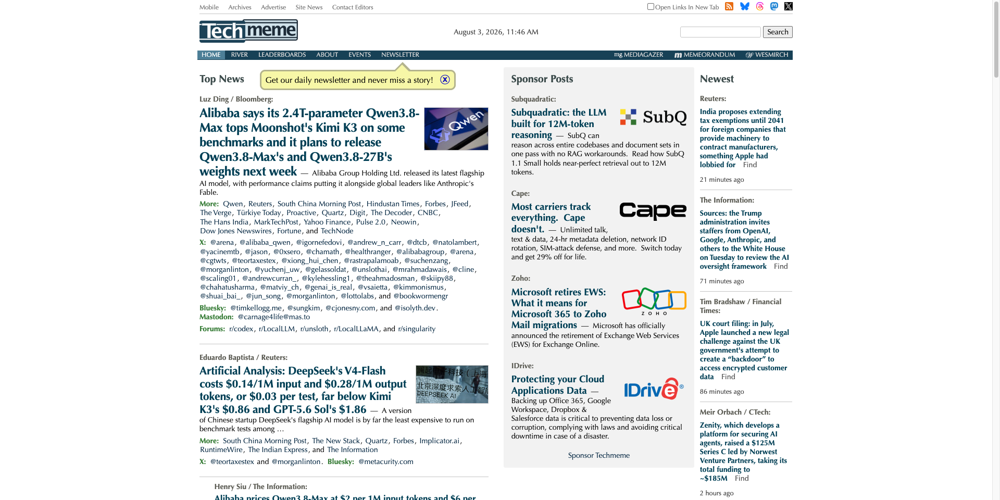
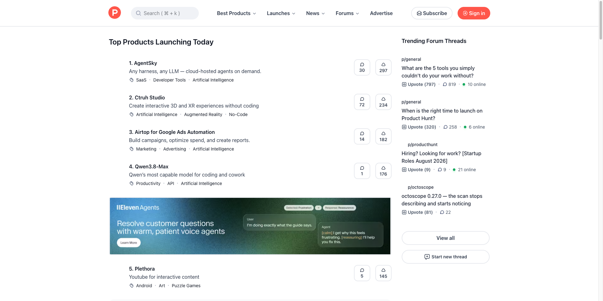
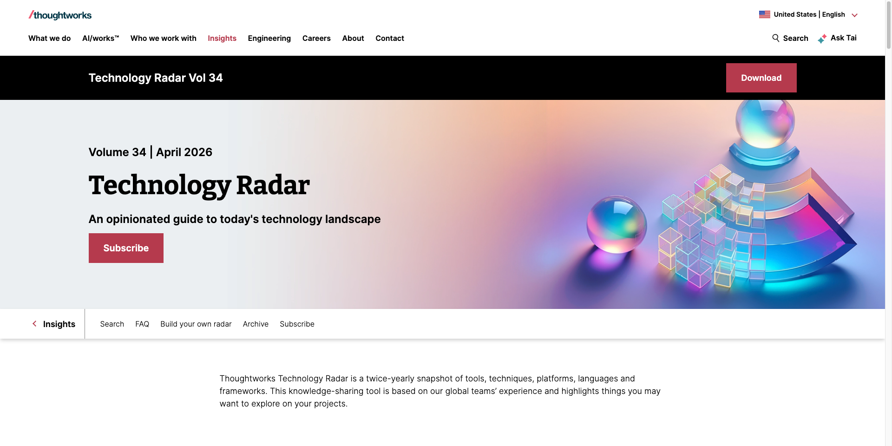
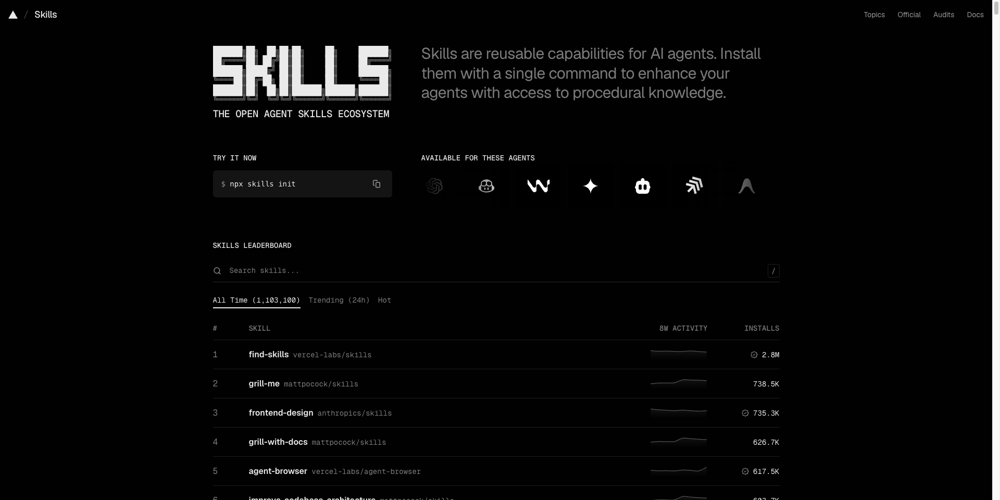

# AI Cool 2.0 竞品与参考项目快照

- 调研日期：2026-08-03
- 页面采集：Ego Lite / `ego-browser`
- 截图视口：1920 × 960
- 用途：支撑 [`../../design/ai-cool-2.0-product-design.md`](../../design/ai-cool-2.0-product-design.md) 的产品决策与视觉基线

## 调研方法

1. 先把逐字稿拆成“资讯、发现、评测、工具箱、后续能力库”五类问题，不按页面外观盲选竞品。
2. 每类同时查看专有产品和开源替代，记录可借鉴的机制、不可照搬的部分、授权与接入边界。
3. 使用 Ego Lite 打开产品当前页面，保存同一视口截图；只访问公开页面，不使用登录态或导出账户数据。
4. 对 AI Hot 额外核对 Agent 页面、`llms.txt`、OpenAPI、服务条款和关联 GitHub 仓库，区分“公开调研是否发现产品源码”和“是否允许作为来源”。
5. 方案只提取产品机制，不复制页面、文案、榜单数据或受版权保护的正文。

截图是调研时点快照，页面内容和条款可能继续变化；正式接入前应重新核对上游文档。

## 参考组合

| 产品 | 观察对象 | 借鉴 | 不照搬 | 对应模块 |
|---|---|---|---|---|
| [AI Hot](https://aihot.virxact.com/) | 精选、热点、日报、主题、Agent/API | 资讯分层、事件聚合、机器摘要与原文并列、多种消费方式 | 不镜像全文，不让单一二级源决定推荐 | 资讯情报、覆盖对标 |
| [Techmeme About](https://www.techmeme.com/about) | 主报道、更多 outlets、社交观点、River | 一个事件聚合多家媒体；爬虫/发现工具与编辑共同形成 editorial pyramid | 高密度老式 UI、具体排序权重不可复现、全天候编辑成本 | 热点聚类、编辑工作台 |
| [Product Hunt](https://www.producthunt.com/) / [Points](https://help.producthunt.com/en/articles/10275873-what-are-points) | 每日发布、分类、互动、Maker | 产品身份、发布信号、场景分类 | 投票和发布热度不等于质量；不做拉票榜 | 工具发现信号 |
| [Futurepedia 目录](https://www.futurepedia.io/ai-tools) / [编辑准则](https://www.futurepedia.io/editorial-guidelines) | AI 工具目录、任务分类、详情卡 | 按用户任务组织工具，展示定价、可用性、限制 | 不追求海量收录，不混淆[付费提交](https://www.futurepedia.io/submit-tool)与独立结论 | 工具雷达、工具箱 |
| [Thoughtworks Radar](https://www.thoughtworks.com/en-us/radar) / [FAQ](https://www.thoughtworks.com/en-us/radar/faq) | Assess、Trial、Adopt、Caution | 用状态表达组织观点和变化；AI Cool 进一步规定实际试用开始后才展示 Trial | 不把拥挤圆盘当主导航，不由总分自动升级 | 评测状态、准入决策 |
| [skills.sh](https://www.skills.sh/) / [Docs](https://www.skills.sh/docs) / [API](https://skills.sh/docs/api) | Skill 目录、榜单、安装和审计入口 | Canonical 仓库、趋势维度、版本与文件信息 | 安装量不是质量，审计不是安全认证；托管 API 需要 Vercel OIDC，不能直接承诺后端同步 | Skill 候选源、后续能力库 |
| [Backstage Software Catalog](https://backstage.io/docs/features/software-catalog/) | 稳定实体、Owner、Lifecycle、Relations | 稳定身份、所有者、生命周期、关系和错误状态 | 当前阶段不引入整套开发者门户，不要求业务用户写 YAML | 工具领域模型、治理 |

补充开源参考：

- [Folo](https://github.com/RSSNext/Folo)：多源订阅、收藏、摘要与跨媒介阅读；主体为 AGPL-3.0，`icons/mgc` 有不可再分发例外，不直接复用为服务端实现。
- [TrendRadar](https://github.com/SANSAN0/TrendRadar)：热度演化、关键词/AI 筛选、增量输出；GPL-3.0，更适合作为机制参考。
- [NewsNow](https://github.com/ourongxing/newsnow)：实时资讯聚合和多平台源适配参考；MIT。
- [RSSHub](https://github.com/DIYgod/RSSHub)：非标准来源转 RSS 的适配层；AGPL-3.0，接入前需核对站点条款与部署责任。
- [Feeds Fun](https://github.com/Tiendil/feeds.fun)：规则、标签和 LLM 结合的信息筛选参考；BSD-3-Clause。
- [MCP Registry](https://registry.modelcontextprotocol.io/docs)：发布者通过 GitHub、DNS 或 HTTP challenge 证明其控制命名空间，不验证服务代码的质量或安全；当前是 preview，可能破坏性变更或重置数据。Registry Data 为 CC0，文档为 CC-BY-4.0，代码处于 MIT/Apache-2.0 迁移期。
- [skills CLI](https://github.com/vercel-labs/skills)：CLI 为 MIT；每个被索引 Skill 的许可证仍以源仓库为准，不能由 CLI 许可证代替。
- [Backstage](https://github.com/backstage/backstage)：Apache-2.0；只借鉴实体与生命周期机制，不引入整套平台。
- [GitHub Trending](https://github.com/trending)：趋势信号参考；GitHub Star 和短期增速不能单独形成推荐。

### 关键证据链接

- Techmeme：[About / editorial pyramid](https://www.techmeme.com/about)、[River](https://www.techmeme.com/river)。
- Product Hunt：[About](https://www.producthunt.com/about)、[Points](https://help.producthunt.com/en/articles/10275873-what-are-points)、[API 使用条件](https://api.producthunt.com/v2/docs)。
- Futurepedia：[目录](https://www.futurepedia.io/ai-tools)、[编辑准则](https://www.futurepedia.io/editorial-guidelines)、[付费提交](https://www.futurepedia.io/submit-tool)。
- Thoughtworks：[Radar](https://www.thoughtworks.com/en-us/radar)、[FAQ](https://www.thoughtworks.com/en-us/radar/faq)、[企业 Radar 方法](https://www.thoughtworks.com/insights/blog/technology-strategy/how-to-create-your-enterprise-technology-radar)、[Build Your Own Radar](https://github.com/thoughtworks/build-your-own-radar)。
- MCP Registry：[About / preview 与 namespace 验证](https://modelcontextprotocol.io/registry/about)、[Terms / Registry Data](https://modelcontextprotocol.io/registry/terms-of-service)、[代码仓库](https://github.com/modelcontextprotocol/registry)。
- skills.sh：[Docs / 安装量与审计边界](https://www.skills.sh/docs)、[API / OIDC](https://www.skills.sh/docs/api)、[MIT CLI](https://github.com/vercel-labs/skills)。
- Backstage：[Catalog](https://backstage.io/docs/features/software-catalog/)、[Apache-2.0 仓库](https://github.com/backstage/backstage)。

## AI Hot 专项结论

### 是否开源

**截至 2026-08-03，本次公开调研未发现 AI Hot 产品服务或数据管线源码。** 核验范围是主页、Agent 页、`llms.txt`、OpenAPI、条款和关联 [AI Hot Skill 仓库](https://github.com/KKKKhazix/khazix-skills/tree/main/aihot)；这不能证明互联网不存在其他仓库。已发现的 Skill 仓库只包含 Agent Skill、调用说明和辅助文件，其 MIT 许可不等于 AI Hot 网站、服务或数据开源。

可替代的开源组合不是一个项目，而是：

- 采集与订阅：RSSHub、Folo、NewsNow；
- 热点和增量信号：TrendRadar、Feeds Fun；
- AI Cool 现有 Go/React/PostgreSQL 管线负责统一富化、聚类、存储和内部展示。

### 能否作为 AI Cool 来源

**可以作为二级情报源和覆盖率对标，但不作为唯一生产来源。** 当前 [AI Hot 接入说明](https://aihot.virxact.com/agent)、[`llms.txt`](https://aihot.virxact.com/llms.txt) 和 [OpenAPI v1](https://aihot.virxact.com/openapi-v1.json) 提供匿名只读 API、RSS、MCP 和 Skill；2026-08-01 版 [服务条款](https://aihot.virxact.com/terms) 允许合理的内部使用，但不授予第三方原文、图片和全文的再许可。调研时 OpenAPI `info.version` 为 `1.1.0`。

落地策略：

- 只走 `/api/v1`，不抓取页面正文；旧 `/api/public/*` 将于 2026-12-31 停服，不进入新实现。
- 保存 `original_url`、`aihot_url`、发现时间和 `ai_generated` 标记。
- AI Hot 条目只生成“覆盖缺口”或“工具提及”信号；重要事实回到一手来源核验。
- 普通条目只有 24 小时/滚动 7 天窗口；完整精选先取 `selected/snapshot`，再消费 `selected/changes`。
- 轮询遵守 ETag、响应缓存头和 `Retry-After`；服务无 SLA，因此不把它设为核心单点依赖。
- 若 AI Cool 后续对公网开放、商业化或批量再分发，再次核对用途、归因和授权。

## Ego Lite 截图

### 当前 AI Cool

观察：现有产品已经形成日报、精选、全部信息和图谱基线；2.0 应扩展现有工作台，而不是做独立营销页。

### AI Hot

观察：内容分层、热点聚类和时间线值得借鉴；来源与机器总结要明确区分。

### Techmeme

观察：一个主事件关联多来源与讨论，适合改善 AI Cool 的热点证据结构。

### Product Hunt

观察：可用作新产品信号源和产品元数据参考，不能把日榜排名直接当评测结果。

### Futurepedia

观察：按任务发现工具比按仓库来源浏览更符合使用者心智。

### Thoughtworks Technology Radar

观察：状态及变更历史比单一排行榜更适合表达团队采用意见。

### skills.sh

观察：安装量、趋势、仓库和审计均是信号；页面也明确提醒审计不能保证安全。

### Backstage Catalog

观察：稳定实体、Owner、Lifecycle 和关系模型适合成为工具治理底座。

## 文件清单

所有图片均在 [`screenshots/`](./screenshots/)；未保存 Cookie、账号、Token、接口响应或站内私有数据。
